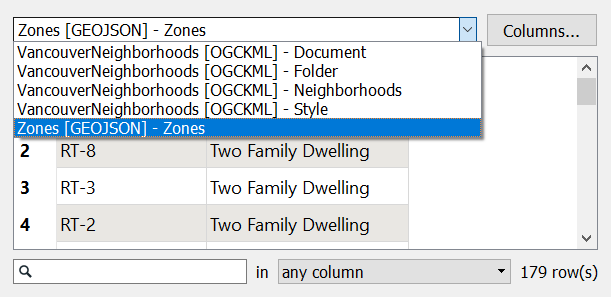

  

    <article class="markdown-body entry-content" itemprop="text">
<table>
<tbody><tr>
<td width="25%">
<i></i>
练习3
</td>
<td>
基本数据检查
</td>
</tr>
<tr>
<td>数据</td>
<td>分区数据（GeoJSON） 街区（Google KML）</td>
</tr>
<tr>
<td>总体目标</td>
<td>检查先前转换的输出</td>
</tr>
<tr>
<td>演示</td>
<td>使用FME Data Inspector进行基本数据检查</td>
</tr>
<tr>
<td>启动工作空间</td>
<td>无</td>
</tr>
<tr>
<td>结束工作空间</td>
<td>无</td>
</tr>
</tbody></table>

在上一个练习中，您被要求在格式之间转换一些数据。在发送转换后的数据之前，您应该检查它以确保它是正确的。让我们通过检查快速转换的输出来了解FME Data Inspector接口的工作原理。

<strong>1）启动FME Data Inspector</strong>
 从Windows开始菜单中选择FME Data Inspector，启动它。您可以在“开始”&gt;“FME Desktop 2018.0”&gt;“FME Data Inspector 2018.0”下找到它。

 <strong>2）打开数据集</strong>
  FME Data Inspector将启动并以空视图显示开始。

要打开数据集，请从菜单栏中选择“文件”&gt;“打开数据集”。出现提示时，按如下所示填写“选择数据集”对话框中的字段：

<table>
<tbody><tr>
<td>读模块格式</td>
<td>GeoJSON（地理JavaScript对象表示法）</td>
</tr>
<tr>
<td>读模块数据集</td>
<td>C:\FMEData2018\Output\Training\Zones.json
</td>
</tr>
</tbody></table>

<em><strong>注意：</strong></em> <em>如果找不到数据集 - 也许您没有完成第一次练习，或者将数据写入其他位置 - 那么您可以按照练习2中的描述打开原始分区数据集。</em>

GeoJSON数据集如下所示：

 <strong>3）浏览数据</strong>
 使用工具栏上的窗口工具浏览数据集，仔细检查。使用“查询”工具查询单个要素并检查“要素信息”窗口中的信息。

尝试右键单击不同的Data Inspector窗口，以发现上下文菜单中存在的要素。

 <strong>4）添加数据集</strong>
 让我们在显示屏上添加第二个数据集，以便与我们的分区数据进行比较。该数据集将是街区边界的KML文件。然后我们将能够看到每个区域重叠的街区。

要添加数据集，请从菜单栏中选择“文件”&gt;“添加数据集”。出现提示时，按如下所示填写“选择数据集”对话框中的字段：

<table>
<tbody><tr>
<td>读模块格式</td>
<td>谷歌KML</td>
</tr>
<tr>
<td>读模块数据集</td>
<td>C:\FMEData2018\Data\Boundaries\VancouverNeighborhoods.kml
</td>
</tr>
</tbody></table>

显示现在看起来像这样：

使用“表视图”练习检查每种要素类型的表格数据。单击表视图顶部的下拉箭头，在Zones.json和Neighborhoods.kml表之间来回切换：

虽然视图窗口中的图层看起来很混乱，但我们可以清理显示，我们很快就会发现。

<table>
<tbody><tr>
<td>
<i></i>
恭喜
</td>
</tr>
<tr>
<td>

通过完成本练习，您已学会如何：
 
<ul><li>在FME Data Inspector的新视图中打开数据集</li>
<li>使用FME Data Inspector中的窗口和检查工具</li>
<li>使用FME Workbench功能在FME Data Inspector中打开数据集</li></ul>

</td>
</tr>
</tbody></table>
</article>
  

