|  练习4 |  FME Data Inspector |
| :--- | :--- |
| 数据 | 区域数据（GeoJSON） 街区（Google KML） |
| 总体目标 | 设置图层和数据集显示 |
| 演示 | 在Data Inspector中使用显示控件和背景图 |
| 启动工作空间 | C:\FMEData2019\Workspaces\DesktopBasic\Basics-Ex4-Begin.fmw |
| 结束工作空间 | C:\FMEData2019\Workspaces\DesktopBasic\Basics-Ex4-Complete.fmw |

在上一个练习中，我们检查了转换中的一些数据并添加了第二个数据集。现在我们可以重新排列数据以使显示更清晰。

  
**1）启动FME Data Inspector**  
继续上一练习中的FME Data Inspector。您应该同时拥有转换后的zone数据（如GeoJSON）和KML中Neighborhoods边界的数据集。“显示控制”窗口如下所示：

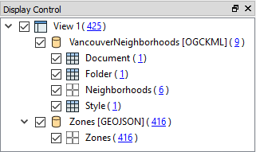
  
**2）设置街区符号**  
显示控制窗口显示了VancouverNeighborhoods数据集中的许多不同图层。实际上，其中大多数是表格（非空间）项目。我们感兴趣的层称为Neighborhoods(街区）。

在“显示控制”窗口中单击“Neighborhoods”数据的符号系统图标：

将颜色设置为中性色调（如橙色）并将不透明度值增加到0.8：

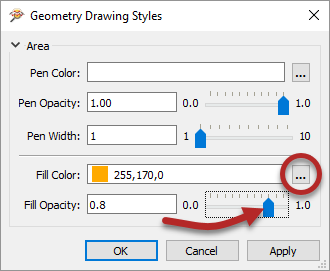

  
**3）设置绘制顺序**  
先前的更改清楚地表明区域要素位于绘图顺序中的街区之下。要解决此问题，请将“区域”数据集拖动到“显示控制”窗口中的VancouverNeighborhoods数据集上方。

同时为区域数据填充颜色设置颜色，并将不透明度值减小到0.1。主视图现在看起来像这样：

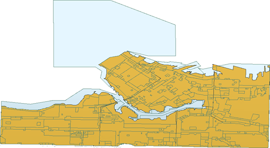

如果查询区域要素，您将看到它同时具有ZoneCategory和ZoneName属性。您可能没有意识到，但这些属性之间存在关联。每个ZoneName属于特定的ZoneCategory，其中Category:Name是1:多个的关系。

让我们通过将每个ZoneCategory的所有要素合并为一个要素来阐明显示。我们可以在FME Workbench中做到这一点。

  
**4）返回工作空间**  
返回FME Workbench。打开练习2中保存的工作空间或上面列出的工作空间。

我们在这里要做的是使用我们所谓的转换器。我们将在“数据转换”一章中更详细地介绍此对象。它是以某种方式转换数据的对象。

单击连接Reader Feature Type和Writer Feature Type的深色线。开始输入“Dissolver”一词：

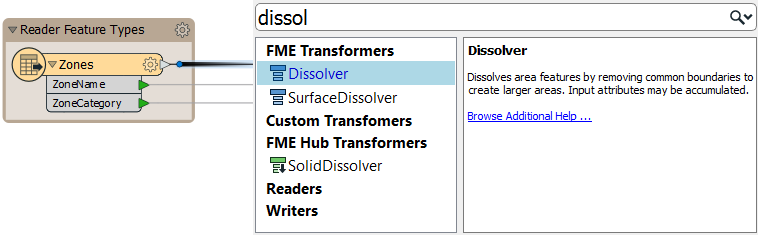

当您看到Dissolver转换器出现在列表中时，双击它以将其放入工作空间。结果将如下所示：

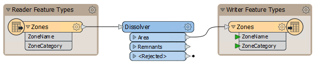

Dissolver参数将使用公共属性值合并所有要素。

  
**5）设置Dissolver参数**  
点击Dissolver转换器上的小齿轮图标（它可能是黄色的）：

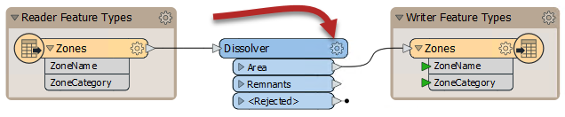

这样做将打开转换器的参数对话框。单击“分组依据”参数旁边的省略号（...）按钮。在打开的对话框中，选择ZoneCategory属性，然后单击“确定”。

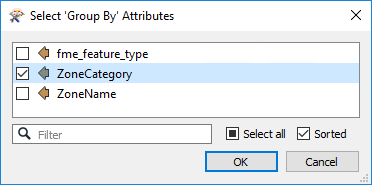

再次单击“确定”关闭参数对话框。

保存工作空间并再次运行它。转换将运行，数据将被覆盖。

**6) 在Visual Preview中检查要素缓存**

保存工作空间。让我们现在尝试使用要素缓存和Visual Preview。单击Dissolver将其选中，然后单击Run to This：

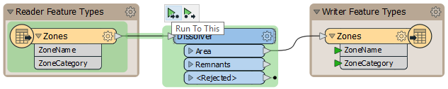

Workbench将缓存“Zones”要素类型，然后在Dissolver上创建两个缓存：“Area”和“Remnants”。只要Dissolver保持选中状态，Remnants将自动显示在Visual Preview中，因为它是转换器上的最后一个输出端口，而Area是我们感兴趣的端口。您可以通过在Visual Preview显示控制窗口中取消选中Dissolver_Remnants来更改在Visual Preview中显示的端口：

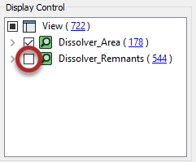

现在，“图形”窗口应显示Dissolver通过合并具有相同区域类别的相邻多边形来简化了的原始数据：

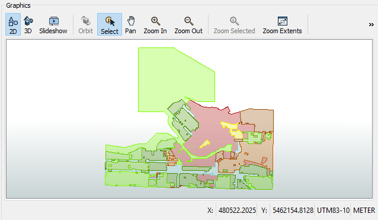

您可以通过选择“Zones”要素类型以及Dissolver转换器来比较之前和之后的结果。有两种方法可以执行此操作：单击以选择一个，然后<kbd>Ctrl</kbd>+单击以选择另一个，或者单击并拖动一个矩形以同时选择两个：

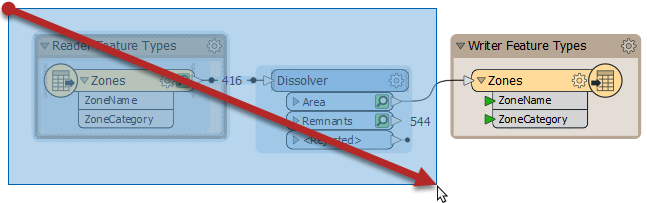

然后，原始的区域数据将被添加到“显示控制”窗口中，您可以打开或关闭区域缓存以进行比较（确保Dissolver_Remnants保持关闭状态）：

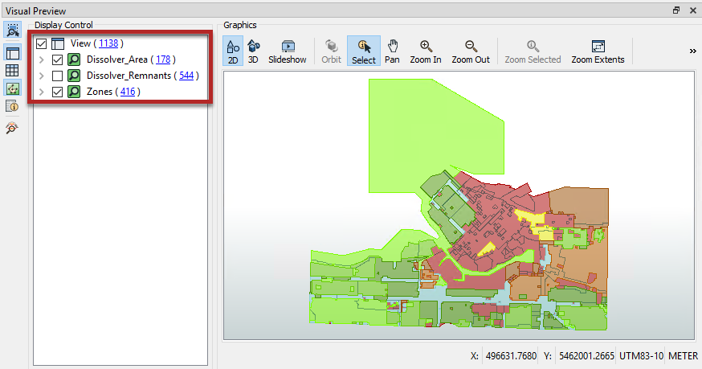

现在我们正在使用Visual Preview，您应该注意到几乎所有相同的工具都可以在此处使用，就像在Data Inspector中一样。除非另有说明，否则本课程的其余部分将使用Visual Preview。

**7) 添加背景图** 

检查数据时，有一个背景图有助于提供位置感。您可以从许多地图服务中进行选择。

在“ 可视化预览图形”窗口工具栏中单击 **添加背景图** :

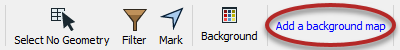

---

<!--Tip Section-->

<table style="border-spacing: 0px">
<tr>
<td style="vertical-align:middle;background-color:darkorange;border: 2px solid darkorange">
<i class="fa fa-info-circle fa-lg fa-pull-left fa-fw" style="color:white;padding-right: 12px;vertical-align:text-top"></i>
技巧
</td>
</tr>

<tr>
<td style="border: 1px solid darkorange">

如果愿意，可以右键单击“ 可视化预览图形”窗口，然后选择“背景图”>“切换到新的背景图”：  
 
在使用较小的屏幕或可视化预览时，此方法有时会更容易。

</td>
</tr>
</table>

---

在“添加背景图”对话框中，单击“源”下拉列表：

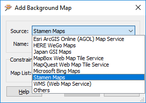

您会注意到FME支持各种背景地图服务。大多数服务器都需要一个现有的帐户或服务器，但是在此示例中，我们选择“Stamen Maps”，无需帐户即可使用。

选择“Stamen Maps”后，单击省略号按钮以检索可用的背景地图样式列表。选择地形，然后单击确定：

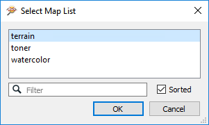

单击确定，然后单击保存以关闭这些对话框。背景图将添加到显示中。请注意，数据已重新投影以匹配所选背景的坐标系。例如，“Stamen Maps”背景会使数据重新投影到球形墨卡托，并且形状发生明显变化：

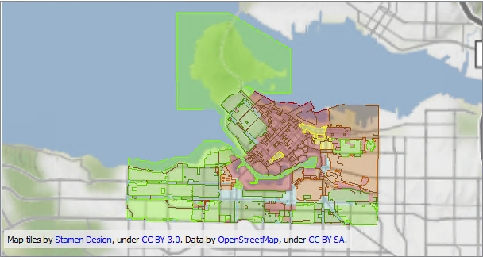
 地图瓦片提供由 <a href="https://stamen.com">Stamen Design</a>, 许可由 <a href="https://creativecommons.org/licenses/by/3.0">CC-BY-3.0</a>。数据提供由<a href="http://openstreetmap.org">OpenStreetMap</a>, 许可由 <a href="http://creativecommons.org/licenses/by-sa/3.0">CC-BY-SA</a>。

 **8) 过滤数据**
 让我们过滤数据以控制显示的内容。我们只想查看工业分区区域。

单击“ 可视化预览图形”窗口工具栏的“Filter”按钮：

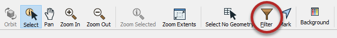

在“Filter Features”对话框中，选中“Enable Filter”。然后单击“Left Value”字段，然后开始键入ZoneCategory。这将搜索可用的属性：

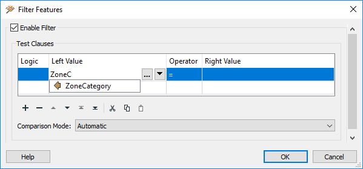

一旦看到ZoneCategory出现在列表中，请双击将其选中。然后，在“Operator”字段中单击并选择=（等于）符号（如果尚未选择）。

对于“ Right Value”字段，单击该字段，然后输入**Industrial**一词（不用担心，它不区分大小写）：

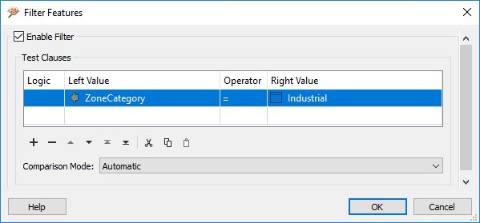

单击“OK”关闭对话框。显示将被过滤以仅显示工业区：

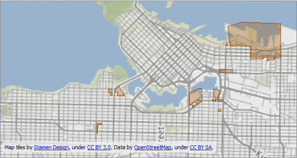
 地图瓦片提供由 <a href="https://stamen.com">Stamen Design</a>, 许可由 <a href="https://creativecommons.org/licenses/by/3.0">CC-BY-3.0</a>。数据提供由<a href="http://openstreetmap.org">OpenStreetMap</a>, 许可由 <a href="http://creativecommons.org/licenses/by-sa/3.0">CC-BY-SA</a>。
  
显示控制窗口还将显示过滤器的效果：

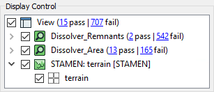

---

<!--Exercise Congratulations Section-->

<table style="border-spacing: 0px">
<tr>
<td style="vertical-align:middle;background-color:darkorange;border: 2px solid darkorange">
<i class="fa fa-thumbs-o-up fa-lg fa-pull-left fa-fw" style="color:white;padding-right: 12px;vertical-align:text-top"></i>
恭喜
</td>
</tr>

<tr>
<td style="border: 1px solid darkorange">

通过完成本练习，您已经了解了如何：
 
<ul>
<li>设置检查要素的符号</li>
<li>设置背景图以检查数据</li>
<li>在FME Workbench中添加转换器并设置其参数</li>
<li>使用测试子句过滤检查的数据</li>

</td>
</tr>
</table>
