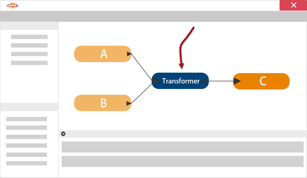
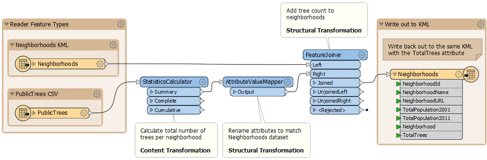

# 什么是数据转换

**数据转换** 是FME处理数据的能力。转换步骤发生在格式转换过程中。读取，转换数据，然后将其写入所选格式。

## 数据转换类型

数据转换可以细分为两种不同的类型： _结构转换_ 和 _内容转换_.

### 结构转型

结构转型可能更好地称为“重组”。它指的是FME在几乎无限数量的安排中将数据从源传送到目标的能力。

这包括合并数据的能力（如上图所示），划分数据，重新排序数据和定义自定义数据结构。

通过操作其模式来执行转换数据集的结构。

### 内容转换

内容转换可能更好地称为“修订”。它指的是改变数据集内容的能力。

操作要素的几何对象或计算新的属性值是FME如何转换内容的最佳示例。

内容转换可以独立进行，也可以与结构转换同时进行。

