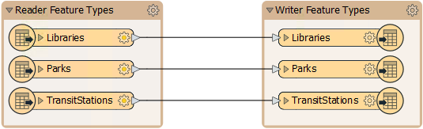
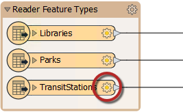
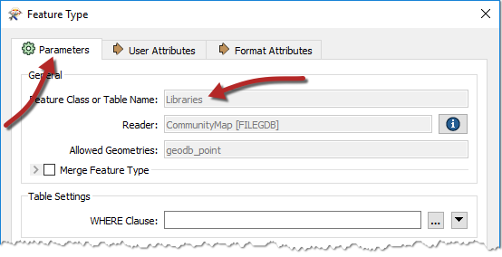
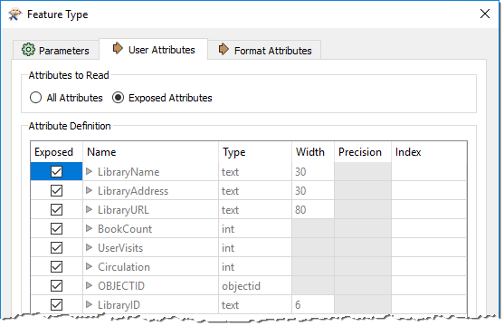
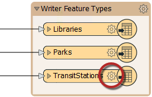

# 结构转换

转换数据集的结构需要使用FME来操作 _模式_ 。FME使用术语“模式”，但您可能将其视为 _数据模型_ 。

## 模式概念

_**模式**_ 定义了一个数据集的结构。每个数据集都有其独特的模式; 它包括定义或限制其内容的图层，属性和其他规则。

### 模式表示

创建新工作空间时，FME会扫描源数据集。它创建了一个 _**读模块，**_ 其要素类型显示在工作空间画布的左侧，而一个 _**写模块**_ 的要素类型显示在工作空间画布的右侧：

|  技巧 |
| :--- |
|  此图中的每个对象表示源数据集中的一个细分。在FME术语中，这些对象称为**要素类型**。FME支持400多种格式，而且几乎有同样多的术语用于数据细分。最常见的术语是层，表，类，类别，级或对象。  |
|  虽然这些子划分的通用FME术语是**要素类型**，但是FME Workbench中的所有对话框都使用特定于格式的术语（如果正确的术语适用）。  |

### 读模块模式

对于读模块，通过单击每个要素类型对象上的齿轮图标，可以显示有关模式的更多信息：

此“要素类型”对话框有许多选项卡。在“参数”选项卡下面是一组常规参数，例如要素类型的名称（在本例中为“库”），允许的几何类型以及父数据集的名称：

“用户属性”选项卡显示属性列表。每个属性由其名称，数据类型，宽度和小数位数定义：

每个要素类型都有不同的名称，也可以有一组完全不同的属性。所有这些信息都构成了读模块模式。字面意思是 ***"我们拥有的”"***。

### 写模块模式

与读模块一样，每个写模块都有一组详细的模式信息，可通过打开要素类型的对话框来访问：

默认情况下，写模块模式（ ***"我们想要的"*** ）是源的镜像，因此转换的输出将是输入的副本。此要素允许用户无需进一步编辑即可从格式转换为格式（ _快速转换_ 
）。

如果 _“我们想要的”_ 与默认模式定义不同，我们必须使用称为_**模式编辑**_的技术来更改它。
