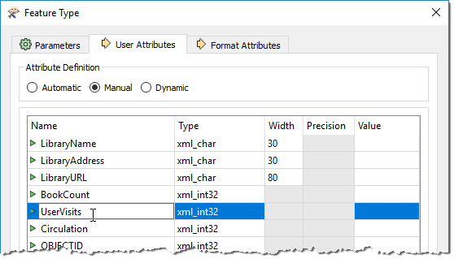
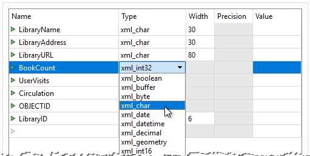
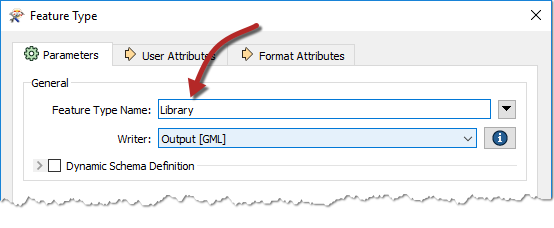
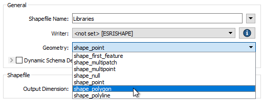
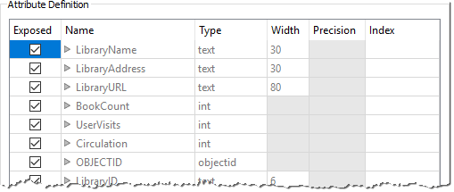

# 模式编辑

_**模式编辑**_ 是更改写模块模式以自定义输出数据结构的过程。一个很好的例子是重命名属性字段。

在编辑之后，源模式仍然代表 _“我们拥有的”_ ，但目标模式现在确实代表 _“我们想要的”_ 。

## 可编辑的组件

可以执行许多编辑，包括但不限于以下内容：

### 属性重命名

可以重命名目标模式上的属性，例如将POSTALCODE重命名为PSTLCODE。

要重命名属性，请打开“要素类型”对话框，然后单击“用户属性”选项卡。单击要重命名的属性并输入新名称。

### 属性类型更改

写模块模式的任何属性都可以更改类型; 例如，从整数字段更改为字符字段。

要更改属性类型，请打开“用户属性”选项卡，并将“类型”字段设置为新类型：

|  技巧 |
| :--- |
|  属性的“类型”列仅显示与该数据格式的允许类型匹配的值。例如，Oracle模式允许varchar或clob的属性类型。MapInfo不支持这些数据类型，因此它们永远不会出现在MapInfo模式中。上面的屏幕截图显示了GML格式的数据类型。 |

### 要素类型重命名

要重命名写模块要素类型，请打开“参数”选项卡，单击“要素类型名称”字段（标签可能因格式类型而异）并根据需要编辑名称：

您还可以通过在Workbench画布中单击某个要素类型并按F2键来重命名该要素类型。

### 几何对象类型更改

要更改要素类型的允许几何对象（例如，将允许的几何对象从线条更改为点），请打开“参数”选项卡并更改允许的几何对象类型：

此字段仅在格式要求严格决定几何对象类型时可用。如果格式允许在单个要素类型中混合几何对象，则不会显示此设置。

一旦用户对写模块模式进行了所有必需的更改，工作空间就会反映 _“我们想要的”_  - 但它尚未指定读模块模式应如何连接在一起。这是下一个任务，它被称为 _**模式映射**_ 。

|  技巧 |
| :--- |
|  您可能想知道“如果我编辑了**读模块**模式而不是写模块，会发生什么”？     |
|  好吧，默认情况下你是不能的！读模块的模式字段是灰色的以防止这种情况，因为更改会使模式定义与源数据集不同步：  |

有一些罕见的用例 - 但它们超出了本培训课程的范围！
