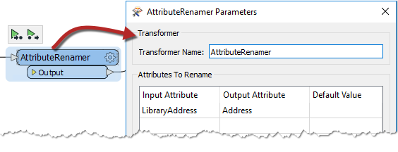
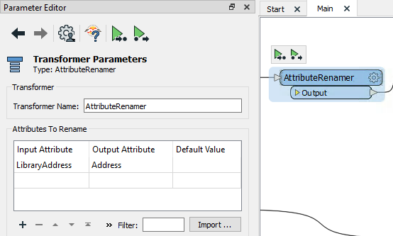
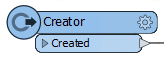
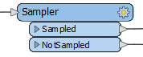
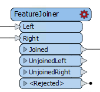
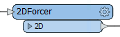
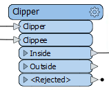
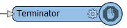
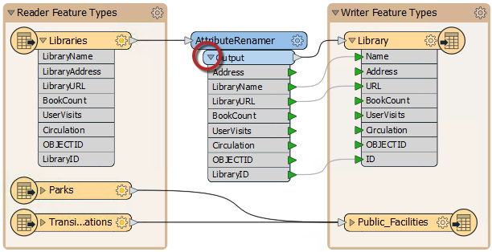

# 用转换器进行转换

除了模式编辑和模式映射之外，还可以使用称为 _**转换器**_ 的对象进行 _**转换**_ 。

## 什么是转换器？

顾名思义，转换器是一个FME Workbench对象，用于执行要素转换。有许多FME转换器，每个转换器执行许多不同的操作。

转换器连接在读模块和写模块要素类型之间，以便数据从读模块，转换过程流向写模块。

转换器通常在画布窗口中显示为矩形浅蓝色物体。

|  技巧 |
| :--- |
|  要添加一个转换器，只需在画布上输入即可。例如，要查找AttributeManager，您将开始输入“ AttributeMan”，然后将出现快速添加。在第4章：转换器中将对此有更多信息。 |

## 转换器参数

每个转换器可能有许多参数（设置）。单击齿轮图标可以访问参数（如要素类型）：

或者，如果参数编辑器窗口打开，只需单击转换器（或任何其他画布对象）即可在此处找到参数：

## 颜色编码的参数按钮

转换器上的参数按钮采用颜色编码，以反映设置的状态。

蓝色参数按钮表示已根据需要检查和修改转换器参数，并且转换器已准备就绪。

黄色参数按钮表示尚未检查默认参数。转换器可以在这种状态下使用，但结果可能无法预测。

|  技巧 |
| :--- |
|  如果参数编辑器窗口打开，那么很少会看到黄色图标，因为转换器的参数会自动打开并假定要进行检查。如果该窗口打开，您应该确保检查它以确保您不会错过设置所需的参数。 |

红色参数按钮表示至少有一个参数，FME无法提供默认值。在使用转换器之前，必须为参数提供一个值。

|  FME蜥蜴说... |
| :--- |
|  在尝试转换之前，请务必检查您的参数。如果其中有任何带有红旗标志的转换器，您的工作空间将无法工作！ |

## 转换器端口

转换器不仅没有单个输入和输出，还可以有多个输入端口，多个输出端口或两者。

此2DForcer转换器具有单个输入和输出端口。

此Clipper具有多个输入和输出端口。请注意，并非所有这些都是 - 或需要 - 连接。

这个Terminator只有一个输入端口......

...而这个Creator只有一个输出端口！

 

### 转换器属性

单击转换器输出端口的下拉箭头以查看退出转换器的所有属性。此列表包括转换器中应用的所有更改。

通过此功能，可以直观地看到在转换器中已创建的，丢失的或以其他方式转换的属性。
