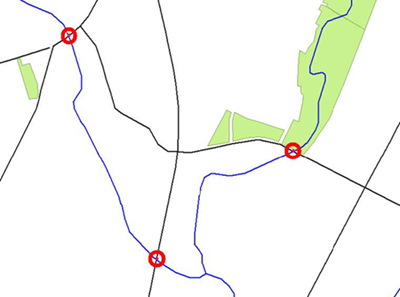

# 内容转换

内容转换是对要素组件进行操作的内容转换。

## 什么是要素？

一个 _**要素**_ 在FME是转换中的单个项目。对于空间数据，要素通常是几何对象（具有或不具有一组相关属性）。

对于表格数据，要素通常是数据库中的记录，电子表格中的行或文本文件中的行。每个列或单元称为一个 _**属性**_。

FME中的要素具有灵活的通用表示，与其源自的格式无关。这意味着任何转换器都可以在任何FME要素上运行，无论其源格式如何。有时内容转换在单个要素上运行，有时在多个要素上运行。

|  FME蜥蜴说... |
| :--- |
|  您可以将内容转换视为更改或编辑数据。 |
|  衣柜类比仍然适用于此。您可以将衣服从衣柜中取出来进行清洁，或改变它们，或修理它们，或将它们染成新的颜色或各种其他任务，然后再将它们送回原位。|
 | 对于空间数据转换也是如此：将数据固定为更干净的样式和真正想要的样式。 |

## 几何转换

_**几何转换**_ 是重构FME要素的空间组件的行为。换句话说，要素的几何形状经历某种形式的改变以产生不同的输出。

几何转换的一些示例包括以下内容：
* **泛化** - 一种重构数据的制图过程，因此可以在给定的地图比例下轻松显示
* **变形** - 调整一组要素的大小和形状，以更接近地匹配一组参考数据
* **拓扑计算** - 将一组线性要素转换为节点/线结构
* **线相交** - 计算**线要素**之间的交点

在这里，道路与河流相交，产生了标志着桥梁位置的点。

## 属性转换

_**属性转换**_ 是重构FME要素的表格组件的行为。换句话说，属性经历某种形式的改变以产生不同的输出。

属性转换的一些示例是：

* **连接** - 将两个或多个属性连接在一起
* **拆分** - 将一个属性**拆分**为多个，这与连接相反
* **测量** - 测量要素的长度或面积以创建新属性
* **ID创建** - 为特定要素创建唯一的ID号

在此属性串联示例中，将地址的每一行串联起来以返回单个行地址。

>     Address1     Suite 1200,+
>     Address2     9639-137a Street,+
>     City         Surrey,+
>     Province     British Columbia,+
>     PostalCode   V3T 0M1
>
>     = Address     Suite 1200, 9639-137a Street, Surrey, British Columbia, V3T 0M1
