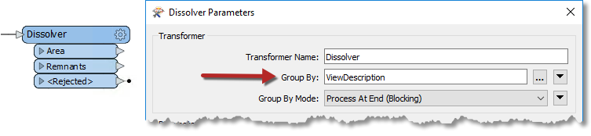
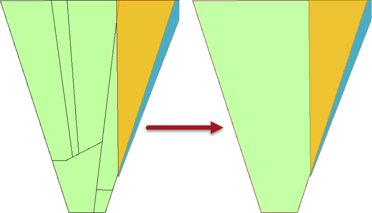

# 分组处理

分组参数允许通过单个FME转换器分组处理要素。

## 什么是组？

FME转换器一次对一个要素进行转换，或一次对一整套要素进行转换。

例如， _AreaCalculator_ 转换器一次对一个要素进行操作（以测量单个多边形要素的面积）。我们称之为 _**基于要素的转换器**_ 。

 _StatisticsCalculator_ 一次处理多个要素（以计算所有这些的平均值）。在FME中，我们将此要素集称为 _**组**_ ，转换器是 _**基于组的转换器**_ 。

## 创建组

因此，组就是由转换器处理的一个已定义的要素集。默认情况下，基于组的转换器会将给其提供的所有要素视为一个组。

但是，此类转换器也具有 _**Group-By**_ 参数。此参数允许用户根据属性的值定义多个组。

|  FME蜥蜴说... |
| :--- |
|  为了说明组，让我们考虑计算FME用户的平均年龄吧。计算的默认组包括**所有** FME用户。 |
|  但是你可以把所有人分成男女，创建两组，并计算每个性别的平均年龄。或者你可以把所有人按国籍划分，然后计算每个国家的平均年龄。 |
|  这与在数据集中具有性别（或国籍）属性并在FME group-by参数中选择该属性相同。 |

这里，Dissolver转换器用于融合（合并）许多多边形要素。选定的Group-By属性是_ViewDescription_：

FME创建一系列用于叠加的组，其中每个组中的要素共享_ViewDescription_属性的相同值。实际结果是多边形融合只发生在线要素共享相同描述的地方：

## 分组模式 ##

对要素进行分组时，转换器可以使用两种不同的方式来处理组。第一种方法是保留所有的要素，直到所有的要素都通过转换器，这称为阻塞。这是通过使用"在结束（阻塞）时处理的分组模式"来设置的。
另一种方法是先通过使用诸如Sorter之类的转换器将数据预先分类为组。然后，一旦对数据进行分组，请使用“分组更改时（高级）处理的分组模式”。此模式将在每个组之后将要素推入转换器，这将有助于提高性能。仅在对数据进行预排序时才使用此选项。
