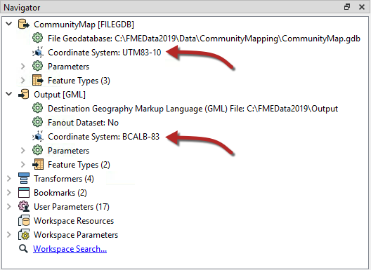
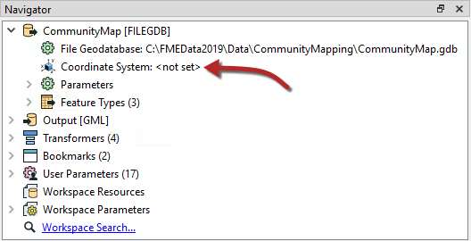

# 坐标系转换

要在地球表面上的某一特定空间中定位，大多数空间数据都与特定的空间参照有关。

一些用户将这个数据位置称为“投影”，但投影只是我们称之为**坐标系**的一个组成部分。坐标系包括坐标系包括投影，基准，椭球，单位，有时还有象限。

## 坐标系设置

可以为FME中的每个读写模块分配一个坐标系。该坐标系在Workbench的导航窗口中或生成工作空间对话框中设置。

与源模式一样，读模块坐标系是 _**“我们拥有的”**_ 而写模块坐标系是 _**“我们想要的”**_. 这里源坐标系已定义为UTM83-10，目标坐标系为BCALB-83：

读模块处理的每个要素都用其参数中定义的坐标系标记。

当一个要素到达一个写模块时，如果它被标记为与该写模块定义的坐标系不同，则FME会自动重新投影数据，以便输出位于正确的位置。

|  技巧 |
| :--- |
|  一旦用坐标系标记，每个要素便会在整个平移过程中保持不变；FME始终知道它属于哪个坐标系。 |
|  这在执行几何变换（如计算面积）或读取属于不同坐标系的多个数据集时很重要（是的，FME将处理该问题）。 |

## 坐标系的自动检测

并不总是需要手动设置坐标系参数。某些数据格式（例如Esri Shapefile）能够存储有关它们所在的坐标系的信息，FME将在可能的位置检索此信息。

这里，因为读模块坐标系标记为&lt;未设置&gt;，FME将尝试从源数据集确定坐标系。如果不能，则将使用&lt;未知&gt;坐标系标记该要素。

根据可用的坐标系（CS）信息的组合，可能会出现许多重投影情景。这里**N**表示“未设置”，**S**表示“已设置”：

| 数据集CS | 读模块CS | 写模块CS | 重投影 |
| :--- | :--- | :--- | :--- |
| N | S | S | 从读模块CS重投影到写模块CS |
| S | N | S | 从数据集CS重投影到写模块CS |
| N | N | S | 错误：没有数据集或读模块CS无法重投影 |
| S | S | S | 从读模块CS重投影到写模块CS |
| N | N | N | 除非格式需要，否则不要重投影 |

如果未在写模块上设置坐标系，则除非输出格式需要，否则不会进行重新投影。例如，KML格式要求数据为纬度/经度。如果未定义源数据集或读模块坐标系，则转换将失败。

