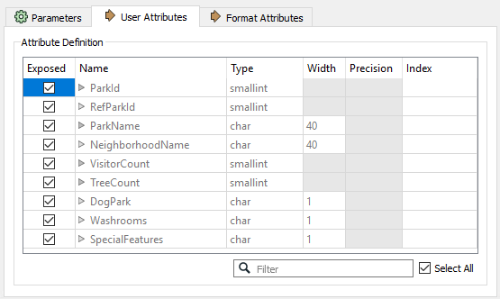

|  练习1 |  地面维护项目 - 模式编辑 |
| :--- | :--- |
| 数据 | 城市公园（MapInfo TAB） |
| 总体目标 | 计算城市中每个公园的大小和平均大小，以用于草地切割，树篱修剪等的地面维护估算。 |
| 演示 | 结构转换，模式编辑 |
| 启动工作空间 | 无 |
| 结束工作空间 | C:\FMEData2019\Workspaces\DesktopBasic\Transformation-Ex1-Complete.fmw |

您刚刚在当地城市的GIS部门担任技术分析师。

负责维护公园和其他草地区域的团队需要了解每个公园的面积和设施，以便计划下一年的预算。您已被分配到此项目，并将使用FME提供此信息的数据集。

此示例的第一步是重命名现有属性并创建新属性，以便为以后的面积计算做准备。

  
**1）启动Workbench**  
使用“生成工作空间”对话框，使用以下参数创建工作空间：

| 读模块格式 | MapInfo TAB（MITAB） |
| :--- | :--- |
| 读模块数据集 | C:\FMEData2019\Data\Parks\Parks.tab |
| 写模块格式 | MapInfo TAB（MITAB） |
| 作家数据集 | C:\FMEData2019\Output\Training |

是! 在这里，我们回写我们正在读取的相同格式的数据！您可以单击“生成工作空间”对话框中的“参数”按钮以检查读模块/写模块参数，但在本练习中不需要更改它们。请注意，写模块只需要一个文件夹而不是特定的文件名。

**2) 查看数据**
在我们开始操作数据之前，我们应该首先查看它，然后看我们正在使用什么数据。

单击Parks读模块要素类型以弹出弹出菜单。然后从弹出菜单中，单击 View Source Data按钮:

然后，源数据将在“ Visual Preview”窗口中打开。在本练习中，我们有兴趣设置写模块以拥有我们想要的属性名称，以及为数据分配正确的数据类型。熟悉输出数据的结构非常重要。对于MapInfo（MITAB）格式，这些是数据类型：

* **char:** 字符串字符，无法执行数学运算
* **float:** 带有十进制值的数字
* **integer:** 整数，无小数点（32位）
* **smallint:** 整数，无小数（16位）

[MapInfo TAB (MITAB)文档](https://docs.safe.com/fme/html/FME_Desktop_Documentation/FME_ReadersWriters/mitab/user_attributes_w.htm)中还详细介绍了其他数据类型。对于我们的数据集，我们有一些字符数据（3-4、7-9），整数数据（5）和小整数数据（1-2、6）：

我们将需要确保写模块正确分配了这些数据类型，并且我们希望删除不需要的额外属性。

**3）重命名要素类型**  
 FME创建一个工作空间，其中目标模式与源匹配。但是，数据的最终用户已请求清除部分模式。

检查写模块要素类型参数。单击标记为表名的字段（请记住此标签是特定于格式的，并在MapInfo中处理“表”）并将名称从Park更改为ParksMaintenanceData：

  
**4）更新属性**  
现在检查用户属性。它们看起来像这样：

必须清理这些内容，以便删除不必要的信息。需要更新其他属性，并添加一些额外的属性来存储计算结果。因此，请执行以下操作：

| 删除属性 | RefParkID |  |
| :--- | :--- | :--- |
| 删除属性 | DogPark |  |
| 删除属性 | Washrooms |  |
| 删除属性 | SpecialFeatures |  |
| 重命名属性 | 从：NeighborhoodName | 到：Neighborhood |
| 更改类型（VisitorCount） | 从：短整数 | 到：整数 |
| 添加属性 | ParkArea | 类型：浮点数 |
| 添加属性 | AverageParkArea | 类型：浮点数 |

...然后单击参数编辑器“应用”按钮。现在，属性列表应如下所示：

现在，当运行工作空间时，输出将命名为ParksMaintenanceData.tab，并将包含更新的属性模式。

  
**5）取消暴露源属性**  
工作空间现在看起来像这样：

|  新内容 |
| :--- |
| FME 2019.0的新增功能：画布上的对象将自动调整大小（如上图所示）以适合要素类型名称。 |

请注意，有几个源属性不会在工作空间中使用或发送到输出。我们可以通过隐藏它们来整理工作空间。

检查读模块要素类型参数上的“用户属性”选项卡。它看起来像这样：

取消选中我们不需要的以下属性的复选框：

* RefParkID
* Washrooms
* SpecialFeatures

这是我们删除的属性列表，除了DogParks，我们将在转换中使用它们。

单击“应用/确定”以确认更改。

  
**6）保存工作空间**  
保存工作空间 - 将在其他示例中完成。它现在应该是这样的：

|  FME蜥蜴说... |
| :--- |
|  一些写模块属性（ParkArea和AverageParkArea）有红色连接箭头，因为还没有任何内容可以映射到它们或名称已更改（Neighborhood）。虽然VisitorCount为绿色，但未显示连接线，这是因为数据仍然相同，但输出数据类型已更改。  |

您仍然可以运行此工作空间，只是为了看看输出是什么样子。

<table>
  <thead>
    <tr>
      <th style="text-align:left">恭喜</th>
    </tr>
  </thead>
  <tbody>
    <tr>
      <td style="text-align:left">
        
通过完成本练习，您已学会如何：
           
        

        <ul>
          <li>编辑写模块模式的属性</li>
          <li>编辑写模块模式的输出要素类型名称</li>
          <li>隐藏读模块模式上的属性</li>
        </ul>
      </td>
    </tr>
  </tbody>
</table>
