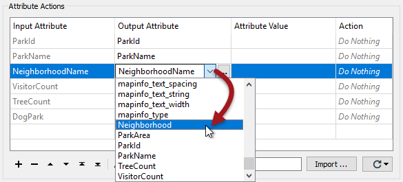

|  练习2 |  地面维护项目 - 结构转换 |
| :--- | :--- |
| 数据 | 城市公园（MapInfo TAB） |
| 总体目标 | 计算城市中每个公园的大小和平均大小，以用于割草，树篱修剪等的地面维护估算。 |
| 演示 | 用转换器进行结构转换 |
| 启动工作空间 | C:\FMEData2019\Workspaces\DesktopBasic\Transformation-Ex2-Begin.fmw |
| 结束工作空间 | C:\FMEData2019\Workspaces\DesktopBasic\Transformation-Ex2-Complete.fmw C:\FMEData2019\Workspaces\DesktopBasic\Transformation-Ex2-Complete-Advanced.fmw |

让我们继续您的地面维护项目。

如果您忘记了，负责维护公园和其他草地区域的团队需要了解每个公园的面积和设施，以计划下一年的预算。

在项目的这一部分，我们将从源数据中过滤出狗公园（因为它们具有不同的维护成本）并将它们写入日志窗口。我们还将处理重命名的属性NeighborhoodName。

  
**1）启动FME Workbench**  
启动FME Workbench并从上一个练习中打开工作空间。或者，您可以打开C:\FMEData2019\Workspaces\DesktopBasic\Transformation-Ex2-Begin.fmw。

  
**2）添加AttributeManager转换器**  
让我们先处理源属性NeighborhoodName，它在写模块上重命名为Neighborhood但尚未连接。

我们可以通过简单地绘制连接来做到这一点，但通常最好使用转换器。我们可以使用两种转换器。一个称为AttributeRenamer，另一个 - 我们将在这里使用 - 是AttributeManager。

因此，单击从读模块到写模块要素类型的要素连接：

开始输入短语“AttributeManager”。这种方法是我们如何将转换器放置在工作空间中。键入时，FME会搜索匹配的转换器。当列表足够短，您可以看到AttributeManager时，从对话框中选择它（双击它）：

这样做将放置一个AttributeManager转换器：

|  技巧 |
| :--- |
|  关于添加转换器的一个很好的建议，请参阅我们[**有史以来十大FME技巧**](http://blog.safe.com/2014/10/fmeevangelist128/)列表中的[**＃5**](http://blog.safe.com/2014/10/fmeevangelist128/) |

  
**3）设置AttributeManager参数**  
查看AttributeManager参数（其对话框或参数编辑器窗口）。它看起来像这样：

请注意，它所连接的流上的所有属性都将自动显示在对话框中。

如果“输入属性”字段设置为“ NeighborhoodName”，请单击“输出属性”字段。单击下拉列表的按钮，然后选择Neighborhood作为要使用的新属性名称：

作为响应，Action字段将更改为 _Rename_。

|  技巧 |
| :--- |
|  街区（NeighborhoodName）只出现在列表中，因为它已存在于写模块模式中。如果我们在编辑写模块模式之前完成了此步骤，则必须在此对话框中手动输入新的属性名称。 |

单击“确定”关闭对话框。现在，在Workbench画布窗口中，您将看到Neighborhood属性标有绿色箭头，以确认正在为该属性提供值。

  
**4）添加Tester转换器**  
现在我们应该从数据中删除狗公园，因为它们有自己的一组成本。

我们可以使用Tester转换器来做到这一点。单击从AttributeManager输出端口到写模块上的ParksMaintenanceData要素类型的连接。

开始输入单词Tester。当您发现Tester转换器时，双击它以将其中一个添加到工作空间。在整理画布布局后，工作空间现在看起来像这样：

请注意，Passed输出端口是默认连接的输出端口。

  
**5）设置Tester参数**  
检查Tester转换器的参数。单击左值字段，然后单击向下箭头并选择属性值&gt; DogPark：

对于“Right Value”，单击该字段并键入值N.运算符字段应自动填充为等号（=），这是我们在这种情况下所需的。

单击“确定”接受值并关闭对话框。

|  技巧 |
| :--- |
|  测试适用于DogParks = N,因为我们想要保留这些要素，并且它是连接的Passed端口。如果测试是DogParks = Y，那么Failed端口将是连接的端口。 |

|  新东西和更新的内容 |
| :--- |
|  在FME 2018，FME 2019甚至FME 2019.1之间，Tester转换器已经发生了很大变化！  |

首先，现在将子句逻辑（例如AND和OR语句）作为新列合并到“测试子句”面板中： 

此外，在2019.1中，逻辑还显示在可编辑的“复合表达式”面板中：

复合表达式面板是经验丰富的用户进行更改的快捷方式，比操作主测试子句面板的逻辑列更快。对复合表达式所做的任何更改都会自动应用到逻辑列，反之亦然，以保持两个参数的一致性。

  
**6）添加Logger转换器**  
我们现在使用属性值测试从我们的数据中过滤掉狗公园。问题是，我们应该如何处理我们过滤掉的要素？我们可以做很多事情，但是现在，我们会将信息记录到FME日志窗口。

要执行此操作，请右键单击Tester Failed端口，然后选择Connect Logger选项：

Logger转换器将添加到工作空间。此转换器将所有传入要素记录到日志窗口：

用这种方法插入的记录器以它们连接到的输出端口（这里为Tester_Failed）命名-并在日志中用-报告。

  
**7）运行工作空间**  
保存并运行工作空间。它尚未完成，但运行它将证明到目前为止一切正常。

为了确认它是否正确运行，您应该具有来自Tester:Passed输出端口的73个要素和来自Tester:Failed输出端口的7个要素。

|  高级练习 |
| :--- |
|  画布上的读模块和写模块自动在其周围添加了书签对象。您可以通过选择全部转换器并单击工具栏上的“书签”或按Ctrl + B键对转换器执行相同操作。为书签指定您选择的名称，以描述正在执行的操作。  书签是我们在FME中称为**最佳实践**的示例。 |

<table>
  <thead>
    <tr>
      <th style="text-align:left">恭喜</th>
    </tr>
  </thead>
  <tbody>
    <tr>
      <td style="text-align:left">
        
通过完成本练习，您已学会如何：
           
        

        <ul>
          <li>将转换器添加到工作空间</li>
          <li>使用AttributeManager转换器执行模式映射</li>
          <li>使用Tester转换器过滤数据</li>
          <li>使用Logger转换器记录数据</li>
          <li>将书签添加到工作空间</li>
        </ul>
      </td>
    </tr>
  </tbody>
</table>
