|  练习4 |  地面维护项目 - 标签要素 |
| :--- | :--- |
| 数据 | 城市公园（MapInfo TAB） |
| 总体目标 | 计算城市中每个公园的大小和平均大小，以用于割草，树篱修剪等的地面维护估算。 |
| 演示 | 使用并连转换器进行内容转换 |
| 启动工作空间 | C:\FMEData2019\Workspaces\DesktopBasic\Transformation-Ex4-Begin.fmw |
| 结束工作空间 | C:\FMEData2019\Workspaces\DesktopBasic\Transformation-Ex4-Complete.fmw C:\FMEData2019\Workspaces\DesktopBasic\Transformation-Ex4-Complete-Advanced.fmw |

让我们继续您的地面维护项目。

在项目的这一部分，我们将为每个公园创建一个标签，并将其写入新的输出层。此步骤最好使用并行数据流。

  
**1）启动Workbench**  
 启动Workbench（如有必要）并从练习3打开工作空间。或者，您可以打开C:\FMEData2019\Workspaces\DesktopBasic\Transformation-Ex4-Begin.fmw

之前的练习使用AreaCalculator测量了公园面积。现在我们被要求将此信息作为标签添加到输出数据集中。

可以使用LabelPointReplacer转换器实现此步骤。

  
**2）创建新的写模块要素类型**  
因为我们想要将标签要素写入输出中的单独图层（表），我们需要在画布上创建另一个要素类型对象。在后面的章节中有更多相关内容，但是现在，右键单击编写器要素类型并选择“复制”选项。这样做会在输出数据集中创建新要素类型（此处为图层，但其他格式可能是表或其他数据分组）。

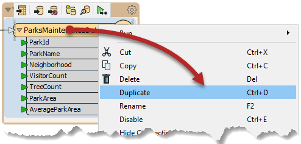

现在清理此要素类型的模式。查看要素类型的对话框，并将新类型重命名为ParkLabels。在“用户属性”选项卡中，删除所有现有用户属性。

---

<!--Tip Section-->

<table style="border-spacing: 0px">
<tr>
<td style="vertical-align:middle;background-color:darkorange;border: 2px solid darkorange">
<i class="fa fa-info-circle fa-lg fa-pull-left fa-fw" style="color:white;padding-right: 12px;vertical-align:text-top"></i>
技巧
</td>
</tr>

<tr>
<td style="border: 1px solid darkorange">

通过将“属性定义”切换为“自动”，然后再切换回“手动”，可以快速删除所有现有的用户属性。自动将清除它，因为当前没有属性输入。 <strong>这仅适用于尚未连接到工作区其余部分的要素类型</strong>

</td>
</tr>
</table>

---

**3）放置一个StringConcatenator转换器**  
单击画布的空白区域。键入“StringConcatenator”以添加此类型的转换器。

通过将第二个连接从那里拖到新变换器，将其连接到StatisticsCalculator的Complete端口。

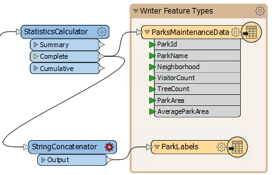

创建从StringConcatenator到ParkLabels要素类型的新连接。

  
**4）检查转换器参数**  
查看StringConcatenator转换器的参数。有基本和高级对话框，基本对话框如下所示：

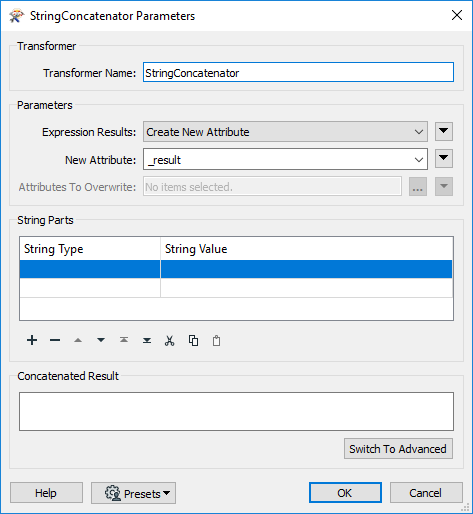

输入 _LabelText_ 作为要创建的新属性的名称。

在“字符串部件”部分中，设置以下四个部分：

| 字符串类型 | 字符串值 |
| :--- | :--- |
| Attribute Value | ParkName |
| New Line |  |
| Attribute Value | ParkArea |
| Constant |  sq meters |

确保在“sq meters”之前的常量中包含空格字符。

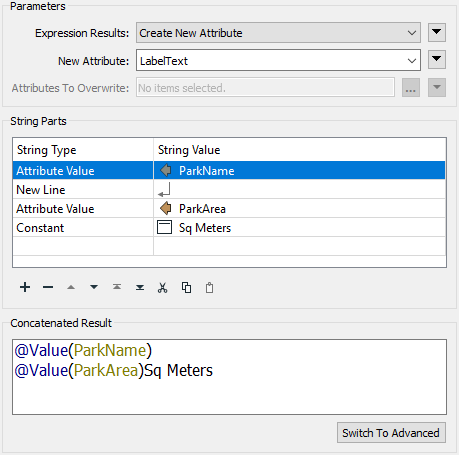

|  技巧 |
| :--- |
|  您可能会发现切换到高级编辑器对话框并直接输入内容更快： |
|  @Value（ParkName） @Value（ParkArea）sq meters |

 **5) 运行工作空间**
 让我们运行工作空间以确保StringConcatenator达到我们的预期。确保启用了要素缓存，然后单击StringContatenator打开弹出菜单。然后单击Run to This，这样StringContatenator将运行，但是我们不会将数据重写：

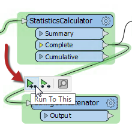

然后单击输出端口上的放大镜以在Visual Preview中查看缓存。如果双击LabelText列中的任何要素，将出现一个对话框，其中将显示格式正确的标签字符串：

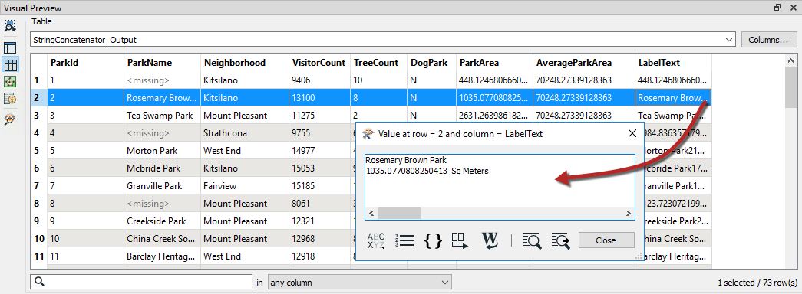

**6）放置LabelPointReplacer转换器**  
单击StringConcatenator:Output和ParkLabels要素类型之间的连接。键入“LabelPointReplacer”以添加此类型的转换器。

将添加新转换器并自动连接这两个对象。

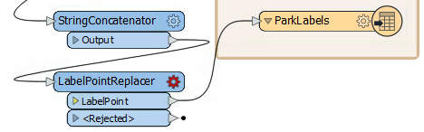

  
**7）检查LabelPointReplacer参数**  
检查LabelPointReplacer参数。

首先单击Label参数右侧的下拉箭头：

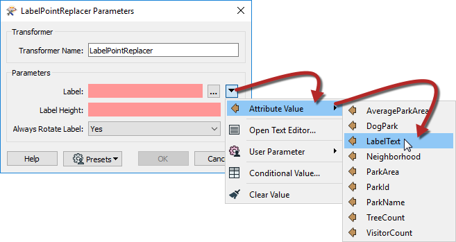

选择“Attribute Value”&gt;“LabelText”以选择先前在StringConcatenator中定义的标签。

现在单击Label Height字段并键入25（即25个工作单位，在本例中为米）。

“Always Rotate Label”参数可以保留其默认值。

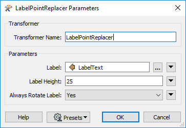

|  技巧 |
| :--- |
|  许多参数字段（如Label Height）可以设置为常量值（通过键入）或通过单击下拉箭头并选择Attribute Value设置为属性。  |
|  并且 - 您很快就会看到 - 也可以直接在转换器设置中构造参数值 |

 **8) 运行转换**
 如果需要，可以添加另一个书签，然后运行转换，因为转换被缓存到了StringContatenator中，所以只花一点时间就可以写出数据。

单击ParksMaintenanceData以打开弹出菜单，然后单击View Written Data:

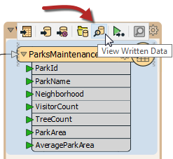

数据将在Visual Preview中打开，但是我们想一起查看两个输出，因此我们将不得不移至FME Data Inspector。在可视化预览(Visual Preview)中, 单击"Open in Data Inspector"按钮或单击<kbd>Ctrl</kbd> + <kbd>Alt</kbd> + <kbd>D</kbd>。FME Data Inspector将打开并在当前视图中显示数据：

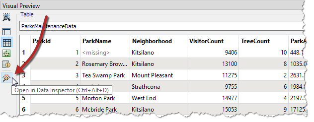

现在，在FME Data Inspector打开的情况下，单击菜单栏上的“添加数据”按钮。这会将数据添加到当前视图，因此我们可以查看公园顶部的标签：

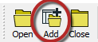

在“选择要添加的数据集”对话框中，将“格式”设置为MapInfo TAB（MITAB），然后浏览到ParkLabels数据集：

<pre>
C:\FMEData2019\Output\Training\ParkLabels.tab
</pre>

单击确定，并且标签现在应该在公园上。请注意，输出在两个文件的两层中。使用FME Data Inspector在同一视图中打开两个输出文件。

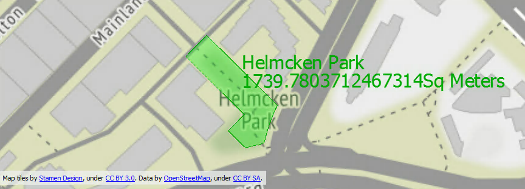

 地图瓦片提供由 <a href="https://stamen.com">Stamen Design</a>, 授权由 <a href="https://creativecommons.org/licenses/by/3.0">CC-BY-3.0</a>.。数据提供由<a href="http://openstreetmap.org">OpenStreetMap</a>, under <a href="http://creativecommons.org/licenses/by-sa/3.0">CC-BY-SA</a>.

|  高级练习 |
| :--- |
|  现在您知道如何在输出中创建新要素类型，如何测试数据以及如何使用并行流，为什么不尝试此任务：确定哪些公园小于平均值，哪些公园大于平均值，并将它们写出为于不同的要素类型。 |

<table>
  <thead>
    <tr>
      <th style="text-align:left">恭喜</th>
    </tr>
  </thead>
  <tbody>
    <tr>
      <td style="text-align:left">
        
通过完成本练习，您已学会如何：
           
        

        <ul>
          <li>创建新的写模块要素类型</li>
          <li>在单个工作空间中使用多个转换器流</li>
          <li>使用StringConcatenator构造一个字符串以供其他地方使用</li>
          <li>使用属性作为转换器参数的值</li>
        </ul>
      </td>
    </tr>
  </tbody>
</table>
