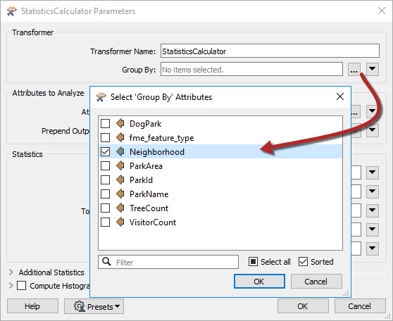
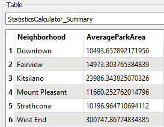

|  练习5 |  地面维护项目 - 街区平均值 |
| :--- | :--- |
| 数据 | 城市公园（MapInfo TAB） |
| 总体目标 | 计算城市中每个公园的大小和平均大小，以用于草地切割，树篱修剪等的地面维护估算。 |
| 演示 | 分组处理 |
| 启动工作空间 | C:\FMEData2019\Workspaces\DesktopBasic\Transformation-Ex5-Begin.fmw |
| 结束工作空间 | C:\FMEData2019\Workspaces\DesktopBasic\Transformation-Ex5-Complete.fmw |

让我们继续您的地面维护项目。

公园团队已决定他们不想要整个城市的平均公园面积。相反，他们想要每个社区的公园的平均大小; 让我们为他们这样做。

  
**1）启动Workbench**  
 启动Workbench（如有必要）并从练习4打开工作空间。或者，您可以打开C:\FMEData2019\Workspaces\DesktopBasic\Transformation-Ex5-Begin.fmw

  
**2）在StatisticsCalculator中设置Group-By**  
这是一项非常简单的任务。查看StatisticsCalculator转换器的参数，然后单击Group By参数旁边的“浏览”按钮。选择名为Neighborhood的属性：

单击“确定”/“应用”以将更改应用于转换器。

  
**3）运行工作空间**  
单击StatisticsCalculator，然后单击Run To This。在Visual Preview中检查“Summary”输出端口。“Summary”输出端口会为您正在计算的任何统计信息创建一个摘要表。
您应该看到每个街区现在都有自己的AverageParkArea值：

---

<!--Exercise Congratulations Section-->

<table style="border-spacing: 0px">
<tr>
<td style="vertical-align:middle;background-color:darkorange;border: 2px solid darkorange">
<i class="fa fa-thumbs-o-up fa-lg fa-pull-left fa-fw" style="color:white;padding-right: 12px;vertical-align:text-top"></i>
恭喜
</td>
</tr>

<tr>
<td style="border: 1px solid darkorange">

通过完成本练习，您已学会如何：
 
<ul><li>在FME转换器中使用分组参数</li></ul>

</td>
</tr>
</table>
