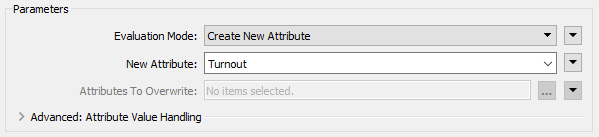
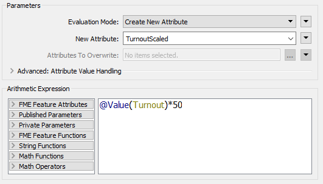

|  练习7 |  投票分析项目 |
| :--- | :--- |
| 数据 | 选举映射（GML） 选举统计（Microsoft Excel） |
| 总体目标 | 映射投票模式的统计 |
| 演示 | 数据转换 |
| 启动工作空间 | C：\ FMEData2019 \工作空间\ DesktopBasic \转型-EX7-Begin.fmw |
| 结束工作空间 | C：\ FMEData2019 \ Workspaces \ DesktopBasic \ Transformation-Ex7-Complete.fmw C：\ FMEData2019 \ Workspaces \ DesktopBasic \ Transformation-Ex7-Complete-Advanced.fmw |

在地面维护项目中，市政选举官员已经听说过您的技能，并要求帮助确定上次选举中投票率低的投票分区，或选民难以理解该过程的分区。

他请求您的帮助，您建议将结果显示在Google Earth中，以便员工无需使用完整的GIS系统即可查看结果。

 **1) 查看数据**
 启动FME Workbench并打开启动工作空间。它已经添加了读模块和写模块来处理数据。我们需要做的就是执行转换，但是首先，让我们检查数据以了解我们正在使用什么：

单击VotingDivisions以打开弹出菜单，然后单击View Source Data按钮以在Visual Preview窗口中查看数据。注意表视图中的属性。

对Councillors重复此步骤，并注意属性。

---

<!--Tip Section-->

<table style="border-spacing: 0px">
<tr>
<td style="vertical-align:middle;background-color:darkorange;border: 2px solid darkorange">
<i class="fa fa-info-circle fa-lg fa-pull-left fa-fw" style="color:white;padding-right: 12px;vertical-align:text-top"></i>
技巧
</td>
</tr>

<tr>
<td style="border: 1px solid darkorange">

如果需要同时查看两种或多种读模块要素类型，FME Data Inspector是一个有用的工具，因为它在不同的选项卡中打开每个数据集，因此可以来回翻转。 
  
为此，在Visual Preview中查看数据时，单击左侧的放大镜以在FME Data Inspector中打开数据集。重复其他要素类型。 
  

</td>
</tr>
</table>

---

请注意，两个数据集都有一个分区属性，用于标识每个投票分区（区域）。Excel数据是非空间的，但具有一组其他投票属性：

* **选民**：登记选民人数
* **投票**：**投票**的选民人数
* **空白**：投空白票或废弃票的选民数量
* **OverVotes**：投票选举太多候选人的选民人数
* **UnderVotes**：未投票数

OverVotes和UnderVotes属性指示了对投票过程的了解程度。每位选民最多可投票给10名候选人（共30名）。

OverVotes是那些投票选出超过十名候选人的选民。UnderVotesUnderVotes是本来可以投出但没有投出的票数; 例如，选民只投了四个候选人而不是十个，有六个未投。

 **2) 添加FeatureJoiner转换器**
 第一个任务是将统计选举数据加入到实际要素中。我们将使用FeatureJoiner转换器来执行此操作。FeatureJoiner是一种连接或合并要素的方法。在这种情况下，我们将选举结果记录合并到选举边界要素上。

添加FeatureJoiner转换器。将VotingDivisions数据连接到Left端口，将Councilors（结果）数据连接到Right端口：

---

 **3) 设置FeatureJoiner参数**
 查看FeatureJoiner参数。因为我们想要所有的投票分区要素，我们将进行左连接; 因此将Join Mode设置为Left。

对于“左”和“右”连接字段，单击该字段并从下拉列表中选择“Division”属性。此属性是我们连接数据的通用键：

 **4) 查看数据 **

 运行转换以创建功要素缓存，而忽略任何报告意外输入的警告或日志消息。

然后单击FeatureJoiner:Joined输出端口以在Visual Preview中查看新加入的数据：

检查数据以确保所有分区多边形现在都包括一组从Excel电子表格复制的属性数据：

 **5) 添加ExpressionEvaluator转换器**
 现在我们有了需要的数字，我们就可以开始计算一些统计数据了。为此，我们首先使用ExpressionEvaluator转换器来计算每个分区的选民投票率百分比。

在FeatureJoiner之后放置一个ExpressionEvaluator转换器 - 将它连接到FeatureJoiner:Joined输出端口。查看转换器的参数。将New Attribute设置为Turnout投票率（以匹配我们在目标模式上的内容）：

在“算术表达式”部分中，将表达式设置为：

<pre>
(@Value(Votes)/@Value(Voters))*100
</pre>

您无需在其中键入@Value（Votes）和@Value（Voters）部分，可以通过双击FME功能属性下左侧列表中的属性来获得它。

如果愿意，可以再次运行转换，并且它将仅在所有内容都已缓存之前运行ExpressionEvaluator。然后单击“Output”端口以在“ Visual Preview”窗口中查看结果。

 **6) 添加另一个ExpressionEvaluator转换器**
 使用类似的技术，添加第二个ExpressionEvaluator来计算每个选民的UnderVotes数量，并将其放在与输出模式匹配的属性中（例如UnderVoting）。表达式将是这样的：

<pre>
@Value(UnderVotes)/@Value(Voters)
</pre>

***注意:*** *这不是百分比，就像之前的计算一样。*

可以随意在两个ExpressionEvaluator转换器周围添加书签。

 **7) 添加AttributeRounder转换器**
 将我们的统计数据计算到13位小数或更多位置有点过分了。我们应该截断这些数字。为此，在第二个ExpressionEvaluator之后放置一个AttributeRounder转换器。

对于参数，在“要舍入的属性”下，选择新创建的Turnout和UnderVoting属性。将小数位数设置为2：

如果需要，再次运行工作空间以检查结果。

 **8) 添加注释**
 将标签添加到AttributeRounder是没有意义的，因此右键单击转换器并选择Attach Annotation选项。

这样做会为转换器添加标签。编辑内容，例如“将投票率和投票数舍入到小数点后两位”：

---

<!--Tip Section-->

<table style="border-spacing: 0px">
<tr>
<td style="vertical-align:middle;background-color:darkorange;border: 2px solid darkorange">
<i class="fa fa-info-circle fa-lg fa-pull-left fa-fw" style="color:white;padding-right: 12px;vertical-align:text-top"></i>
技巧
</td>
</tr>

<tr>
<td style="border: 1px solid darkorange">

注释将在第5章：最佳实践中更详细地介绍，但这不应阻止您现在创建记录良好的工作空间！

</td>
</tr>
</table>

---

 **9) 连接模式**
 最后一步让我们将AttributeRounder连接到输出模式。只需从AttributeRounder连接到两种写模块要素类型：

运行工作空间并检查Google Earth中的输出，以证明其具有正确的属性并且位于正确的位置。

---

<!--Tip Section-->

<table style="border-spacing: 0px">
<tr>
<td style="vertical-align:middle;background-color:darkorange;border: 2px solid darkorange">
<i class="fa fa-info-circle fa-lg fa-pull-left fa-fw" style="color:white;padding-right: 12px;vertical-align:text-top"></i>
技巧
</td>
</tr>

<tr>
<td style="border: 1px solid darkorange">

所以这显然是一种并行数据流，但一直持续到最后一步。另一种布局是在FeatureJoiner之后拆分数据，如下所示：
  
  输出没有区别，因此唯一的考虑因素是哪个更容易创建，哪个更好。使用的主要方法应该在两个方面都胜出。
</td>
</tr>
</table>

---

<!--Advanced Exercise Section-->

<table style="border-spacing: 0px">
<tr>
<td style="vertical-align:middle;background-color:darkorange;border: 2px solid darkorange">
<i class="fa fa-cogs fa-lg fa-pull-left fa-fw" style="color:white;padding-right: 12px;vertical-align:text-top"></i>
高级练习
</td>
</tr>

<tr>
<td style="border: 1px solid darkorange">

该项目已完成，但输出非常简单。改善结果的外观会好得多，有几种方法可以用KML来完成。
  我们可以根据他们的投票率/总票数简单地对投票部门进行着色，但更令人印象深刻的方法是使用三维块。
  按照以下步骤在输出KML数据集中创建三维形状...
</td>
</tr>
</table>

---

 **10) 添加第三个ExpressionEvaluator转换器**
 每个块的高度应该与该分区的率成比例。但是，为了看到差异，垂直比例需要夸大一些。

在AttributeRounder和Turnout要素类型之间放置一个ExpressionEvaluator。设置参数以将Turnout属性乘以值50.将其放入名为TurnoutScaled的新属性中。

 **11) 添加3DForcer转换器**
 在新的ExpressionEvaluator之后添加一个3DForcer转换器。这会将要素提升到所需的高度。在参数对话框中，将高程设置为“属性值”&gt;“TurnoutScaled”。

**12）添加KMLPropertySetter**  
在3DForcer之后添加KMLPropertySetter转换器。该转换器允许我们在输出中设置3D块。设置几何东西参数如下：

* 高度模式:绝对值
* 挤出：是的

**13）添加KMLStyler** 最后，添加一个KMLStyler转换器。工作空间现在看起来像这样：

检查参数。选择颜色并填充要素的颜色。将填充不透明度增加到0.75左右。

保存并运行工作空间。现在，在Google Earth中，输出应如下所示：

这些3D块将向用户显示城市选民投票率高/低的情况。

如果您愿意，请重复这些步骤，为UnderVoting统计数据提供3D表示。

---
<table>
  <thead>
    <tr>
      <th style="text-align:left">恭喜</th>
    </tr>
  </thead>
  <tbody>
    <tr>
      <td style="text-align:left">
        
通过完成本练习，您证明了您知道如何：
           
        

        <ul>
          <li>使用转换器进行内容转换（ExpressionEvaluator，AttributeRounder，3DForcer）</li>
          <li>使用转换器参数创建与写模块模式匹配的属性</li>
          <li>在单个工作空间中使用多个转换器流</li>
        </ul>
        
您还学会了如何：
           
        

        <ul>
          <li>使用通用键合并多个数据流（FeatureJoiner）</li>
          <li>使用FME的内置数学编辑器对话框</li>
          <li>使用转换器为输出要素设置符号系统（样式）</li>
        </ul>
      </td>
    </tr>
  </tbody>
</table>
