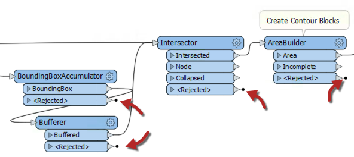
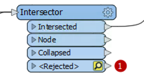
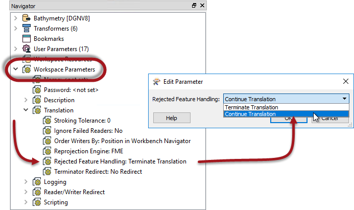
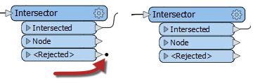
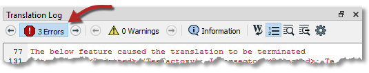
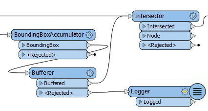
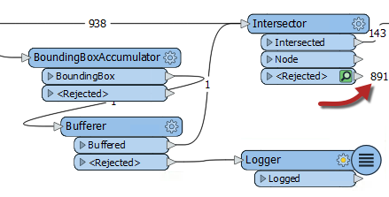

## 被拒绝的要素 ##

任何工作流程的一个重要部分是处理未能处理的数据; 例如，将没有几何对象的要素发送到基于几何对象的转换器（如AreaBuilder）。

FME通过&lt;Rejected&gt;端口输出数据来处理此类故障，这些端口可在许多转换器上找到：



存在一个参数来控制&lt;Rejected&gt;端口的操作，并为工作空间作者选择要采取的操作。

当要素被拒绝时，转换将停止，并且在<Rejected>端口上将出现带有数字的红色圆圈。您可以单击缓存以检查要素并确定其被拒绝的原因：
  



### 拒绝要素处理

可以在“工作空间参数”下的“导航”窗口中找到控制被拒绝要素处理的参数：



这两个选项是 _终止转换_ 和 _继续转换_。

当参数设置为terminate时，通过&lt;Rejected&gt;端口退出的要素会导致转换停止。为了在视觉上表示这一点，&lt;Rejected&gt;端口上有一个黑色标记。

当参数设置为continue时，无论退出&lt;Rejected&gt;端口的要素有多少，转换都将继续。在这种情况下，黑色标记被删除：



在*终止*模式下，被拒绝的要素将被写入日志窗口，并显示错误消息：

```text
The below feature caused the translation to be terminated
```

还会有一个与转换器有关的错误消息：

```text
Intersector_<Rejected>(TeeFactory): Intersector_<Rejected>:
Termination Message: 'Intersector output a <Rejected> feature.
```

此错误很有用，因为它告诉作者哪个转换器出现故障。

---

<!--Tip Section-->

<table style="border-spacing: 0px">
<tr>
<td style="vertical-align:middle;background-color:darkorange;border: 2px solid darkorange">
<i class="fa fa-info-circle fa-lg fa-pull-left fa-fw" style="color:white;padding-right: 12px;vertical-align:text-top"></i>
<span style="color:white;font-size:x-large;font-weight: bold;font-family:serif">技巧</span>
</td></tr>
<tr>
<td style="border: 1px solid darkorange">
<span style="font-family:serif; font-style:italic; font-size:larger">
为了快速找到这些错误消息，您可以通过单击“错误Errors”按钮来过滤转换日志。 
<br><br>

</span>
</td>
</tr>
</table>

---


### 混合模式

在终止模式下，如果&lt;Rejected&gt;端口连接到另一个对象，则被拒绝的要素不会导致转换终止：


简而言之，作者可以创建混合模式，其中一些转换器在拒绝某个要素（上面的交叉点）时终止，但其他转换器将以另一种方式处理该要素（Bufferer）。这样，作者可以尝试处理预期的被拒绝要素，但如果确实存在意外故障则停止转换。

### 要素计数和检查

在继续模式下，退出&lt;Rejected&gt;端口的要素将被计算并保存以供检查：



即使没有连接Logger 或其他转换器，也会保存要素以供检查。该数字告诉我们有多少要素被拒绝，并且可以单击绿色图标来检查数据。
