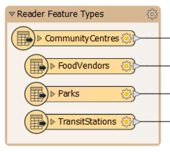
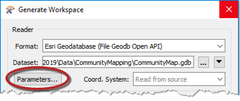
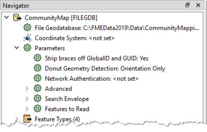
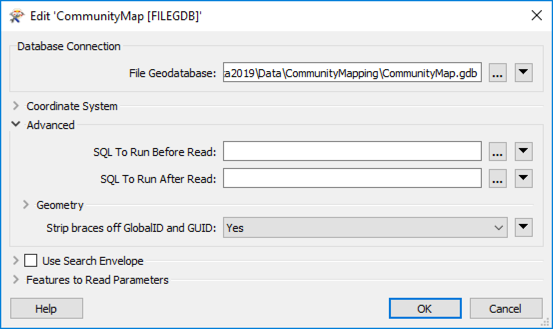

## 读模块参数 ##
众所周知，工作空间包含一个读模块，用于读取数据集，并且该数据集中的每个要素类型都显示在工作空间画布中：

要控制读模块的操作方式，需要使用**读模块参数**。

### 查找读模块参数 ###
可以在生成新的工作空间时单击“参数”来定位和设置读模块参数：

也可以在Workbench的“导航器”窗口中找到它们：

因为参数指的是相关格式的特定组件和特征，所以不同格式的读模块具有一组不同的控制参数。

### 设置读模块参数 ###
要在“导航器”窗口中编辑参数，请双击任何一个参数。这样做会打开一个对话框，可以在其中设置参数的值：

---

<!--Person X Says Section-->

<table style="border-spacing: 0px">
<tr>
<td style="vertical-align:middle;background-color:darkorange;border: 2px solid darkorange">
<i class="fa fa-quote-left fa-lg fa-pull-left fa-fw" style="color:white;padding-right: 12px;vertical-align:text-top"></i>
FME蜥蜴说...
</td>
</tr>

<tr>
<td style="border: 1px solid darkorange">

读取器参数控制数据集中的所有要素类型。把它想象成煮一壶咖啡。咖啡机的强度控制会影响所有倒咖啡的杯子。
</td>
</tr>
</table>
