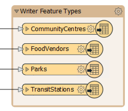
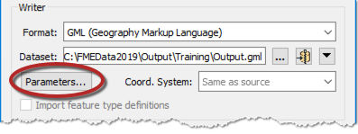
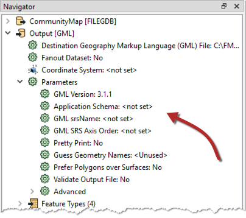
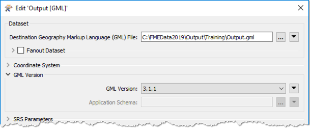

## 写模块参数 ##
像读模块一样，我们知道工作空间包含编写数据集的写模块，并且要写入的每种要素类型都显示在工作空间画布中：

要控制该写模块的操作方式，需要使用写模块参数。

### 查找写模块参数 ###
可以在生成新工作空间时单击“参数”来查找和设置写模块参数：

也可以在Workbench的“导航器”窗口中找到它们：

因为参数指的是相关格式的特定组成部分和特征，所以不同格式的写模块具有一组不同的控制参数。

### 设置写模块参数 ###
要在“导航器”窗口中编辑参数，请双击任何一个参数。这样做会打开一个对话框，可以在其中设置参数的值：

---

<!--Person X Says Section-->

<table style="border-spacing: 0px">
<tr>
<td style="vertical-align:middle;background-color:darkorange;border: 2px solid darkorange">
<i class="fa fa-quote-left fa-lg fa-pull-left fa-fw" style="color:white;padding-right: 12px;vertical-align:text-top"></i>
FME蜥蜴说...
</td>
</tr>

<tr>
<td style="border: 1px solid darkorange">
 <!-- Check version number in the example below with the screenshot about -->
像读模块一样，写模块参数控制数据集中的所有要素类型。例如，在上面的屏幕快照中，所有要素类型均为3.1.1版。 
  但是每种读模块和写模块要素类型都有其自己的设置（就像每杯咖啡都可以用奶油和糖调节一样）。我们将在下一章中找到有关信息。
</td>
</tr>
</table>
