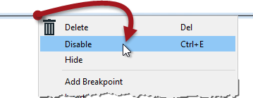
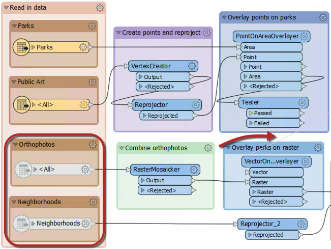

## 部分运行

部分运行是指仅执行工作空间的一个部分。一种方法是禁用画布中的对象以仅运行某些已启用的部分。另一种方法是使用名为“部分运行”的工具，当启用缓存运行工作空间时，该工具由弹出选项表示。

您使用的技术取决于工作空间的大小，以及您需要运行多少工作空间。您可以使用一种技术或另一种技术 - 或者您可以同时使用两种技术！

### 禁用的对象

如果设计正确，大型工作空间应由小的部分组成。通过禁用与​​所有其他组件的连接，可以隔离部分（或部分中的一部分）以进行测试。

通过右键单击对象（连接或要素类型）并选择“禁用”（或选择它并使用快捷键Ctrl + E），可以禁用对象（连接或要素类型）：

禁用的连接不起作用，就像它被删除一样，并且没有任何要素可以通过。可以对其他画布对象（例如转换器和要素类型）执行相同的禁用。甚至可以通过“导航”窗口禁用读模块/写模块。

这里作者禁用了两个连接（都来自Tester：Passed端口）和两个要素类型：

通过该设置，工作空间的顶部将一直运行直到（并包括）Tester。底部根本不会运行。禁用的要素类型不会显示任何数据，也不会从测试程序传递任何数据。

启用缓存后，作者可以检查部分工作空间而无需运行整个转换。（如此例）当禁用的部分占用了整个处理时间的大部分时，此要素是一个显着优势。

### 部分运行
部分运行的技术方面已经涵盖。但是，使用部分运行是工作空间测试的重要组成部分。您应该使用部分运行来逐步开发工作空间，并测试每个新部分以确保其正常工作。

部分运行对于避免从源头重新读取数据特别有用。尤其是当数据来自缓慢的远程位置（例如Web服务）时。创建缓存可以帮助增加工作空间的开发。

最后，将缓存另存为模板时，可以将其与工作空间一起保存 (File &gt; Save As Template, 选中Include Feature Caches). 这意味着可以使用上一个会话甚至其他作者的缓存重新运行工作空间！
