|  练习3 |  住宅垃圾收集区 |
| :--- | :--- |
| 数据 | 地址（Esri地理数据库），区域（MapInfo TAB） |
| 总体目标 | 为住宅垃圾收集创建边界 |
| 演示 | 读模块和写模块 |
| 启动工作空间 | C:\FMEData2018\Workspaces\DesktopBasic\Design-Ex3-Begin.fmw |
| 结束工作空间 | C:\FMEData2018\Workspaces\DesktopBasic\Design-Ex3-Complete.fmw |

在这里，我们继续一个重新定义垃圾收集计划的项目。

根据分区类型，在前两个练习中，我们使用各种转换器将地址划分为五个不同的组。然后我们将数据写入Geopackage并（可选）用FeatureReader / FeatureWriter转换器替换读写模块。

现在的任务是用多边形边界替换点要素组。

  
**1）打开工作空间副本**  
从上一个练习中打开工作空间。

如果您在其名称中为该工作空间指定了版本号，则应使用新版本号创建工作空间的副本。例如，如果您将其保存到GarbageCollection-v2.fmw，则创建一个名为GarbageCollection-v3.fmw的副本并打开它进行编辑。

或者，您可以打开工作空间C：\ FMEData2018 \ Workspaces \ DesktopBasic \ Design-Ex3-Begin.fmw：

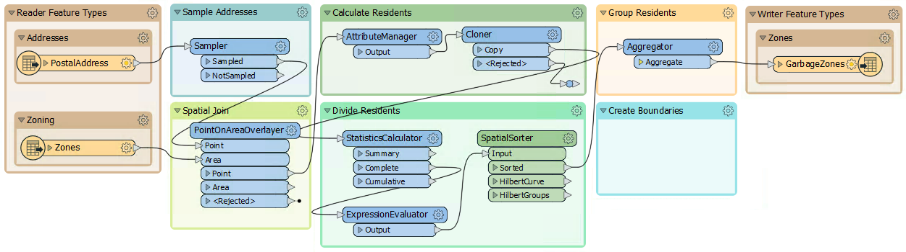

 **2) 运行工作空间**
 运行工作空间以完成写出数据。您可以根据需要检查输出数据集，方法是单击GarbageZones写模块要素类型，然后单击弹出菜单中的View Written Data按钮。

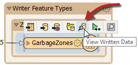

**3）添加HullReplacer**  
将HullReplacer转换器从“转换器”书签移动到“创建边界”书签。在Aggregator和FeatureWriter之间进行连接：

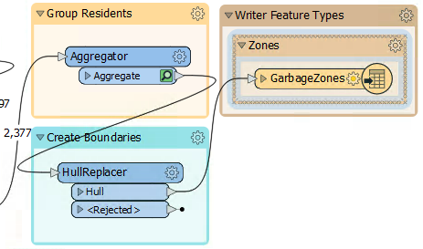

注意，由于HullReplacer是新放置的，因此它没有缓存。

 **4) Re-Run the Workspace**
 现在让我们重新运行工作空间。但是，我们可以只运行刚刚添加的新转换器，而不必重写输出数据。单击HullReplacer转换器，然后在弹出的图标上，单击Run To This：

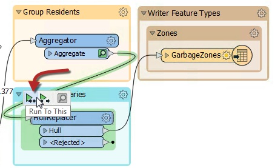

请注意悬停如何显示工作空间的哪些部分将运行。由于我们已经具有缓存到Aggregator的要素（假设自上次运行以来您尚未关闭工作空间），因此仅运行Aggregator和HullReplacer之间的部分。

<!--Tip Section-->

<table style="border-spacing: 0px">
<tr>
<td style="vertical-align:middle;background-color:darkorange;border: 2px solid darkorange">
<i class="fa fa-info-circle fa-lg fa-pull-left fa-fw" style="color:white;padding-right: 12px;vertical-align:text-top"></i>
技巧
</td>
</tr>

<tr>
<td style="border: 1px solid darkorange">

使用“Run To This”选项是在将数据写出之前检查转换的好方法，尤其是当您正在写数据库或在线资源时。

</td>
</tr>
</table>

---

单击HullReplacer:Hull输出端口上的缓存要素以确认数据。现在，输出包含多边形，以证明转换功能正常：

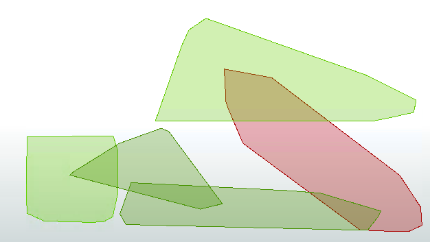

**5）清理重叠部分**  
输出的问题是所有多边形在某种程度上重叠。这需要修复，以便没有重叠。更重要的是，我们应该通过查看哪个组包含其大部分地址来检查重叠属于哪个区域。

因为这是意料之外的，我们还没有预留工作空间的区域。添加新书签（或移动当前为空的转换器书签）并将其命名为Clean Up Overlaps（清理重叠）：

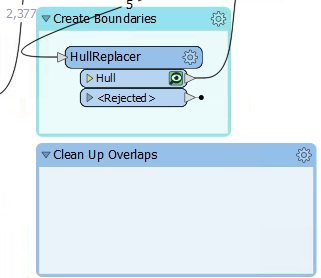

**6）添加AreaOnAreaOverlayer**  
可以使用AreaOnAreaOverlayer转换器对重叠部分进行切割，因此，将其中一个添加到新书签中，连接到HullReplacer转换器。检查参数并将**Attribute Accumulation Mode**设置为 _Drop Incoming Attributes_。

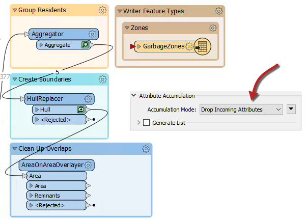

**7）添加PointOnAreaOverlayer**  
重叠现在是单独的要素，但我们还不知道它们应分配到哪个区域。应该是地址最多的那个; 例如，如果重叠包含来自组1的31个地址和来自组2的52个地址，则应将其分配给组2多边形。

我们可以通过使用PointOnAreaOverlayer来开始。这个转换器将让我们创建一个重叠包含的地址列表。

所以添加一个PointOnAreaOverlayer转换器。面要素将是AreaOnAreaOverlayer的输出。

点要素应该是地址的副本。获得这些的最简单方法是从SpatialSorter建立第二个连接：

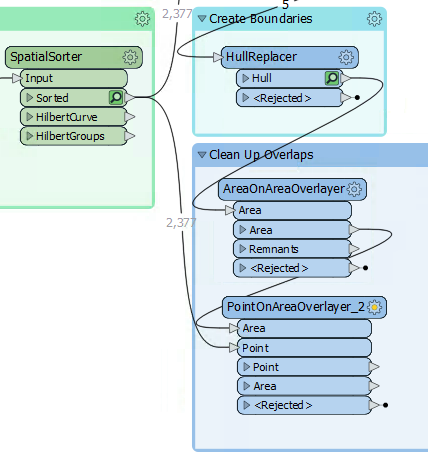

检查参数。在“Attribute Accumulation”下，设置以下参数：

| 合并属性\(Merge Attributes\) | Yes |
| :--- | :--- |
| 在输出'面'上生成列表\(Generate List on Output 'Area'\) | Yes |
| '面'列表名称\('Area'List Name\) | PointList |
| 选定的属性\(Selected Attributes\) | GroupID |

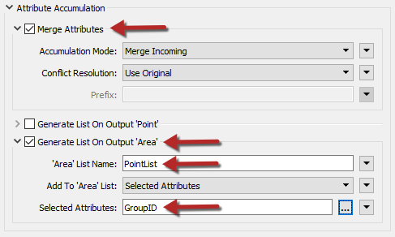

这样做将创建FME列表属性。列表属性是具有多个值的属性。此列表将包含落在多边形内的点要素（及其GroupID值）的记录。

通过在新的PointOnAreaOverlayer上运行工作空间来确认这是否正常工作。注意转换如何从两个缓存中提取数据; AreaOnAreaOverlayer和SpatialSorter转换器：

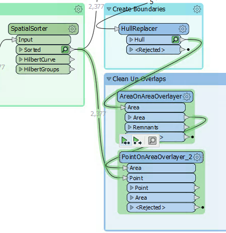

检查PointOnAreaOverlayer:Area 输出端口要素。 选择一个要素将显示（在“要素信息”窗口中）列表属性及其所有值。

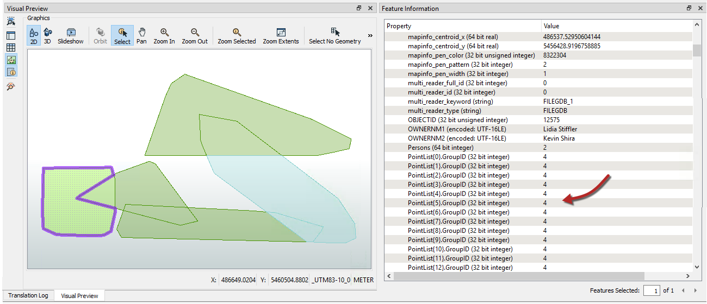

**8）添加ListHistogrammer**  
为了计算重叠上每个列表的最频繁GroupID，我们将使用ListHistogrammer转换器。

|  技巧 |
| :--- |
|  这不是常用的转换器，所以如果您不了解它，或者您担心FME中可用的大量转换器，请不要担心。您将通过练习了解有关这些转换器的更多信息。目前，使用部分运行的能力更为重要。 |

将ListHistogrammer转换器连接到PointOnAreaOverlayer:Area输出端口。检查参数并选择PointList{}.GroupID作为源属性：

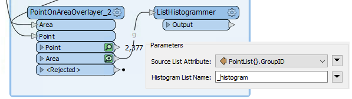

重新运行工作空间（从ListHistogrammer）并检查结果。请注意，创建了一个新的列表属性; 在列表顶部有最频繁GroupID的不同GroupID值的数量列表。所以我们只需要使用该GroupID来合并区域。

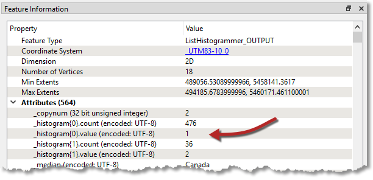

**9）添加Dissolver**  
最后添加Dissolver转换器以将这些要素合并在一起。将Dissolver连接到ListHistogrammer输出端口：

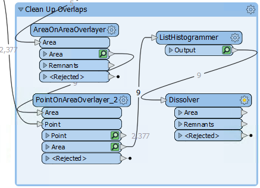

检查参数。在Group By下，选择属性\_histogram.value：

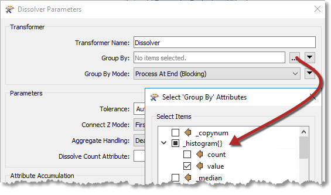

系统会提示您输入值; 这是我们想要的列表中的哪个项目。我们想要第一个元素，因为它具有最多的值，因此该字段应该设置为零（默认情况下将是这样）：

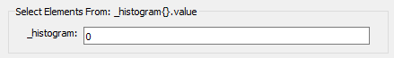

将工作空间运行到Dissolver并检查Dissolver:Area输出端口：

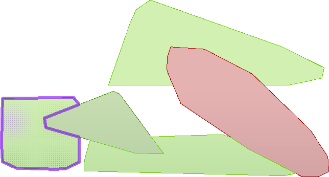

我们现在有五个多边形要素来表示垃圾收集区域，每个区域的居民数量大致相同。将Dissolver:Area端口连接到写模块要素类型，此工作空间几乎已完成。

---

<!--Updated Section--> 

<table style="border-spacing: 0px">
<tr>
<td style="vertical-align:middle;background-color:darkorange;border: 2px solid darkorange">
<i class="fa fa-bolt fa-lg fa-pull-left fa-fw" style="color:white;padding-right: 12px;vertical-align:text-top"></i>
2019.1更新
</td>
</tr>

<tr>
<td style="border: 1px solid darkorange">

我们不再使用它, 但是要注意，"Assume Input Is Clean" 参数已从FME 2019.1中删除。

</td>
</tr>
</table>

---

**10）删除Sampler**  
要完成项目，让我们来在完整数据集上运行工作空间, 但是首先让工作空间准备好进行生产。

过删除Sampler转换器, 确保已连接PostalAddress和PointOnAreaOverlayer:Point输入端口。

---

<!--Tip Section-->

<table style="border-spacing: 0px">
<tr>
<td style="vertical-align:middle;background-color:darkorange;border: 2px solid darkorange">
<i class="fa fa-info-circle fa-lg fa-pull-left fa-fw" style="color:white;padding-right: 12px;vertical-align:text-top"></i>
技巧
</td>
</tr>

<tr>
<td style="border: 1px solid darkorange">

您可以禁用它而不是删除Sampler。右键单击Sampler并选择Disable，然后像上面的步骤一样连接PostalAddress和PointOnAreaOverlayer。这样，如果您需要返回并进行一些调整，则可以轻松地再次采样数据集。

</td>
</tr>
</table>

---

在运行转换之前，由于PostalAddress数据集很大，因此请禁用要素缓存。单击“Run”按钮旁边的下拉菜单，然后单击“Enable Feature Cache”以将其禁用：

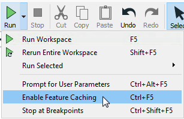

现在禁用了要素缓存，“Run”按钮将运行整个工作空间：

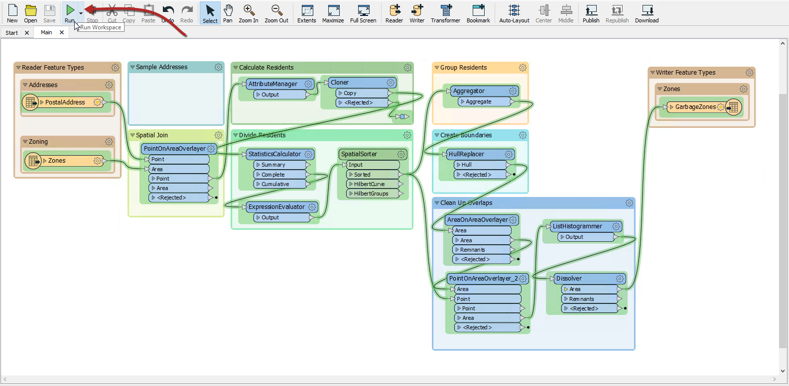

正如预期的那样，由于我们正在使用完整的数据集，结果看起来会有所不同：

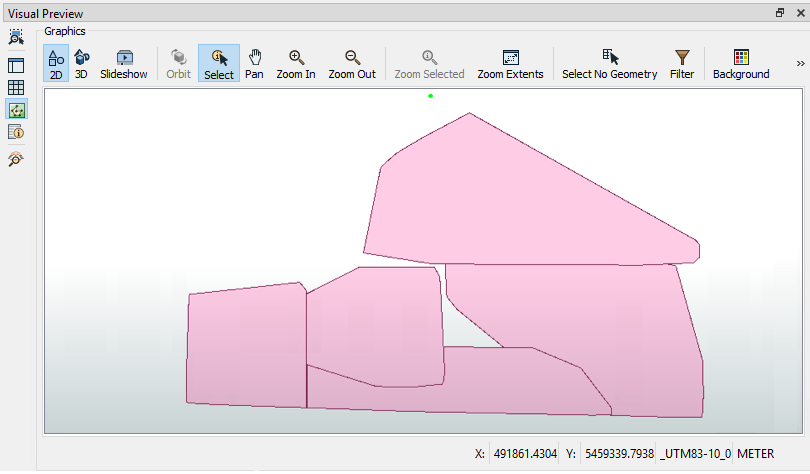

---

<!--Exercise Congratulations Section-->

<table style="border-spacing: 0px">
<tr>
<td style="vertical-align:middle;background-color:darkorange;border: 2px solid darkorange">
<i class="fa fa-thumbs-o-up fa-lg fa-pull-left fa-fw" style="color:white;padding-right: 12px;vertical-align:text-top"></i>
恭喜
</td>
</tr>

<tr>
<td style="border: 1px solid darkorange">

通过完成本练习，您已经了解了如何：
 
<ul><li>使用“运行到此”选项进行测试</li>
<li>禁用要素缓存</li>
<li>使用新的转换器：HullReplacer, ListHistogrammer, Dissolver</li>
<li>删除转换器</li></ul>

</td>
</tr>
</table>
