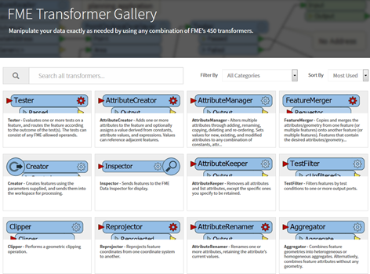

# 定位转换器 #
即使是经验丰富的FME用户也会发现转换器的完整列表令人望而生畏。在本节中，您将学会不再担心并喜欢转换器库。

FME拥有超过五百个转换器，具有很多功能; 可能比新用户实现的要多得多，其中大部分对他们非常有用。本节帮助您找到所需的变压器，即使您都不知道自己需要它。

虽然转换器列表看起来有点过于庞大，但不要惊慌！现实情况是，大多数用户关注的是与他们的日常工作流程相关的20-30个转换器。您不需要知道每个转换器也能有效地使用FME。
