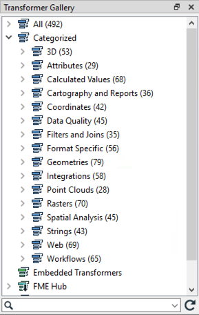
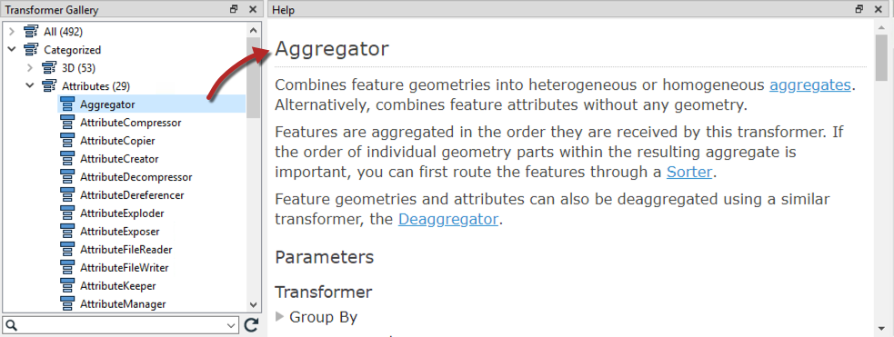

## 转换器库

转换器库窗口是开始寻找转换器的明显地方。这里可以通过多种方式找到转换器。

## 转换器类别

转换器类别是探索转换器列表的好起点。转换器按类别分组，以帮助找到与手头问题相关的转换器。

虽然所有这些都很重要，但最常用的转换器有以下几类：

* **属性**：属性/列表管理的操作
* **计算值**：返回计算值的操作
* **过滤器和连接**：用于分割和合并数据流的操作
* **几何图形**：创建几何图形或将其转换为不同几何图形类型的操作
* **空间分析**：返回空间分析结果的操作
* **字符串**：操作字符串内容的操作，包括日期

只需单击展开按钮即可显示特定类别中的所有转换器。

## 转换器帮助

FME Workbench帮助工具显示有关转换器的信息。只需单击转换器，然后按F1键打开帮助对话框。

此工具链接到FME Workbench，以便选择的转换器（在库中或画布上）触发要在“帮助”工具中显示的内容。

|  技巧 |
| :--- |
|  另一个有用且可打印的文档是[**FME转换器参考指南**](http://cdn.safe.com/resources/fme/FME-Transformer-Reference-Guide.pdf)。 |
