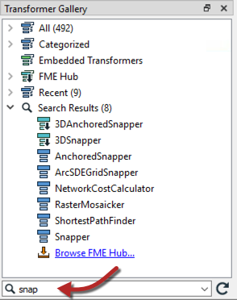
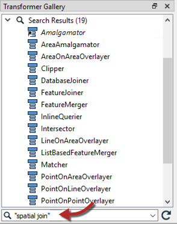
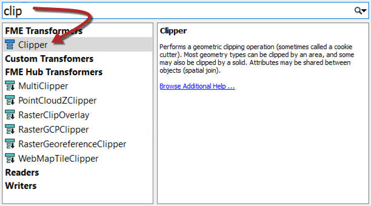
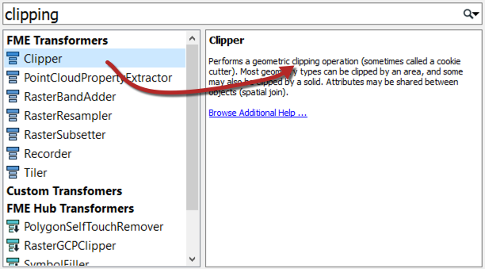
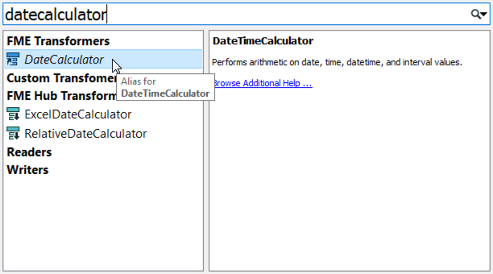
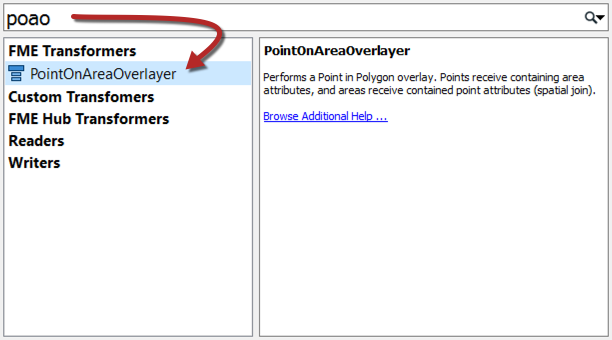
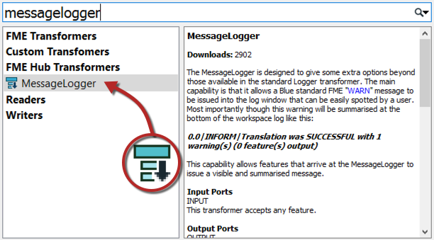

## 转换器搜索

转换器库和“快速添加”对话框中都有搜索功能。

### 转换器库搜索

要在转换器库中执行搜索，请输入搜索词，然后按<kbd>enter</kbd>键或单击搜索图标（双筒望远镜图标）。

转换器库搜索在名称和描述中搜索。因此，搜索项可能是转换器的确切名称，或者它可能是通用关键字，通常指的是功能：

搜索字词可以是完整字词或部分字词，也可以包含多个关键字，包括用于包含单个搜索引用的引号：

---

### 快速添加搜索

快速添加搜索字词也可以是完整或部分字词：

默认情况下，“快速添加”不会查找转换器描述，因此搜索项必须是转换器的实际名称：

但是，如果按<kbd>tab</kbd>键，“快速添加”将搜索转换器描述：

快速添加结果包括别名 - 例如，具有替代名称或已重命名的转换器 - 还包括在FME Hub中找到的转换器：

#### 驼峰式命名法

快速添加还允许使用驼峰式命名法的首字母作为快捷方式。驼峰式命名法是一个单个关键字由几个连接的单词组成的单词，每个单词保留一个大写的首字母; 例如AttributeFileWriter（AFW）或ShortestPathFinder（SPF）。

---

### FME Hub ###

FME Hub是一个在线工具，用于共享FME功能，例如自定义转换器，Web连接，模板，格式和包：

来自FME Hub的转换器在“快速添加”中显示，带有向下的小箭头，表示如果选择它们，将下载它们：

---

<!--New Section-->

<table style="border-spacing: 0px">
<tr>
<td style="vertical-align:middle;background-color:darkorange;border: 2px solid darkorange">
<i class="fa fa-bolt fa-lg fa-pull-left fa-fw" style="color:white;padding-right: 12px;vertical-align:text-top"></i>
新内容
</td>
</tr>

<tr>
<td style="border: 1px solid darkorange">

FME Hub的软件包是2019.0的新软件包。它们是在FME主要版本之外发布功能完整的组件的一种方式。软件包是完全可移植的，其中包含运行它们所需的所有必需依赖项。支持Python支持的转换器以及Workbench创建的项目。 
  可以像搜索自定义转换器一样搜索和下载软件包。它们在“快速添加”中用一个小框图标表示： 程序包在“导航器”窗口中有其自己的部分，以指示更新何时可用。 
  
  Packages have their own section on the Navigator window to denote when updates are available.

</td>
</tr>
</table>
