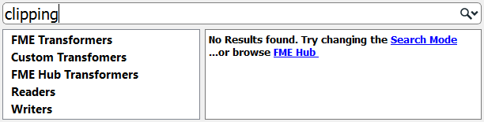

 

    <article class="markdown-body entry-content" itemprop="text"><h2>转换器搜索</h2>

转换器库和“快速添加”对话框中都有搜索功能。

<h3>转换器库搜索</h3>

要在转换器库中执行搜索，请输入搜索词，然后按键或单击搜索图标（双筒望远镜图标）。

转换器库搜索在名称和描述中搜索。因此，搜索项可能是转换器的确切名称，或者它可能是一般性的关键字，通常指的是功能：

搜索字词可以是完整字词或部分字词，也可以包含多个关键字，包括用于包含单个搜索引用的引号：

<h3>快速添加搜索</h3>

快速添加搜索字词也可以是完整或部分字词：

默认情况下，“快速添加”不会查找转换器描述，因此搜索项必须是转换器的实际名称：

但是，如果按&lt;TAB&gt;键，“快速添加”将搜索转换器描述：

快速添加结果包括别名 - 例如，具有替代名称或已重命名的转换器 - 还包括在FME中心中找到的转换器：

<table>
<tbody><tr>
<td>
<i></i>
消防队员Mapp说......
</td>
</tr>
<tr>
<td>

以防您不知道，FME Hub（hub.safe.com）是一个用于共享FME功能的工具，例如自定义转换器，Web连接和格式：
 集线器中的转换器显示在Quick Add中，带有一个小的向下 - 指向箭头，表示如果选择它们将被下载。

  
  </td>
</tr>
</tbody></table>

<h4>驼峰式命名法</h4>

快速添加还允许使用驼峰式命名法的首字母作为快捷方式。驼峰式命名法是一个单个关键字由几个连接的单词组成的单词，每个单词保留一个大写的首字母; 例如AttributeFileWriter（AFW）或ShortestPathFinder（SPF）。

<table>
<tbody><tr>
<td colspan="2">
<i></i>
Vector小姐说......
</td>
</tr>
<tr>
<td colspan="2">

试试这些问题，看看你是否可以搜索转换器。
 以下哪一项不属于转换器？
  <a href="http://52.73.3.37/fmedatastreaming/Manual/QAResponse2017.fmw?chapter=5&amp;question=1&amp;answer=1&amp;DestDataset_TEXTLINE=C%3A%5CFMEOutput%5CQAResponse.html" rel="nofollow">1.属性</a>
 <a href="http://52.73.3.37/fmedatastreaming/Manual/QAResponse2017.fmw?chapter=5&amp;question=1&amp;answer=2&amp;DestDataset_TEXTLINE=C%3A%5CFMEOutput%5CQAResponse.html" rel="nofollow">2.计算</a>
 <a href="http://52.73.3.37/fmedatastreaming/Manual/QAResponse2017.fmw?chapter=5&amp;question=1&amp;answer=3&amp;DestDataset_TEXTLINE=C%3A%5CFMEOutput%5CQAResponse.html" rel="nofollow">3.数据质量</a>
 <a href="http://52.73.3.37/fmedatastreaming/Manual/QAResponse2017.fmw?chapter=5&amp;question=1&amp;answer=4&amp;DestDataset_TEXTLINE=C%3A%5CFMEOutput%5CQAResponse.html" rel="nofollow">4.工作流程</a>
  这里有四个转换器和四个类别。将转换器与正确的类别匹配。

</td>
</tr>
<tr><td width="50%">场景</td><td>工具</td></tr>
<tr><td><a href="http://52.73.3.37/fmedatastreaming/Manual/QAResponse2017.fmw?chapter=5&amp;question=2&amp;answer=1&amp;DestDataset_TEXTLINE=C%3A%5CFMEOutput%5CQAResponse.html" rel="nofollow">Chopper</a></td><td>工作流程</td></tr>
<tr><td><a href="http://52.73.3.37/fmedatastreaming/Manual/QAResponse2017.fmw?chapter=5&amp;question=2&amp;answer=2&amp;DestDataset_TEXTLINE=C%3A%5CFMEOutput%5CQAResponse.html" rel="nofollow">Terminator</a></td><td>字符串</td></tr>
<tr><td><a href="http://52.73.3.37/fmedatastreaming/Manual/QAResponse2017.fmw?chapter=5&amp;question=2&amp;answer=3&amp;DestDataset_TEXTLINE=C%3A%5CFMEOutput%5CQAResponse.html" rel="nofollow">Matcher</a></td><td>几何图形</td></tr>
<tr><td><a href="http://52.73.3.37/fmedatastreaming/Manual/QAResponse2017.fmw?chapter=5&amp;question=2&amp;answer=4&amp;DestDataset_TEXTLINE=C%3A%5CFMEOutput%5CQAResponse.html" rel="nofollow">DateTimeConverter</a></td><td>数据质量</td></tr>

</tbody></table>
</article>
  

