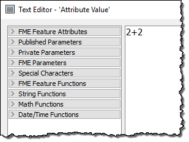

<html lang="zh-CN" class="translated-ltr"><head><meta http-equiv="Content-Type" content="text/html; charset=UTF-8">

  

    <article class="markdown-body entry-content" itemprop="text"><h1>构造属性</h1>

除了常量属性值，FME还允许您使用字符串操作和算术计算来构造值。通过单击“属性值”字段中的箭头并选择“打开文本编辑器”或“打开算术编辑器”来实现此过程：

此方法非常有用，因为该属性不再需要是固定值：它可以由现有属性，参数和常量的混合构成。

<h2>文本编辑器</h2>

文本编辑器 - 正如您所期望的那样 - 允许您构造文本值。它包括您需要的所有常用字符串处理功能，例如连接，修剪，填充和大小写更改。

文本编辑器如下所示：

在这里，用户通过将各种现有属性与一些固定字符（逗号）连接来构造地址字符串。

注意左侧的菜单。此处列出了现有属性，并通过双击将其添加到字符串中。另外，请注意其他菜单选项。也许文本最重要的是字符串函数：

这些是可用于操做正在使用的字符串的函数。例如，在这里，用户要确保使用的属性在使用时被裁剪:

<table>
<tbody><tr>
<td>
<i></i>
技巧
</td>
</tr>
<tr>
<td>

注意文本编辑器中的日期/时间函数，可用于操作日期，时间，日期时间字符串，包括TimeZone组件。

</td>
</tr>
</tbody></table>

<h2>算术编辑器</h2>

算术编辑器与文本编辑器非常相似，只是输入对话框的内容将被计算为算术表达式，并返回数值结果：

在这里，用户通过将每年的访客数量除以12来计算每月的公园访客数量。与文本编辑器一样，现有属性和算术函数是从左侧的菜单中获得的。

<table>
<tbody><tr>
<td>
<i></i>
警告
</td>
</tr>
<tr>
<td>

算术编辑器的内容 <strong>必须</strong> 形成一个可以用数学方法计算的算术表达式。

</td>
</tr>
</tbody></table>

<h3>FME要素函数</h3>

文本和算术编辑器菜单中的另一个项目是FME要素函数：

这些函数可以触及FME核心功能的核心。它们是构建转换器的基石; 是可以将值返回给编辑器的基本功能。

例如，@ Area（）函数返回当前要素的面积（假设它是多边形）。@CoordSys（）返回坐标系。它们是AreaCalculator和CoordinateSystemExtractor转换器的功能等价物。

一些函数返回字符串; 其他返回数值。因此，可用的函数取决于是使用文本编辑器还是算术编辑器。在上面的屏幕截图中，文本编辑器函数位于左侧，算术编辑器函数位于右侧。文本编辑器可以使用文本或数值; 算术编辑器只能接受数值。

FME要素函数非常有用，因为它们允许您直接在AttributeManager中构建处理，而不是使用单独的转换器。

<h3>替换其他转换器</h3>

集成的文本和算术编辑器为工作空间创建提供了很大的好处。它们允许属性创建函数直接在单个转换器中执行。

例如，AttributeManager文本编辑器可以用作StringConcatenator和ExpressionEvaluator转换器的直接替代。

AttributeManager还可以替换StringPadder和AttributeTrimmer转换器，尽管用户友好性稍差。如果在编辑器中使用FME要素函数，则此转换器也可以在技术上替换转换器，例如AreaCalculator，LengthCalculator，CoordinateCounter，TimeStamper等等。

这个特性通常是件好事。当尽可能多的外围操作直接集成到单个转换器中时，工作空间将更紧凑，定义更明确。但是，由于AttributeManager可以执行许多操作，因此使用最佳实践并确保其具有正确的注释也更为重要。

如果没有正确注释AttributeManager，则无法通过查看Workbench画布确定它正在执行的操作！

<table>
<tbody><tr>
<td>
<i></i>
Vector小姐说......
</td>
</tr>
<tr>
<td>

这是一个问题，看看你是否注意到了。查看编辑对话框的屏幕截图，告诉我返回属性的值是：
     
 <a href="http://52.73.3.37/fmedatastreaming/Manual/QAResponse2017.fmw?chapter=5&amp;question=3&amp;answer=1&amp;DestDataset_TEXTLINE=C%3A%5CFMEOutput%5CQAResponse.html" rel="nofollow">1. 2 + 2 </a> <a href="http://52.73.3.37/fmedatastreaming/Manual/QAResponse2017.fmw?chapter=5&amp;question=3&amp;answer=2&amp;DestDataset_TEXTLINE=C%3A%5CFMEOutput%5CQAResponse.html" rel="nofollow">2. 4 </a> <a href="http://52.73.3.37/fmedatastreaming/Manual/QAResponse2017.fmw?chapter=5&amp;question=3&amp;answer=3&amp;DestDataset_TEXTLINE=C%3A%5CFMEOutput%5CQAResponse.html" rel="nofollow">3. 4.0 </a> <a href="http://52.73.3.37/fmedatastreaming/Manual/QAResponse2017.fmw?chapter=5&amp;question=3&amp;answer=4&amp;DestDataset_TEXTLINE=C%3A%5CFMEOutput%5CQAResponse.html" rel="nofollow">4.错误！</a>  

</td>
</tr>
</tbody></table>

</article>
  

</html>
