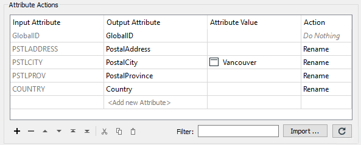
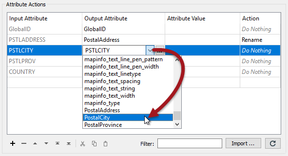
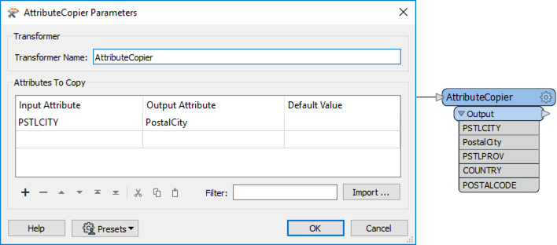
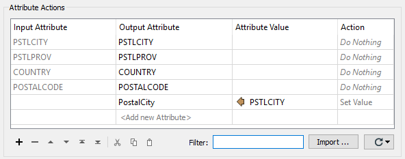

# 重命名和复制属性

重命名和 - 在较小程度上 - 复制属性也是FME中的关键属性功能。重命名属性时，它在其先前名称下不再存在; 复制时，它既存在于新名称中，也存在于旧名称中。

能够重命名属性的转换器是：

|  转换器 |  功能 |
| :--- | :--- |
| AttributeCopier | 复制 |
| AttributeCreator | 复制 |
| AttributeManager | 复制并重命名 |
| AttributeRenamer | 重命名 |

## 重命名

重命名的基本目的是手动为所选属性输入新名称。旧属性将被删除并替换为新命名的属性：

这里，AttributeManager用于通过为输出属性输入不同的名称来重命名多个字段。操作自动设置为重命名。请注意，用户还为PSTLCITY / PostalCity属性输入新的常量值。

当读模块模式（'我们拥有的'）需要重命名以匹配写模块模式（'我们想要的'）时，这种行为显然是有用的。

|  技巧 |
| :--- |
|  虽然您可以在“输出属性”字段中手动键入新属性名称，但如果转换器连接到具有正确属性的写模块要素类型，则其属性名称将自动可供选择：  |

## 复制

根据转换器的不同，复制属性可以是两种样式之一。

这里的AttributeCopier包括选择现有属性并为其输入新名称。同样，当连接到写模块要素类型时，可以使用其模式。

注意转换器输出上的PSTLCITY和PostalCity是如何存在的，证明它正在复制属性而不是重命名。

|  技巧 |
| :--- |
|  您可以（如上所述）在AttributeCopier中输入常量属性值，但实际上在这种情况下它几乎不是复制操作; 它更像是一个属性创建任务。 |

对于其他转换器，设置样式相反：创建一个新属性，并为其指定一个现有属性的值：

在此AttributeManager转换器中，用户创建一个新属性（PostalCity）并从另一个属性（PSTLCITY）中为其分配值。实际上，他们已经复制了原始属性。

