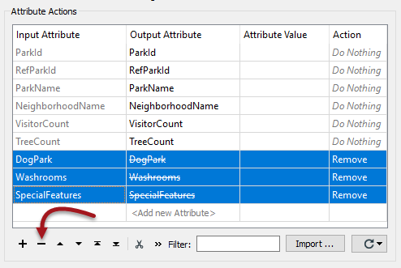

## 删除属性

删除属性可能被视为FME中不太重要的任务。这是因为 - 对于手动属性模式 - 只将写模块中定义的属性写入输出; 只需忽略不需要的额外属性。

但是，删除属性确实带来了有用的好处：

* 删除不需要的属性可以整理工作空间并使其更易于理解
* 工作空间是对象和模式的复杂网络。删除属性可简化此网络，并使Workbench界面更具响应性
* 所有数据处理都会产生时间和内存成本。删除属性意味着处理的数据更少，因此FME引擎执行速度更快

|  技巧 |
| :--- |
|  读模块要素类型具有隐藏模式中属性的参数。这有助于整理工作空间，但无助于提高转换性能。但是，某些格式（主要是数据库）也有“要读取的属性”的设置，使用它将有助于提高性能。 |

可以删除属性的转换器是：

* AttributeKeeper
* AttributeManager
* AttributeRemover
* BulkAttributeRemover

### 删除属性

AttributeManager和AttributeRemover具有相同的技术; 选择要删除的属性：

通过选择属性并单击 - 按钮，可以在AttributeManager中删除属性。或者，您可以将操作字段从“ _不执行任何_操作”更改为“删除”。

请注意，上面已删除了三个属性。输出属性（选中时）显示已删除的名称，表示它不再存在。

### 保留属性

AttributeKeeper转换器执行相同的功能，但从相反的方向接近它。它允许用户指定**不**删除哪些属性; 换句话说，这个转换器允许用户指定要保留的转换器。

因此，应该在要删除一个或两个属性的情况下使用AttributeManager，但保留大部分属性。当要删除大多数属性时，应使用AttributeKeeper，并且只保留其中的一个或两个。

### 批量属性删除

BulkAttributeRemover - 与BulkAttributeRenamer一样 - 允许用户对多个属性执行处理。在这种情况下，用户不是能够选择所有属性，而是输入字符串匹配表达式来定义要删除的属性：

在这里，用户正在删除名称以“Count”结尾的所有属性。

