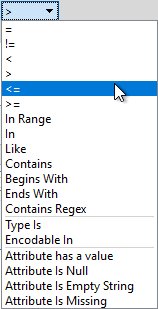

## The Tester和TestFilter转换器 ##

Tester和TestFilter是条件过滤的两个关键转换器。它们测试属性值的值。

### Tester ###

Tester转换器通常用于产生“是/否”结果的单次测试。

例如，在这里我们希望根据Snowfall属性的值是否大于150毫米（约6英寸）来决定是否将扫雪机发送到特定道路：

如果降雪量大于150，道路要素将通过测试，并将发送扫雪机。

---

#### 多个子句

Tester中的每个子句都是一个允许通过/失败结果的单独测试。例如，以下每个条件可能是单独的测试：

* 有超过100毫米（4英寸）的降雪？
* 这是一条主要道路吗？
* 温度是否低于零摄氏度？
* 上一次使用沙子是否超过24小时？

但是，测试程序允许组合多个测试，其中用户可以使用AND和OR语句组合任意数量的子句。因此，我可能会问：

* 这是一条主道路并且积雪超过100毫米吗？

Tester还允许使用所谓的复合测试混合AND和OR语句。例如：

* 这是一条主干道AND\(积雪是否超过100毫米？OR\(温度是否低于零AND并且道路（用沙子）经过了24小时以上的处理）)？

但是 - 无论测试变得多么复杂 - 它仍然会导致单个是/否（二进制）结果; 要素将通过或未通过这组测试。

还值得记住的是，我们不仅限于简单的相等测试（A = B）; 在上面，还有“大于”和“小于”的测试。那是因为有许多不同的运算符可用于测试子句。

---

<!--Warning Section--> 

<table style="border-spacing: 0px">
<tr>
<td style="vertical-align:middle;background-color:darkorange;border: 2px solid darkorange">
<i class="fa fa-exclamation-triangle fa-lg fa-pull-left fa-fw" style="color:white;padding-right: 12px;vertical-align:text-top"></i>

</td>
</tr>

<tr>
<td style="border: 1px solid darkorange">

请注意，您可以在“逻辑”列中键入值，也可以从下拉列表中选择它们。这意味着您不受限于基本的单圆括号，下拉框会让您相信它!

</td>
</tr>
</table>

---

<!--Updated Section-->

<table style="border-spacing: 0px"><tr><td style="vertical-align:middle;background-color:darkorange;border: 2px solid darkorange"><i class="fa fa-bolt fa-lg fa-pull-left fa-fw" style="color:white;padding-right: 12px;vertical-align:text-top"></i>2019.1更新</td></tr>

<tr><td style="border: 1px solid darkorange">在2019.0中使用多个子句构建测试时，将鼠标悬停在逻辑列的任何部分都可以将整个逻辑视为工具提示。在FME 2019.1中，整个逻辑现在显示在下面的文本框中：  

  表达式中的数字表示测试字句表中的行号。因此，“ 1 AND 2”表示第1行和第2行中的测试子句（AND表示两个子句都必须通过才能使整个要素通过。） 
  另外请注意，在2019.1中，您还可以通过直接编辑复合表达式来调整测试组合。为此，只需要用户单击“编辑”按钮并键入一个新表达式即可。有经验的用户会发现使用“逻辑”列下拉选项的速度更快。 
  逻辑列和复合表达式字段是彼此的镜像。对任何一个的任何更改都反映在另一个中。例如，在上面，如果我在逻辑列（第二行）中将AND更改为OR，则复合表达式将更改以匹配。相反，如果我将复合表达式更改为1 AND（2 OR 3），则测试子句将更改以匹配，包括删除现在未使用的第4行。
</td></tr></table>

---

#### 运算符

Tester转换器（或许多其他使用Tester对话框的位置）中可用的运算符列表如下所示：

除了通常的运算符之外，还有一些基于SQL where子句的运算符。这些包括:

* In
* Like
* Contains
* Begins With
* Ends With
* Contains Regex

...还有其他测试可以检查属性和值的存在：

* 属性有一个值
* 属性为空
* 属性为空字符串
* 属性缺失

---

<!--Tip Section-->

<table style="border-spacing: 0px">
<tr>
<td style="vertical-align:middle;background-color:darkorange;border: 2px solid darkorange">
<i class="fa fa-info-circle fa-lg fa-pull-left fa-fw" style="color:white;padding-right: 12px;vertical-align:text-top"></i>
技巧
</td>
</tr>

<tr>
<td style="border: 1px solid darkorange">

“属性具有值Attribute has a value”与其他三个测试相反；例如，此属性不是Null，并且它不是一个空字符串，并且它也不缺失。顺便说一句，“缺失”表示该属性在要测试的要素上根本不存在。

</td>
</tr>
</table>

---

<!--Tip Section-->

<table style="border-spacing: 0px">
<tr>
<td style="vertical-align:middle;background-color:darkorange;border: 2px solid darkorange">
<i class="fa fa-info-circle fa-lg fa-pull-left fa-fw" style="color:white;padding-right: 12px;vertical-align:text-top"></i>
技巧
</td>
</tr>

<tr>
<td style="border: 1px solid darkorange">

“包含正则表达式Contains Regex”表示仅字符串的一部分需要匹配。例如...
<pre>
属性值:  abcd
搜索字符串:    ^ab
包含正则表达式:  Passed
</pre>
例如，整个字符串不需要匹配。

</td>
</tr>
</table>

---

### TestFilter ###
TestFilter允许测试许多条件，每个条件都可以有许多测试条款。每个条件都有一个输出端口，还有一个额外的输出端口，用于在所有测试条件下失败的要素。

TestFilter与编程或脚本语言中的CASE或SWITCH命令非常相似。在Workbench中它看起来像这样：

请注意，有多个条件，每个条件都有一个输出端口。每个条件/端口组合相当于一个Tester转换器; 因此，TestFilter是将多个Tester转换器合而为一的好方法。

TestFilter输出端口可以给出自定义名称，而不是简单的PASSED / FAILED，这是该转换器相比Tester的另一个优势。

TestFilter具有Tester可用的全套运算符，例如相等，大于，小于等等。每个条件依次进行测试。

通过的要素通过匹配的输出端口输出。失败的要素将发送到列表中的下一个条件。因此，以正确的顺序获得条件非常重要。

<table>
  <thead>
    <tr>
      <th style="text-align:left">FME蜥蜴说...</th>
    </tr>
  </thead>
  <tbody>
    <tr>
      <td style="text-align:left">
        
TestFilter非常适合通过一系列级联条件过滤要素，例如，这里有一组测试可以再次确定是否派出扫雪机：
           
           - 降雪量超过150毫米？
           - 降雪量超过100毫米并且这是一条干道吗？
           - 温度是否低于零摄氏度并且是否在24小时前使用了沙子

        

           
           这是一套级联测试，因为如果有超过150毫米的雪，扫雪机就会被送出去; 您不需要测试任何其他条件。因此测试顺序非常重要。如果每次测试都失败，那么扫雪机不会派出。
          

      </td>
    </tr>
  </tbody>
</table>如果使用上面的降雪示例，您使用了三个Tester转换器，则可以节省工作区画布上的空间，通过仅使用一个TestFilter替换该设置。

|  FME蜥蜴说... |
| :--- |
|  因为TestFilter可以执行单个测试（以及多个测试），所以可以完全使用它而不是Tester转换器。 |

