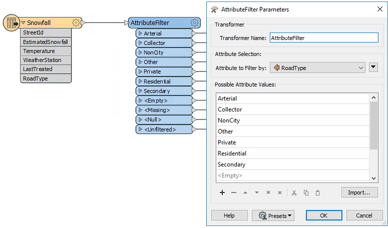
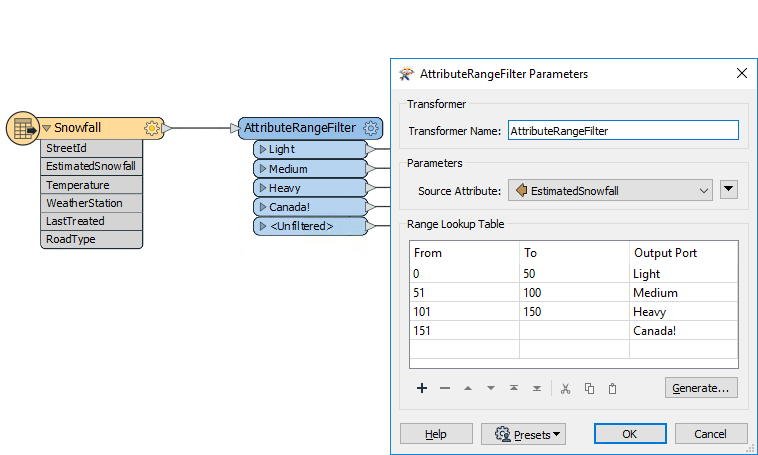
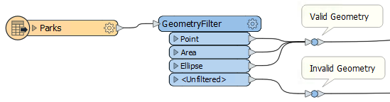
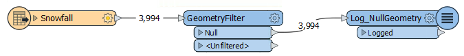

## 其他主要过滤转换器

Tester和TestFilter不是唯一有用的过滤转换器。

### AttributeFilter
AttributeFilter转换器通过所选属性中的值来定向要素。它不是二进制测试（是/否），而是一种为单个属性分隔多个值的方法，例如：

* 那条道路是主干道，联络道路，非城市的，其他，私人的，住宅区道路还是二级公路 ？

如果您使用七个Tester转换器来分隔这些数据，则可以节省工作区画布上的空间，并仅使用一个TestFilter替换该设置。

---

<!--Tip Section-->

<table style="border-spacing: 0px">
<tr>
<td style="vertical-align:middle;background-color:darkorange;border: 2px solid darkorange">
<i class="fa fa-info-circle fa-lg fa-pull-left fa-fw" style="color:white;padding-right: 12px;vertical-align:text-top"></i>
技巧
</td>
</tr>

<tr>
<td style="border: 1px solid darkorange">

使用导入...按钮可以快速添加现有数据集中的属性。

</td>
</tr>
</table>

---

<!--Person X Says Section-->

<table style="border-spacing: 0px">
<tr>
<td style="vertical-align:middle;background-color:darkorange;border: 2px solid darkorange">
<i class="fa fa-quote-left fa-lg fa-pull-left fa-fw" style="color:white;padding-right: 12px;vertical-align:text-top"></i>
FME蜥蜴说...
</td>
</tr>

<tr>
<td style="border: 1px solid darkorange">

在几乎所有使用多个Tester转换器的场景中，可以使用不同的过滤转换器来实现相同的结果，但在画布上使用的空间要少得多。
</td>
</tr>
</table>

---

AttributeFilter也可以使用处理数值; 但是，它唯一的“运算符”是求等价\(=\)，所以你会很少用它来进行算术测试。在这种情况下，更好的解决方案是AttributeRangeFilter。

### AttributeRangeFilter
AttributeRangeFilter执行与AttributeFilter相同的操作，除了它可以处理一系列数值而不是简单的一对一匹配。

例如，我们可能希望根据一系列降雪值来分离数据，如下所示：

请注意，AttributeRangeFilter参数对话框有一个Generate按钮，可以从一组用户定义的区段自动生成范围。

---

### GeometryFilter
GeometryFilter基于几何类型定向要素; 例如，点，线，面，椭圆：

它甚至可以根据空几何对象（表格记录）过滤数据：

GeometryFilter对以下内容非常有用：

* 过滤掉不需要的几何类型; 例如，在使用AreaBuilder转换器之前删除非线性要素
* 根据允许类型列表验证几何对象; 例如，数据集被约束到点或面要素（上图）
* 划分几何类型以写入单独的目标要素类型; 例如，写入到有几何限制的格式（如Esri Shapefile）时

---

<!--Person X Says Section-->

<table style="border-spacing: 0px">
<tr>
<td style="vertical-align:middle;background-color:darkorange;border: 2px solid darkorange">
<i class="fa fa-quote-left fa-lg fa-pull-left fa-fw" style="color:white;padding-right: 12px;vertical-align:text-top"></i>
FFME蜥蜴说...
</td>
</tr>

<tr>
<td style="border: 1px solid darkorange">

如果Tester，TestFilter和AttributeFilter都根据属性条件过滤要素，那么有什么区别？我什么时候会用到它们？
  最好的解决方案是在Safe Software博客上查看这两篇文章：
 - <a href="https://www.safe.com/blog/2013/03/fmeevangelist113/">FME中的条件处理E</a>
 - <a href="https://www.safe.com/blog/2019/03/test-clauses-2019-evangelist186/">重做测试字句: FME 2019中的数据过滤
</a>
  还有一个有用的表格，我放在一起：

</td>
</tr>
</table>

<table style="font-size:smaller;font-family:serif" border="1">
<tbody>
<tr style="height: 15.0pt;" valign="bottom">
<td style="height: 15.0pt; width: 103pt;" width="137" height="20"></td>
<td style="width: 130pt;" colspan="2" width="173" align="center">单一测试</td>
<td style="width: 130pt;" colspan="2" width="173" align="center">多次测试</td>
<td style="width: 77pt;" colspan="2" width="103" align="center">测试类型</td>
<td style="width: 63pt;" width="84" align="center">运算符</td>
<td style="width: 63pt;" width="84" align="center">属性</td>
</tr>
<tr style="height: 15.0pt;" valign="bottom">
<td></td>
<td align="center">单一 子句</td>
<td align="center">多个 子句</td>
<td align="center">单一 子句</td>
<td align="center">多个 子句</td>
<td align="center">字符串</td>
<td align="center">数字</td>
<td></td>
<td></td>
</tr>
<tr style="height: 15.0pt;" valign="bottom">
<td>Tester</td>
<td align="center">Y</td>
<td align="center">Y</td>
<td align="center">–</td>
<td align="center">–</td>
<td align="center">Y</td>
<td align="center">Y</td>
<td align="center">16</td>
<td align="center">多个</td>
</tr>
<tr style="height: 15.0pt;" valign="bottom">
<td>TestFilter</td>
<td align="center">Y</td>
<td align="center">Y</td>
<td align="center">Y</td>
<td align="center">Y</td>
<td align="center">Y</td>
<td align="center">Y</td>
<td align="center">16</td>
<td align="center">多个</td>
</tr>
<tr style="height: 15.0pt;" valign="bottom">
<td>AttributeFilter</td>
<td align="center">Y</td>
<td align="center">Y</td>
<td align="center">–</td>
<td align="center">–</td>
<td align="center">Y</td>
<td align="center">–</td>
<td align="center">1</td>
<td align="center">1</td>
</tr>
<tr style="height: 15.0pt;" valign="bottom">
<td>AttributeRangeFilter</td>
<td align="center">Y</td>
<td align="center">Y</td>
<td align="center">–</td>
<td align="center">–</td>
<td align="center">–</td>
<td align="center">Y</td>
<td align="center">6</td>
<td align="center">1</td>
</tr>
</tbody>
</table>
