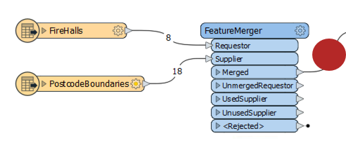

## 基于空间的连接转换器 ##

多个转换器可以通过空间关系连接数据。您使用哪个取决于要测试的空间关系和您的确切连接要求。以下是一些主要的转换器。

### Overlayers ###
有许多不同的“overlaye”转换器，每个转换器处理不同形式的重叠层。

例如，PointOnAreaOverlayer在落在面（多边形）要素内的点上执行空间连接。此操作有时称为“多边形点”重叠。

正如帮助解释的那样，“每个点都接收包含它的面的属性，每个包含面接收它包含的每个点的属性。”

中转站(TransitStation)要素在这里提供了邮政编码（CFSAUID），具体取决于它们落入哪个PostcodeBoundary多边形。

"_overlaps"属性是此转换器的另一个有用结果。它告诉我们每个站落入多少个多边形; 在这种情况下，重叠的邮政编码可能被具有多于一个重叠的站点发现。

相反，面输出将具有 "_overlaps" 属性，该属性将告诉我们每个邮政编码中有多少站点。

---

### NeighborFinder ###
NeighborFinder转换器基于临近关系执行空间连接。在这里，NeighborFinder用于识别每个中转站最近的消防站：

消防站号码，名称，地址和电话号码属性将合并到每个设施（Facility）要素以及许多有用的属性（并非全部显示），记录最近的消防站的X/Y坐标，方向和距离。

NeighborFinder的参数包括指定关系的最大距离或要查找的最大邻居数的能力。

---

### FeatureReader ###
FeatureReader是DatabaseJoiner转换器的空间等价物。它从外部数据集读取，并基于初始要素和数据集中的要素之间的空间关系形成匹配。

一个区别是输出不是原始要素，而是查询要素; 因此命名为FeatureReader:

例如，这里使用FeatureReader来执行中转站和邮政编码的相同叠加。PostcodeBoundaries要素被读入工作空间，用于对中转站进行空间查询的一种方法（地理数据库中的一个表）。检索站点时将使用它们所属的邮政编码要素的属性。

这也可以作为一种过滤器的形式，因为除非站点落在邮政编码边界内，否则不会输出。

---

### SpatialFilter ###
SpatialFilter - 顾名思义 - 根据空间关系过滤数据。但是，它也会将属性从一个要素合并到另一个要素，因此可以说是一种空间连接。

重要的是连接Passed和Failed输出端口，除非您还要过滤数据。

---

<!--Person X Says Section-->

<table style="border-spacing: 0px">
<tr>
<td style="vertical-align:middle;background-color:darkorange;border: 2px solid darkorange">
<i class="fa fa-quote-left fa-lg fa-pull-left fa-fw" style="color:white;padding-right: 12px;vertical-align:text-top"></i>
Vector小姐说...
</td>
</tr>

<tr>
<td style="border: 1px solid darkorange">

这是关于数据连接的问题。看下面的截图，然后回答输出连接中会出现多少要素...
  
  <a href="http://52.73.3.37/fmedatastreaming/Manual/QAResponse2017.fmw?chapter=5&question=6&answer=1&DestDataset_TEXTLINE=C%3A%5CFMEOutput%5CQAResponse.html">1. 8</a>
 <a href="http://52.73.3.37/fmedatastreaming/Manual/QAResponse2017.fmw?chapter=5&question=6&answer=2&DestDataset_TEXTLINE=C%3A%5CFMEOutput%5CQAResponse.html">2. 18</a>
 <a href="http://52.73.3.37/fmedatastreaming/Manual/QAResponse2017.fmw?chapter=5&question=6&answer=3&DestDataset_TEXTLINE=C%3A%5CFMEOutput%5CQAResponse.html">3. 26</a>
 <a href="http://52.73.3.37/fmedatastreaming/Manual/QAResponse2017.fmw?chapter=5&question=6&answer=4&DestDataset_TEXTLINE=C%3A%5CFMEOutput%5CQAResponse.html">4. 说不清楚</a>

</td>
</tr>
</table>
