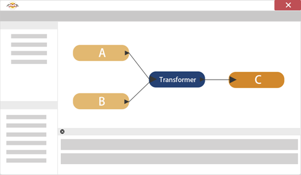

# 数据连接

将数据连接在一起的转换器在FME中也非常常用。它与过滤有关，转换器类别称为过滤和连接。

## 什么是数据连接？

过滤转换器将数据分成不同的流，而其他转换器将数据流组合在一起，根据一组用户定义的条件合并数据。这里（例如）传入流A和B连接在一起形成一个新流C：

除了将两个连接绘制到同一输入端口以合并FME Workbench中的数据外，还需要做更多的事情。以这种方式连接数据流只会将数据合并成单个流，而不会将它们融合在一起。您可能知道这是数据的并集。

---

要合并数据，必须为连接的基础定义关系，这是通过多个转换器中的一个来完成的。

这些转换器不仅允许合并工作空间正在处理的数据，还可以合并数据库或其他外部数据集的连接。

FME中的连接可以基于匹配的属性值（DatabaseJoiner或FeatureMerger / FeatureJoiner），也可以基于空间关系，例如要素之间的重叠或从一个要素到另一个要素的近似度（NeighborFinder或SpatialRelator）。
