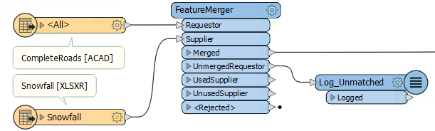
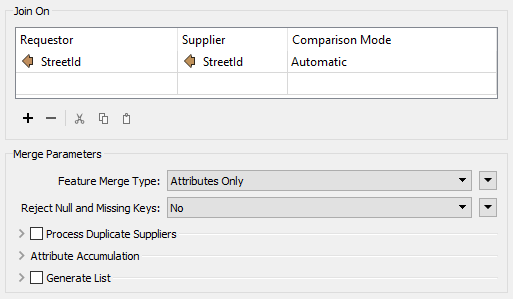
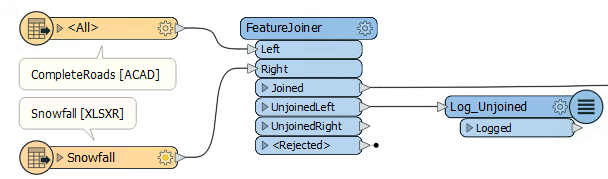
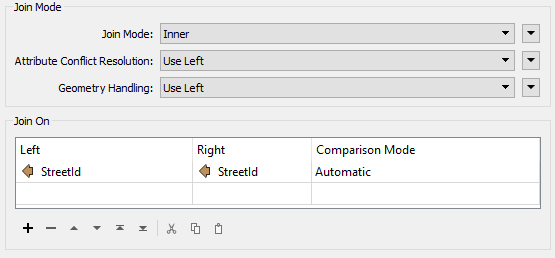
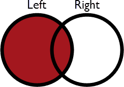
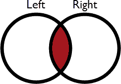
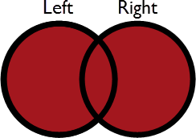
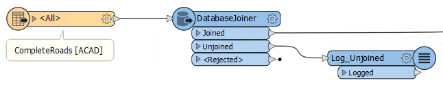
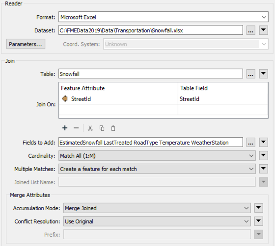
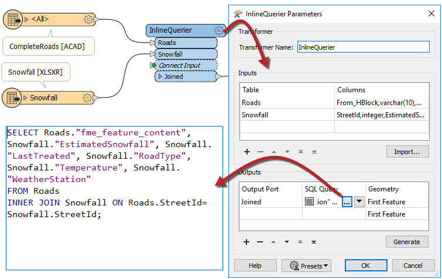

## 基于键的转换器连接

多个转换器可以通过匹配属性值（键）来连接数据。其中一些更倾向于几何对象，而另一些则更像SQL风格。一些在一个工作空间内连接数据流，而另一些则将一个数据流连接到外部数据库。

您使用哪种方法取决于您的连接要求和性能需求。

## FeatureMerger

FeatureMerger是一个转换器，用于根据键字段匹配连接工作空间中的两个（或多个）数据流。

例如，这里的道路数据集具有StreetId编号。FeatureMerger用于将降雪信息电子表格中的信息组合到道路数据上：

FeatureMerger的参数对话框如下所示：

此屏幕截图显示使用StreetId作为键进行连接。具有匹配降雪记录的所有Requestor（Road）要素都通过Merged输出端口输出。没有匹配的所有Road要素都通过UnmergedRequestor端口输出以进行检查，以确定未发生匹配的原因。

还有其他参数可以处理信息冲突，重复键，以及是否仅合并属性或几何对象。

## FeatureJoiner

FeatureJoiner是另一个转换器，用于根据键字段匹配连接工作空间中的两个数据流。

例如，在这里，FeatureJoiner中的Roads / Snowfall相同。转换器的参数如下所示：

如您所见，此转换器更多地基于传统的SQL查询。Join Mode参数可以采用以下三个值之一：

| 模式 | 描述 | 描画 | Joined输出 | Unjoined Left | Unjoined Right |
| :--- | :--- | :--- | :--- | :--- | :--- |
| 左\(Left\) | 左侧要素会查找匹配项，无论它们是否找到匹配项，都会输出 | [] | 所有匹配以及不匹配的左侧要素 | 无 | 未使用的右侧要素 |
| 内部\(Inner\) | 左侧要素会查找匹配项，如果找到则会输出 | [] | 仅所有匹配项 | 不匹配的左侧要素 | 未使用的右侧要素 |
| 完全\(Full\) | 左侧和右侧两者都通过Joined输出端口输出，无论它们是否找到连接 | [] | 所有匹配以及不匹配的左右侧要素 | 无 | 无 |

您可能熟悉的其他术语是_外部连接_和_右侧连接_。外部联接只是完全连接在此处所做的不同名称。要执行右侧连接，您可以切换将哪些要素发送到哪个输入端口并使用“左侧连接”选项。

|  警告 |
| :--- |
|  这里要注意的关键是为每次发生的匹配输出一个要素。 例如，如果1道路要素匹配5个降雪记录，则将有5个要素输出为已连接。  Joined要素始终作为连接输出。Left，Inner和Full实际上只控制Joined输出中包含哪些不匹配的记录。 |

使用左连接时，用户要么认为所有道路都有匹配的降雪记录，要么如果没有匹配也无关紧要。实际上，Unjoined Left输出端口不会显示任何要素。

如果必须确保匹配，则所选模式应为内部\(Inner\)。然后，离开Unjoined Left输出端口的记录可被视为错误，并调查为什么没有匹配。

与FeatureMerger一样，有一些参数可以处理信息冲突以及是否仅合并属性或几何对象。

|  技巧 |
| :--- |
|  因此，FeatureMerger和FeatureJoiner之间的关键区别在于有多个匹配会发生什么。  |
|  如果FeatureJoiner有多个匹配项，它将输出多个要素。  |
|  如果FeatureMerger有多个匹配项，它将仅输出一个要素。该要素将只有一个匹配的记录，或匹配的记录列表，具体取决于Process Duplicate Suppliers参数。 |

## DatabaseJoiner

DatabaseJoiner转换器与FeatureMerger和FeatureJoiner不同，因为它不是合并两个要素流，而是将一个（或多个）数据流与来自外部数据库的记录合并。

以下是与上面的FeatureMerger相同的示例。在这种情况下，道路要素直接从Excel电子表格中的表格获取降雪数据：

DatabaseJoiner的参数对话框如下所示：

同样，从要素和数据库表中使用AddressID以促进两者之间的合并。

与其他转换器一样，有一些参数可以控制聚合的属性以及如何解决冲突。

|  FME蜥蜴说... |
| :--- |
|  DatabaseJoiner与FeatureMerger相比具有许多优势。首先，它具有控制如何处理多个匹配的参数，以及用于优化数据库查询的参数。  |
|  其次，它允许连接要素而无需将整个数据集读入工作空间。FME可以只查询数据库并选择所需的单个记录。这可以大大提高性能。  |
|  当然，它确实要求提供者\(supplier \)记录以适当的数据库格式存储！ |

## InlineQuerier

InlineQuerier转换器接受工作空间中的要素并生成临时数据库。使用该数据库，可以在多个表中应用所需的任何SQL命令（包括连接）：

InlineQuerier具有明显的优势，在单个转换器中允许它的输入重复使用多次; 而多连接则需要多个FeatureJoiner转换器。但是，生成该初始数据库会产生性能开销。

---

<!--Tip Section-->

<table style="border-spacing: 0px">
<tr>
<td style="vertical-align:middle;background-color:darkorange;border: 2px solid darkorange">
<i class="fa fa-info-circle fa-lg fa-pull-left fa-fw" style="color:white;padding-right: 12px;vertical-align:text-top"></i>
技巧
</td>
</tr>

<tr>
<td style="border: 1px solid darkorange">

有了所有这些转换器选择，很难选择哪个转换器适合这项工作。值得庆幸的是，有一个流程图可以帮助您确定，查看 <a href="https://knowledge.safe.com/articles/34619/working-with-database-transformers-1.html"> 合并或联接电子表格或数据库数据</a>文章。

</td>
</tr>
</table>
