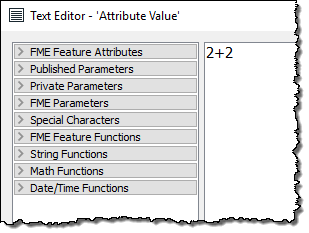

# 实用转换器测验

每个部分均以测验结束，以测试您的新知识。进行选择，然后单击“检查我的答案”以检查每个问题。如果您需要答案的解释，请单击“解释”。

**注意**: 您的分数不会被计算；这只是出于复习目的。

<quiz name="">
  <question>
    

     以下哪项不是转换器类别？?
    

    <answer>Attributes</answer> 
    <answer>Workflows</answer> 
    <answer correct>Images</answer> 
    <answer>Data Quality</answer> 
    <explanation>Images归类为“栅格”，因此“图像”不是类别，但“栅格”是一个类别。</explanation>
  </question>  
</quiz>

将以下转换器与其类别匹配：
<quiz name="">
  <question>
    
Chopper

      <answer>Attributes</answer> 
      <answer correct>Geometry</answer> 
      <answer>Rasters</answer> 
      <answer>Calculated Values</answer> 
      <explanation>使用“转换器库”搜索这些转换器以确定它们的类别</explanation>
  </question>  
  <question>
    
NullAttributeMapper

      <answer correct>Attributes</answer> 
      <answer>Geometry</answer> 
      <answer>Rasters</answer> 
      <answer>Calculated Values</answer> 
      <explanation>使用“转换器库”搜索这些转换器以确定它们的类别</explanation>
  </question>  
  <question>
    
ImageFetcher

      <answer>Attributes</answer> 
      <answer>Geometry</answer> 
      <answer correct>Rasters</answer> 
      <answer>Calculated Values</answer> 
      <explanation>使用“转换器库”搜索这些转换器以确定它们的类别</explanation>
  </question>  
  <question>
    
ExpressionEvaluator

      <answer>Attributes</answer> 
      <answer>Geometry</answer> 
      <answer>Rasters</answer> 
      <answer correct>Calculated Values</answer> 
    <explanation>使用“转换器库”搜索这些转换器以确定它们的类别</explanation>
  </question>  

  <question>
    

    看一下编辑对话框的屏幕截图，告诉我返回给该属性的值是什么：
      

    <answer correct>2+2</answer> 
    <answer>4</answer> 
    <answer>4.0</answer> 
    <answer>Error!</answer> 
    <explanation>关键是要注意该对话框的标题为“文本编辑器”。因此，返回到该属性的值将是文字字符串“ 2 + 2”。如果用户希望将2 + 2加到4，则应该使用算术编辑器！</explanation>
  </question>  

  <question>
    

      如果要测试“是/否”值，使用哪个转换器最好？
    

    <answer correct>Tester</answer> 
    <answer>ExpressionEvaluator</answer> 
    <answer>AttributeManager</answer> 
    <answer>AttributeFilter</answer> 
    <explanation>可以轻松设置Tester以测试一个值TestAttribute = Yes。由于ExpressionEvaluator用于数学运算，而AttributeFilter更适合测试多个值，而AttributeManager需要更长的时间来设置条件值。
  </question>  

  <question>
  
查看以下屏幕截图，然后回答输出连接中将出现多少个要素...
    

  <answer>Eight (8)</answer> 
  <answer>Eighteen (18)</answer> 
  <answer>Twenty-six (26)</answer> 
  <answer correct>Can't tell</answer> 
  <explanation>从屏幕截图中无法分辨，因为您不知道将匹配多少个属性值。因为有八个消防站，所以它的范围从零到八个，但这就是我们所能知道的。实际上，如果这是一个FeatureJoiner转换器，那么如果每个消防站都以某种方式与每个邮政编码边界匹配，则最多可以匹配144个！</explanation>
  </question>

</quiz>
