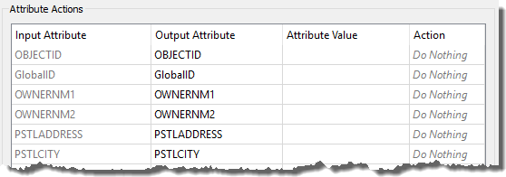

|  练习2 |  噪音控制法项目（地址） |
| :--- | :--- |
| 数据 | 地址（文件地理数据库） |
| 总体目标 | 将文件地理数据库转换为Microsoft Excel并映射模式 |
| 演示 | 模式映射的属性管理 |
| 启动工作空间 | 无 |
| 结束工作空间 | C:\FMEData2019\Workspaces\DesktopBasic\Transformers-Ex2-Complete.fmw |

市议员投票决定修改噪声控制法，生活在受影响地区的居民必须了解这些变化。

您的经理建议您承担查找所有受影响地址的任务。有一个紧迫的截止日期，至少有三位市议员正在观看你的工作。压力很大，由你来决定！

本练习是该项目的第一部分。您知道城市的地址数据库存储在Esri地理数据库中，该模式的模式与本地政府信息模型PostalAddress表相匹配。

但是，您被告知用于执行自动批量邮件的软件需要使用完全不同的模式存储在Excel电子表格中的地址。

因此，您的第一个任务是创建一个工作空间，将地址从Geodatabase转换为Excel，同时映射模式。

 **1) 打开一个空白工作空间**
 像往常一样，第一个任务是使自己熟悉数据。为此，请打开一个空白工作区并确保已打开可视化预览(Visual Preview)： View &#62; Windows &#62; Visual Preview.

打开计算机的文件浏览器并浏览到数据集：

<pre>
C:\FMEData2019\Data\Addresses\Addresses.gdb
</pre>

然后将“ Addresses.gdb”拖放到“ Visual Preview”窗口中：

将地理数据库拖放到Visual Preview中后，将出现“选择要查看的数据集”对话框。确保格式为Esri Geodatabase（File Geodb Open API），然后单击“确定”。然后，确保“表视图”已打开并且表显示“ PostalAddress”。要获得更多空间，您可以关闭“图形视图”，因为我们只对表格感兴趣：

**2）添加Creator / FeatureReader读模块**  
现在您已熟悉源数据，我们可以将数据添加到工作空间中。

我们可以选择使用读模块或FeatureReader转换器来读取源数据。FeatureReader将允许我们构建空间过滤器，因为我们相信这个项目可能需要一些过滤 - 我们将使用FeatureReader转换器和Creator来创建一个触发它的要素。

所以放置一个Creator转换器并将其连接到FeatureReader：

检查FeatureReader参数。如下设置参数：

| 读模块格式 | Esri地理数据库（File Geodb API） |
| :--- | :--- |
| 读模块数据集 | C:\FMEData2019\Data\Addresses\Addresses.gdb |
| 要读取的要素类型 | PostalAddress |

<!--Tip Section-->

<table style="border-spacing: 0px">
<tr>
<td style="vertical-align:middle;background-color:darkorange;border: 2px solid darkorange">
<i class="fa fa-info-circle fa-lg fa-pull-left fa-fw" style="color:white;padding-right: 12px;vertical-align:text-top"></i>
技巧
</td>
</tr>

<tr>
<td style="border: 1px solid darkorange">

与“ Visual Preview”窗口一样，可以将数据集拖放到“Workbench”对话框的数据集字段中。
 在这种情况下，可以将相同的.gdb文件夹拖放到FeatureReader转换器的Reader Dataset字段中，而不使用“浏览数据(browse for data)”按钮。

</td>
</tr>
</table>

---

**3) 添加Excel写模块**
 现在让我们添加一个写模块来写入输出数据。目前似乎没有任何好处或需要使用FeatureWriter，因此从菜单栏中选择Writers&gt; Add Writer并使用以下操作：

| 写模块格式 | Microsoft Excel |
| :--- | :--- |
| 写模块数据集 | C:\FMEData2019\Output\Training\AddressFile.xlsx |
| 工作表定义 | 从数据集导入 |

设置“从数据集导入”将允许我们导入Excel电子表格以用作指南。单击“确定”以添加写模块。

  
**4）导入要素类型**  
此时，系统会提示您选择要从中导入模式定义的数据集。应使用与写模块相同的值设置这两个字段。设置数据集参数如下：

| 读模块数据集 | C:\FMEData2018\Resources\DesktopBasic\AddressSchema.xlsx |
| :--- | :--- |

此文件是我们的指南/模板。单击“确定”接受值。将创建新要素类型以匹配所选的Excel模式。

**5）添加AttributeManager**  
现在我们可以开始将模式从读模块（FeatureReader）映射到写模块。正如你已经注意到的那样，两者目前并不匹配。

因此，放置一个连接在FeatureReader:PostalAddress输出端口和PostalAddress写模块要素类型之间的AttributeManager。

它的参数如下所示：

首先，让我们通过删除一些不需要的属性来清理读模块模式。

单击以下属性， 然后要么按<kbd>Delete</kbd>键要么单击对话框上的<kbd>-</kbd>按钮将其删除：

- OBJECTID
- GlobalID
- INTSTATE
- INTPSTLCD
- REPRESENT
- STATUS
- LASTUPDATE
- LASTEDITOR

**6）重命名属性**  
可以将多个源属性按原样写入输出，但需要先重命名。

在AttributeManager中重命名以下内容：

- PSTLCITY到City
- PSTLPROV到Province
- POSTALCODE到PostalCode
- COUNTRY到Country

如果AttributeManager连接到写模块要素类型，那么您应该能够从下拉列表中选择“输出属性”字段，而不是键入它。

  
**7）创建属性（Provider）**  
输出上的两个属性（Provider和UpdateDate）是新的，不能从源数据中复制。必须创建它们。

在AttributeManager中创建新属性“Provider”。由于该属性存在于输出模式中，因此您可以再次从下拉列表中选择该属性。

设置固定值，例如您自己的组织名称，“Safe Software”或“Interopolis城市”。

  
**8）创建属性（UpdateDate）**  
现在创建新属性“UpdateDate”。不要对值进行硬编码，而是单击“属性值”字段中的下拉箭头，然后选择“打开文本编辑器”。

在文本编辑器中找到名为DateTimeNow的日期/时间函数，然后双击将其放在编辑器中：

默认情况下，它将以ISO语法创建日期时间，这对我们来说很好，因此请单击“确定”以接受此日期时间。

 **9) 创建一个属性(Owners)**
 请注意，输出中有一个“Owners”字段，但是输入中有两个所有者字段（OWNERNM1和OWNERNM2）。因此，要设置输出属性，我们需要连接两个输入字段。这很简单。

仍在AttributeManager参数对话框中，创建一个名为Owners的新属性。在该属性的“属性值”列中，单击下拉箭头，然后选择“打开文本编辑器”。

在文本编辑器中，打开左侧菜单上的“ FME要素属性”部分。找到OWNERNM1和OWNERNM2属性，然后依次双击它们以将其添加到编辑器窗口。在编辑器窗口中，在两个属性之间单击，然后按空格键以添加空格字符。

<pre>
@Value(OWNERNM1) @Value(OWNERNM2)
</pre>

您可以在没有第二个owner的情况下忽略记录上生成的尾随空格（这不会影响输出的有用性），也可以使用TrimRight函数将其删除： 

<pre>
@TrimRight(@Value(OWNERNM1) @Value(OWNERNM2))
</pre>

单击“确定”关闭编辑器对话框。

 **10) 删除属性**
 现在有了“Owners”字段，我们可以删除属性OWNERNM1和OWNERNM2。但是...操作顺序现在很重要。删除OWNERNM1和OWNERNM2之前，必须在参数对话框中创建Owners。

为此，请单击新创建的Owners字段。使用对话框上的向上箭头按钮（<kbd>^</kbd>）将其向上移动到OWNERNM1上方。

然后删除OWNERNM1和OWNERNM2。现在，对话框将如下所示：

单击“确定”关闭AttributeManager参数。

 **11) 运行到AttributeManager**
 现在是时候运行工作空间，以确保到目前为止我们所做的一切都能产生正确的结果。确保功能缓存已打开，然后通过单击AttributeManager转换器并选择“运行至此(Run to This)”来运行工作空间：

这将运行转换到此转换器, 但不写入任何输出（我们还不需要）。

检查AttributeManager:Output缓存以确认该过程按预期工作：

 **12) 添加AttributeSplitter转换器**
 查看输出模式，Number和Street有两个字段（例如“3305”和“W 10th Av”）。但是，源模式将该信息压缩到一个字段中，其中&lt;space&gt;字符分隔字段（“3305 W 10th Av”）。因此，要设置输出属性，我们需要拆分单个输入字段。

插入AttributeSplitter转换器。在AttributeManager _**之前**_ 插入它- 然后如果要对split属性执行任何操作，我们可以使用相同的AttributeManager转换器。

查看AttributeSplitter参数。将PSTLADDRESS设置为要拆分的属性，并在Delimiter参数中输入<kbd>space</kbd>字符。请注意，列表名称在List Name参数中设置（我们将很快使用该列表）：

单击“确定”关闭对话框。如果现在运行工作空间并检查缓存，您将在“要素信息”窗口中看到该地址作为列表属性：

<pre>
_list{0} (encoded: utf-8) 3305
_list{1} (encoded: utf-8) W
_list{2} (encoded: utf-8) 10th
_list{3} (encoded: utf-8) Av
</pre>

请记住，列表属性是可以在单个名称（\_list）下存储多个值的属性。

 **13) 复制列表属性**
 现在让我们处理输出中的Number字段。返回AttributeManager参数。

请注意，现在有一个名为\_list{}的list属性的条目。但是，这只是_“一般的”_ 列表属性- 它没有显示列表中的每个元素（值）。

我们需要做的是创建一个新属性并将我们想要的列表元素复制到其中。因此，在“输出属性”字段中，通过从下拉列表中选择一个名为“编号”的新属性。

对于“属性值”字段，单击下拉箭头并选择“属性值”&gt;“\_list {}”。

现在将提示您选择列表中的元素。确保将其设置为零（0）并单击“确定”。

单击“应用/确定”以确认更改。运行工作空间到AttributeManager转换器，并检查AttributeManager:Output缓存以确保正在复制该编号。

 **14) 构建属性**
 最后一步是重新创建Street属性，而不用地址编号号作为前缀。一种方法是像使用所有者(owner)名称一样，使用文本编辑器来连接_list {1}，_ list {2}和_list {3}。但是，对于列表，我们可以使用特殊的ListConcatenator转换器。它只需要一个初步步骤。

因此，再次打开AttributeManager参数。这次创建一个名为_list {0}的新属性，单击其值的下拉箭头，然后选择将其设置为null的选项：

这将清空第一个列表元素，以便可以轻松地将其余元素串联在一起。为此，请在AttributeManager之后放置一个ListConcatenator转换器。

打开参数对话框。选择_list{}作为要连接的列表。 将*Separator Character(分隔符)* 设置为一个空格。将*Destination Attribute* 设置为Street (以匹配输出模式), 并将*Drop Empty and Null Elements* 设为Yes:

单击“确定”接受这些更改并关闭对话框。运行工作区到这一点并检查输出。您会发现我们将街道名称的所有部分重新连接在一起。

 **15) 设置时间(Event)字段**
 需要设置一个最终属性。可以在AttributeManager中完成此操作，但是要演示其他方法，请打开Excel写模块的“要素类型”对话框。

单击用户属性选项卡，然后为事件字段设置一个固定值：

关闭对话框，所有输出属性现在应显示绿色箭头，“Event”除外，其中“Event”具有粉红色箭头以表明正在要素类型本身中进行设置。

保存工作空间，然后运行它以创建输出数据集。

---

<!--Warning Section-->

<table style="border-spacing: 0px">
<tr>
<td style="vertical-align:middle;background-color:darkorange;border: 2px solid darkorange">
<i class="fa fa-exclamation-triangle fa-lg fa-pull-left fa-fw" style="color:white;padding-right: 12px;vertical-align:text-top"></i>
WARNING
</td>
</tr>

<tr>
<td style="border: 1px solid darkorange">

有一个名为参数重写现有文件，默认设置为无。 如果您每次都在运行整个工作区，则可能是将参数更改为“是”的好时机。Excel写模块有一个参数叫做 <strong>Overwrite Existing File</strong>, 默认设置为<strong>No</strong>.
  
  如果您每次都在运行整个工作空间，则可能是将参数更改为“Yes”的好时机。 

</td>
</tr>
</table>

---

单击PostalAddress写模块要素类型以打开弹出菜单，然后单击“View Written Data”按钮以在Visual Preview中检查数据。输出（在“表视图”中）应如下所示：

<!--Exercise Congratulations Section-->

<table style="border-spacing: 0px">
<tr>
<td style="vertical-align:middle;background-color:darkorange;border: 2px solid darkorange">
<i class="fa fa-thumbs-o-up fa-lg fa-pull-left fa-fw" style="color:white;padding-right: 12px;vertical-align:text-top"></i>
恭喜
</td>
</tr>

<tr>
<td style="border: 1px solid darkorange">

By completing this exercise you have learned how to:
 
<ul><li>使用AttributeManager转换器创建，删除，重命名和排序属性</li>
<li>使用“文本编辑器”对话框来连接（和修剪）属性</li>
<li>使用AttributeSplitter将属性拆分为列表属性</li>
<li>在AttributeManager中处理列表属性</li>
<li>使用ListConcatenator转换器连接列表中的元素</li>
<li>在AttributeManager文本编辑器中使用日期/时间函数</li>
<li>使用要素类型对话框设置属性值</li></ul>

</td>
</tr>
</table>
