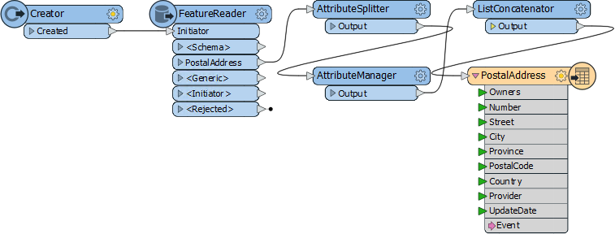
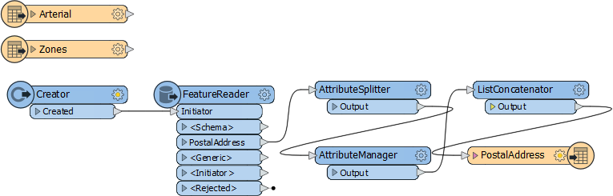
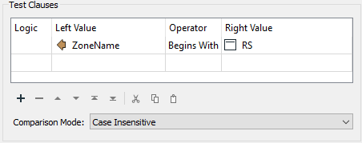
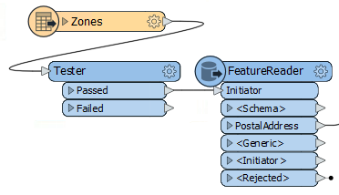
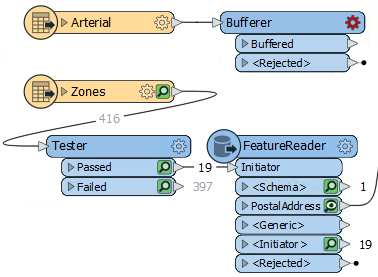
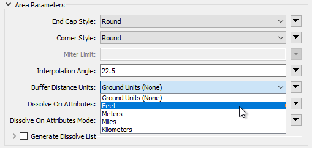
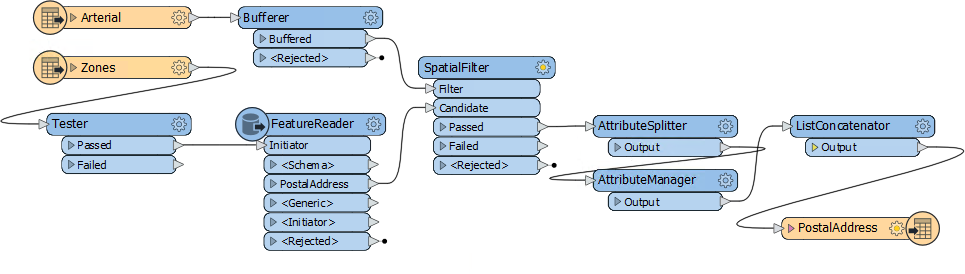
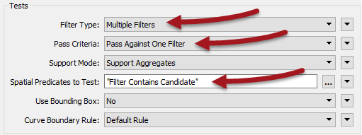

|  练习3 |  噪声控制法项目（空间过滤） |
| :--- | :--- |
| 数据 | 地址（文件地理数据库） 分区（MapInfo TAB） 道路（AutoCAD DWG） |
| 总体目标 | 查找主干道50米范围内的所有住宅地址 |
| 演示 | 条件过滤的方法 |
| 启动工作空间 | C:\FMEData2019\Workspaces\DesktopBasic\Transformers-Ex3-Begin.fmw |
| 结束工作空间 | C:\FMEData2019\Workspaces\DesktopBasic\Transformers-Ex3-Complete.fmw |

众所周知，市议员投票决定修改噪音控制法，生活在受影响地区的居民必须了解这些变化。

您的经理建议您接受任务，并且有一个紧迫的截止日期。

在项目的第一部分中，您创建了一个工作空间，用于将地址从地理数据库转换为Excel，同时映射模式。

该练习是该项目的第二部分：定位所有受影响的居民。您必须在距主要高速公路50米范围内找到所有单户住宅，并从地址数据流中过滤掉所有其他住宅。

  
**1）启动Workbench**  
 启动Workbench（如有必要）并从练习2打开工作空间。或者，您可以打开C:\FMEData2019\Workspaces\DesktopBasic\Transformers-Ex3-Begin.fmw

工作空间已有一个FeatureReader用于读取地址，转换器用于编辑地址模式，还有一个写模块用于将数据写入Excel电子表格。

  
**2）添加读模块（道路数据）**  
使用读模块&gt;添加读模块为道路数据添加读模块。道路数据将用于确定与主干路线的距离。

| 读模块格式 | Autodesk AutoCAD DWG / DXF |
| :--- | :--- |
| 读模块数据集 | C:\FMEData2019\Data\Transportation\CompleteRoads.dwg |

出现提示时，仅选择名为Arterial的要素类型。

  
**3）添加读模块（分区数据）**  
使用Readers&gt; Add Reader为分区数据添加读模块。分区数据将用于确定地址是否是单户住宅。

| 读模块格式 | MapInfo TAB（MITAB） |
| :--- | :--- |
| 读模块数据集 | C:\FMEData2019\Data\Zoning\Zones.tab |

随着属性列表的折叠，工作空间现在看起来是这样的：

请随意检查所有源数据，以熟悉其内容。您甚至可以运行工作空间以确保所有缓存都是最新的。

  
**4）添加Tester转换器**  
将Tester转换器添加到Zoning 要素类型。

该Tester将用于过滤其他分区的住宅区。所有单户住宅区都将以RS开头，因此Tester应如下设置：

重要的是使用“Begins With”运算符设置测试。

**5）连接到FeatureReader**  
过滤数据的一种方法是使用SpatialFilter转换器，我们将使用道路要素来做这件事。但另一种方法是在FeatureReader转换器内部使用过滤。

因此，删除Creator转换器并将Tester：Passed端口连接到FeatureReader：Initiator端口：

**6）设置FeatureReader**  
现在检查FeatureReader的参数。将Spatial Filter参数设置为*Initiator Contains Result*：

这可确保只从数据库中读取属于单户居民区域的地址。确保打开要素缓存并运行工作空间到FeatureReader。检查Tester:Passed和FeatureReader:PostalAddress缓存以确认结果是否正确。

对于Tester，应该有19个来自Tester的要素已通过Tester:Passed输出端口。FeatureReader：PostalAddress输出端口现在将仅有1853个要素，与之相比按区域过滤之前有13597个要素。

 **7) 添加Bufferer转换器**
 现在，我们可以确定哪些过滤地址位于主干路线的50米范围内。首先，我们需要添加一个Bufferer转换器来设置道路周围50米的距离。

 将一个Bufferer转换器添加到工作空间。将其连接到干路数据：

将“Bufferer缓冲区数量”参数设置为50。

---

<!--Updated Section--> 

<table style="border-spacing: 0px">
<tr>
<td style="vertical-align:middle;background-color:darkorange;border: 2px solid darkorange">
<i class="fa fa-bolt fa-lg fa-pull-left fa-fw" style="color:white;padding-right: 12px;vertical-align:text-top"></i>
2019.1更新
</td>
</tr>

<tr>
<td style="border: 1px solid darkorange">

Bufferer的一个常见问题是缓冲量使用什么单位。通常，它是坐标系（地面）单位，但在2019.1中，Bufferer有一个新参数称为<strong>Buffer Distance Units</strong>: 
  
  此参数允许您以英尺（例如）来设置单位，同时将数据保留在其原始坐标系中（也许纬度/经度，单位为十进制度）。
  只要您具有FME2019.1.0.1（内部版本19610或更高版本-2019.1发布版本中存在一个小错误），此参数就可以是地面单位或米（米），因为米既是地面单位也是所需的缓冲量。如果需要，请尝试将单位更改为“英尺”，并将缓冲区大小设置为164。结果实际上应该是相同的。 
  您可能希望在此处设置的另一个参数是 <strong>Dissolve on Attributes</strong>. 这是一种按参数分组的样式，它导致所有缓冲的要素基于属性值融合在一起。这是一种提供整齐的输出，同时仍覆盖相同地理区域的方法。在这种情况下，您可以使用fme_feature_type属性。

</td>
</tr>
</table>

---

**8）添加SpatialFilter转换器**  
添加SpatialFilter转换器。buffered的主干路线是Filter.。Candidate端口可以连接在FeatureReader和AttributeSplitter之间：

这样，AttributeSplitter和AttributeManager仅在过滤的要素上运行。如果在AttributeManager之后连接了SpatialFilter，则数据将被处理然后被丢弃。

**9）设置SpatialFilter参数**  
设置SpatialFilter参数，如下所示：

| 过滤类型 | 多个过滤器 | 有多个缓冲多边形 |
| :--- | :--- | :--- |
| 通过标准 | 通过一个过滤器 | 单个地址不能存在于**所有**缓冲区中 |
| 空间谓词测试 | 过滤器包含候选者Filter Contains Candidate | 查找主干缓冲区中包含的地址 |

也就是说，有多个道路缓冲区，但地址只需要在一个缓冲区内传递，而不是全部。

**10）运行工作空间**  
 按下<kbd>F5</kbd>来运行工作空间并检查输出以确认数据集已正确写入。 电子表格中应该有148条记录，准备发送给管理部门以批量发送邮件。

如果最终电子表格中的行数超过148，请记住将Excel写模块参数设置为“覆盖现有文件”为“是”。

<table>
  <thead>
    <tr>
      <th style="text-align:left">恭喜</th>
    </tr>
  </thead>
  <tbody>
    <tr>
      <td style="text-align:left">
        
通过完成本练习，您已学会如何：
           
        

        <ul>
          <li>使用Tester转换器按属性值过滤</li>
          <li>使用FeatureReader转换器中的空间过滤器选项</li>
          <li>使用Bufferer转换器设置“在x距离内”测试</li>
          <li>使用SpatialFilter转换器按几何对象过滤</li>
        </ul>
      </td>
    </tr>
  </tbody>
</table>
