|  练习4 |  噪音控制法项目（犯罪数据加入） |
| :--- | :--- |
| 数据 | 犯罪统计（CSV） |
| 总体目标 | 在犯罪统计数据和地址要素之间进行连接 |
| 演示 | 基于属性的连接 |
| 启动工作空间 | C:\FMEData2019\Workspaces\DesktopBasic\Transformers-Ex4-Begin.fmw |
| 结束工作空间 | C:\FMEData2019\Workspaces\DesktopBasic\Transformers-Ex4-Complete.fmw |

如你所知，市议员投票决定修改噪音控制法，生活在受影响地区的居民被告知这些变化。。

在项目的第一部分中，您创建了一个工作空间，用于将地址从地理数据库转换为Excel，同时映射模式。在项目的第二部分，您继续工作空间，找到距离主要高速公路50米范围内的所有单户住宅，并从地址数据流中过滤掉所有其他住宅。

现在，一家全国性报纸的数据记者担心，放宽噪音控制法可能会导致该市犯罪率上升。因此，他们要求每个受影响地址的最近犯罪数字。他们打算将此与未来数据进行比较，看看他们的理论是否正确。

该请求是对该城市开放数据政策的重要考验，并且不存在不遵守的问题。然而，由于当前的犯罪数据集（CSV，非空间）没有以任何方式加入地址数据库，因此出现了危机。

因此，对于该项目的最后部分，您必须采用现有的噪声控制工作空间并对其进行修改以纳入犯罪统计数据。

完成这个任务，你就会成为一个数据超级英雄!

  
**1）启动Workbench**  
 启动Workbench（如有必要）并从练习3打开工作空间。或者，您可以打开C：\ FMEData2019 \ Workspaces \ DesktopBasic \ Transformers-Ex4-Begin.fmw

工作空间已设置为读取地址，在空间上过滤它们，并将它们写入Excel电子表格。

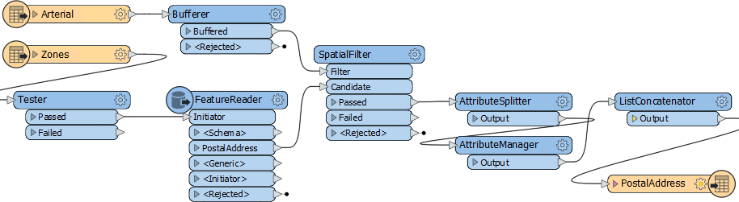


**2）添加CSV读模块**  
现在让我们开始处理犯罪数据。使用FeatureReader没有任何好处，因此使用菜单栏中的“读模块”&gt;“添加读模块”将读模块添加到工作空间。使用以下参数：

| 读模块格式 | 逗号分隔值（CSV） |
| :--- | :--- |
| 读模块数据集 | C:\FMEData2019\Data\Emergency\Crime.csv |
| 读模块参数 | 字段:分隔符字符:,\(逗号\) 字段:字段名称行:1 |

单击确定以添加读模块。


**3）检查数据**  
下一个任务是熟悉源数据。单击犯罪要素类型以打开弹出菜单，然后单击查看源数据按钮。

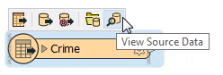

数据在Visual Preview中将如下所示：

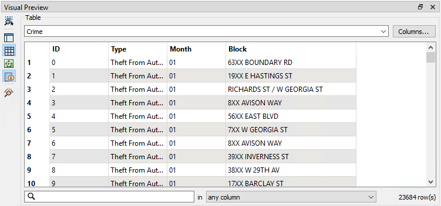

请注意，在“表视图”中仅存在数据，如果打开“图形视图”，它将显示没有几何对象。我们将需要使用块(Block)将犯罪数据与我们的其他数据在空间上相关联。

---

<!--Person X Says Section-->

<table style="border-spacing: 0px">
<tr>
<td style="vertical-align:middle;background-color:darkorange;border: 2px solid darkorange">
<i class="fa fa-quote-left fa-lg fa-pull-left fa-fw" style="color:white;padding-right: 12px;vertical-align:text-top"></i>
<span style="color:white;font-size:x-large;font-weight: bold;font-family:serif">FME蜥蜴说...</span>
</td>
</tr>

<tr>
<td style="border: 1px solid darkorange">
<span style="font-family:serif; font-style:italic; font-size:larger">
由于这是一个犯罪数据集，所以准确的数字被X屏蔽了。 7XX W Georgia Street意味着安大略街以西乔治亚街的第七个街区，覆盖700-800号楼。7XX E Georgia Street将在14个街区之外，是安大略省以东的第七个街区。
</span>
</td>
</tr>
</table>

---

您可能已经发现每个地址要素都有一个数字（不是像“7XX”那样的块ID），并且道路数据以首字母大写（“W Georgia St”）存储在道路数据集中，而犯罪数据集是大写（“W GEORGIA ST”）。

这两者都会使两组数据加在一起变得更加困难，但并非不可能。

  
**4）添加StringReplacer转换器**  
要合并数据，我们需要将地址编号减少到与结构中的犯罪数据匹配的块编号; 例如，我们需要74XX而不是7445。

因此，添加StringReplacer转换器并在AttributeManager和PostalAddress要素类型之间进行连接。

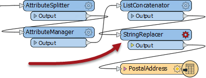

设置以下参数：

| 属性 | 数字 |
| :--- | :--- |
| 模式 | 替换正则表达式 |
| 要替换的文本 | ..$ |
| 替换文本 | XX |

此要替换的文本（.. $）表示替换字符串的最后两个字符，并将它们替换为XX以匹配犯罪数据。

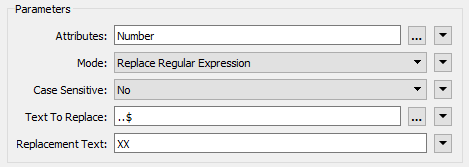

运行工作空间（使用StringReplacer上的*Run to This*）并检查缓存以确保转换器按预期工作。“Number”列中的每个要素都应在末尾加上XX。  


**5）添加StringCaseChanger转换器**  
犯罪/道路数据的另一个区别在于大写/ 首字母大写街道名称。可以使用StringCaseChanger转换器修复此差异。

在StringReplacer之后添加一个StringCaseChanger转换器并设置参数以将Street的值更改为大写：

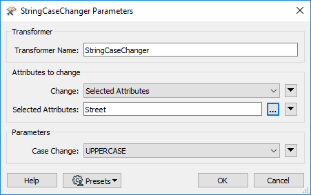

现在，地址街道名称将与犯罪数据集中的街道名称正确匹配。

**6）构建连接键**  
更新了属性以匹配犯罪数据，我们现在必须构造建一个键。

在StringCaseChanger之后将AttributeManager添加到画布。创建一个名为JoinKey的新属性。打开属性的文本编辑器，然后输入（选择）：

```text
@Trim（@Value（Number）@Value（Street））
```

这将匹配犯罪数据的结构（确保在两个属性之间包含空格字符）。Trim函数用于确保这些属性上没有多余的空格。

  
**7）添加FeatureJoiner转换器**  
现在我们已经整理了连接键的结构，我们可以用FeatureJoiner将数据合并在一起。

将FeatureJoiner添加到画布。

将地址数据（AttributeManager输出）连接到Left输入端口。将犯罪数据（CSV读模块要素类型）连接到Right输入端口。

将FeatureJoiner:Joined输出端口连接到PostalAddress写模块要素类型：

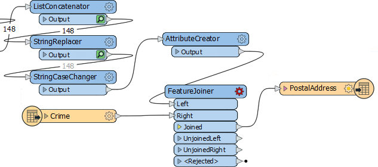

检查FeatureJoiner的参数。

对于Join Mode，选择*Left*。这意味着我们希望输出所有地址，无论它们是否与犯罪记录相匹配。

在Join On参数中，为Left值选择JoinKey属性，为Right值选择Block属性。

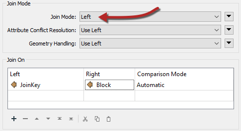

运行工作空间的该部分以查看此转换的结果。

  
**8）添加Aggregator转换器**  
检查FeatureJoiner以查看已加入要素的数量。有趣的是，尽管有148个地址进入FeatureJoiner，但却有267个地址出现：

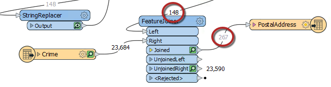

那是因为每个区块有多个犯罪，并且数据有267个匹配。

我们可以使用Aggregator转换器将这些数据聚合在一起。因此，在FeatureJoiner：Joined端口之后放置一个Aggregator转换器：

检查参数。我们需要通过选择将匹配回原始地址的属性来设置group-by参数。每个地址都没有ID，因为我们在上一步中删除了它们，因此：

* 返回到AttributeManager，通过将Action切换为No Nothing来撤消OBJECTID的Remove选项，并使用OBJECTID作为Aggregator的分组依据 
* 使用UpdateDate作为 Aggregator的分组依据（因为每个地址都将收到一个唯一的时间戳）

然后将Count属性设置为NumberCrimes的值：

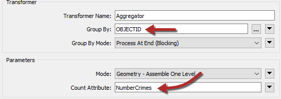


<br>**9) 匿名化数据**
<br>在为记者写入数据之前，我们需要检查是否有任何个人信息应被隐藏。一个明显的属性是“所有者(Owners)”字段。我们可以使用AttributeCompressor转换器将其隐藏。

因此，将AttributeCompressor转换器放置在Aggregator之后。打开其参数。压缩Owners属性并设置您选择的加密类型和密码：

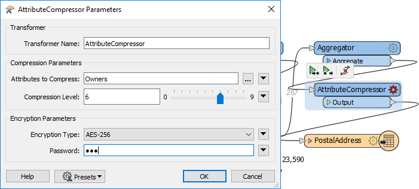

现在，“Owners”字段将转换为压缩和进行了二进制编码，没有适当的密码就无法读取。


<br>**10)写入数据**
<br>如果您为PostalAddress书写器扩展了属性，您将注意到没有出现NumberCrimes。

要解决此问题，只需在此处添加一个名为NumberCrimes的新属性。为其指定类型“数字number”和单元格宽度为6。来自Aggregator的数据现在将在写模块上具有其属性：

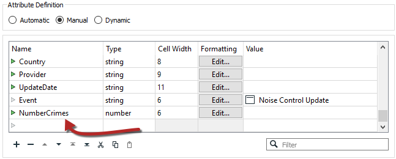

我们可以做的另一件事是检查owner字段，看看它是否支持二进制值。遗憾的是，Excel没有二进制字段类型，所以我们不太可能能够读回那个字段，不管它是不是有密码。但是至少所有者的名字是隐藏的。

关闭对话框，关闭要素缓存，然后重新运行整个工作空间。在Visual Preview中查看写入数据。数据将包括犯罪数量，重新处理属性意味着名称和个人地址也都已匿名。这很重要，因为此数据已公开。


---

<!--Tip Section-->

<table style="border-spacing: 0px">
<tr>
<td style="vertical-align:middle;background-color:darkorange;border: 2px solid darkorange">
<i class="fa fa-info-circle fa-lg fa-pull-left fa-fw" style="color:white;padding-right: 12px;vertical-align:text-top"></i>
<span style="color:white;font-size:x-large;font-weight: bold;font-family:serif">高级练习</span>
</td>
</tr>

<tr>
<td style="border: 1px solid darkorange">
<span style="font-family:serif; font-style:italic; font-size:larger">
该工作流非常复杂，数据来自多个来源，并且属性进行了大量更改。如果您有时间，最好在打包工作空间之前添加一些书签和注释以整理工作空间，以便将来需要返回该工作区。
</span>
</td>
</tr>
</table>

---

<!--Exercise Congratulations Section-->

<table style="border-spacing: 0px">
<tr>
<td style="vertical-align:middle;background-color:darkorange;border: 2px solid darkorange">
<i class="fa fa-thumbs-o-up fa-lg fa-pull-left fa-fw" style="color:white;padding-right: 12px;vertical-align:text-top"></i>
<span style="color:white;font-size:x-large;font-weight: bold;font-family:serif">恭喜</span>
</td>
</tr>

<tr>
<td style="border: 1px solid darkorange">
<span style="font-family:serif; font-style:italic; font-size:larger">
通过完成本练习，您已学会如何：
<br>
<ul><li>预处理数据以获得具有匹配结构的连接键</li>
<li>构建一个用于FeatureJoiner的连接键</li>
<li>使用FeatureJoiner中的连接键连接非空间数据</li>
<li>使用一个Aggregator 转换器来合并连接并计算连接数</li></ul>
</span>
</td>
</tr>
</table>
