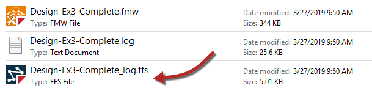

## 记录和日志解释

FME日志包含转换中所有阶段和过程的记录。因此，内容对于调试目的至关重要。

### 日志消息类型

日志窗口中显示了不同的消息类型，包括：

**错误**：一个错误，在日志中用红色文本和术语**ERROR**表示, 代表有问题导致FME终止处理。例如，由于用户权限不正确，FME无法写入输出数据集。

**警告**：一个警告，由蓝色文本和术语**WARN**表示，意为处理问题。这个问题小到足以让FME完成转换，但输出可能会受到不利影响，应该检查。例如，FME无法写入要素，因为它们的几何对象与写模块格式不兼容。要素将从转换中删除，并在日志中发出警告。

**信息**：信息消息，由术语**INFORM**表示代表可以帮助用户确定他们的转换是否已被正确处理的一条信息。例如，FME有时会记录特定数据集参数的确认，例如坐标系。

**统计**：统计信息，由术语**STATS**表示，提供与转换有关的各种数字的信息; 例如，从源数据集读取的要素数量，以及执行此操作所需的时间。

### 空间日志文件 ###

除了将日志写入文本文件（&lt;工作空间名称&gt;.log）之外，FME还写入空间日志：

空间日志是日志中提到的要素（以FME要素商店格式）的数据集。通过使用“导航器”>“工作空间参数”>“读模块/写模块重定向”，或者通过将“要素记录”设置为“日志和记录”的Logger转换器，可以从&lt;Rejected&gt;要素缓存中生成空间日志。

可以在FME Data Inspector或FME Workbench中的Visual Preview窗口中打开FFS数据集，以检查要素并确定导致其被拒绝的任何问题。

---

### 解析日志窗口

日志窗口应该是检查转换完成时的**第一个**位置。它会告诉用户是否有任何相关的错误或警告。

#### 错误

如果发生ERROR，则可能会暂停转换。会有很多红色文本和一些终止语句，例如：

> 程序终止
>
> 转换失败。

可能有几个ERROR消息，因此向上滚动日志窗口以尝试识别其中的第一个，这可能是问题的原因。例如这条消息：

> ERROR \|连接到PostgreSQL数据库时出错（host ='postgis.train.safe.com'，port ='5432'，dbname ='fmedata'，user ='fmedata'，password ='\*\*\*'）：'致命：用户“fmedata”的密码验证失败致命：用户“fmedata”的密码验证失败

...是验证数据库连接的明显问题。

#### 警告

即使转换成功，检查日志以获取以下注释也很重要：

> 转换成功，有X条警告

如果有任何警告（即，如果X&gt; 0），则使用搜索选项查找单词WARN。任何警告消息都可能对输出数据的质量产生重要影响。
