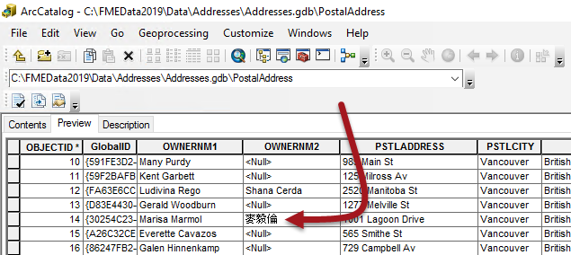
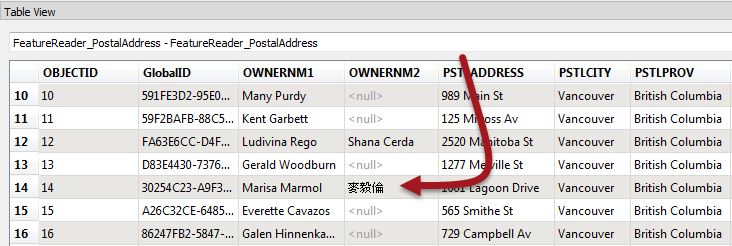
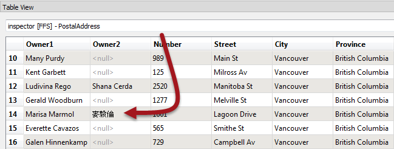
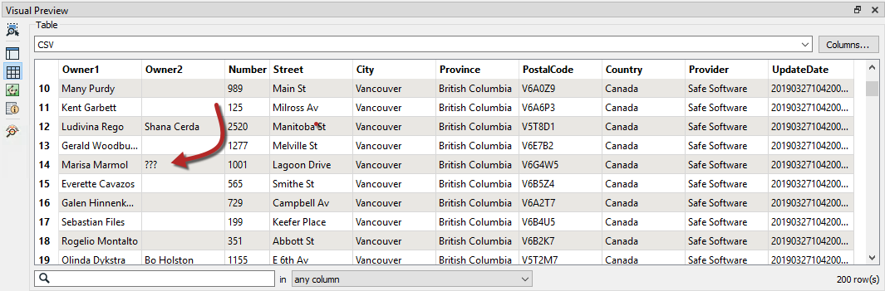
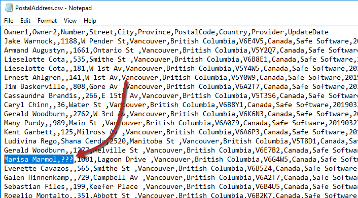
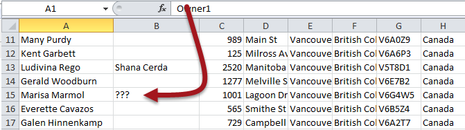
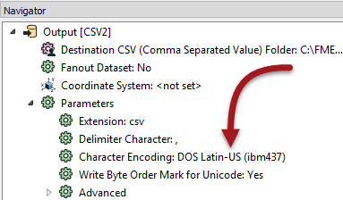

## 检查关键阶段

如果要素计数无法确定问题的位置，则下一步是检查转换关键阶段的数据。

通常，输出数据集中的问题是由于以下原因之一而发生的：

* 数据读取错误
* 数据被错误地转换
* 数据写错了
* 另一个应用程序错误地解释了数据

### 例子

从地址的文件地理数据库到CSV格式的转换会在输出中错误地呈现属性值。例如，名称“麦毅伦”呈现为“???”。

显然，编码问题已经发生，但在哪里呢？数据在另一个应用程序中显示不正确的事实并不能真实地指出问题的引入位置。

在这种情况下，作者应检查关键阶段的数据，以确定数据最后看起来是否正确。

### 在读取之前检查源数据

无需检查即可轻松假设源数据正确无误。因此，如果可能，应在其本机应用程序中检查源数据：

显然，如果源上的数据不正确，那么转换输出就不太可能是正确的。但是在我们的示例中，它在ArcGIS中是正确的，因此转换应该有效。

### 读取后检查源数据

如果源数据在其本机应用程序中是正确的，则使用FME进行检查。可以直接在FME Data Inspector中打开数据，或者 - 如果在启用缓存的情况下运行工作空间 - 从FME Workbench中打开它：

如果此时数据不正确，那么使用FME读取数据的过程就出错了。同样，在我们的示例中，数据是正确的，因此我们必须继续诊断问题。

### 写入前检查数据

现在我们应该检查转换和写入之间的数据。

如果在启用缓存（运行&gt;使用要素缓存运行）的情况下运行工作空间，则数据已可用于检查。否则，请启用此选项（或写模块&gt; 重定向到FME Data Inspector）并重新运行工作空间。

在将数据写入输出之前检查数据以查看它是否正确：

如果Visual Preview此时显示 字符，那么我们可以假设在写入之前数据转换中出现问题。您可以使用要素缓存来检查过程的每个步骤，以找出出现问题的转换器。

在我们的示例中，数据仍然是正确的，因此我们应该测试下一个输出数据集。

### 检查输出数据集

如果在写入之前数据是正确的，那么可能是它被错误地写入了。

在Visual Preview中打开输出数据集。此步骤将显示FME写入的数据（当然，请将其读回）。如果这里的数据不正确，那么在写入数据期间可能会出现问题：

在上面的示例中，如果Visual Preview此时显示 字符，则数据在写入时会被破坏。这似乎就是这种情况。

另一项检查是在文本编辑器中打开数据。由于显而易见的原因，不可能对每个数据集（例如二进制文件或数据库）执行此操作，但对于基于文本的文件，它可以提供此时数据是否正确的明确证据：

对于我们的示例，这确认了在写入数据时出现问题。但是，情况可能并非总是如此。

### 检查另一个应用程序中的输出数据集

如果FME（和文本编辑器）可以显示输出数据，那么可能是预期的应用程序没有正确地解释数据。

因此，打开要在其中使用的应用程序中的输出数据集。如果FME可以正确读取数据，并且在文本编辑器中看起来正确，则问题更可能出在最终应用程序如何解释数据：

如果格式对于该应用程序是非原生的，那将尤其如此; 例如，在Esri产品之外读取地理数据库。

所有这些技术都缩小了可能发生错误的位置，但并不总是指定原因。例如，不正确的输出可能意味着FME在该写模块中具有限制，或者工作空间作者设置了不正确的参数。或者，也许一个应用程序使用不同的默认编码。

在这种情况下，知道写模块有问题，我们可以检查写模块参数并找到一个似乎设置错误编码的参数：

简而言之，这些技术首先确定了调查的位置，但它们本身并不能提供绝对的答案。

|  技巧 |
| :--- |
|  编码对我们来说是一个很好的例子，但它也是一个你应该检查你的计算机是否能够查看这些数据的例子！如果您的计算机设置在错误的地区，那么您甚至可能无法使用它。 |

