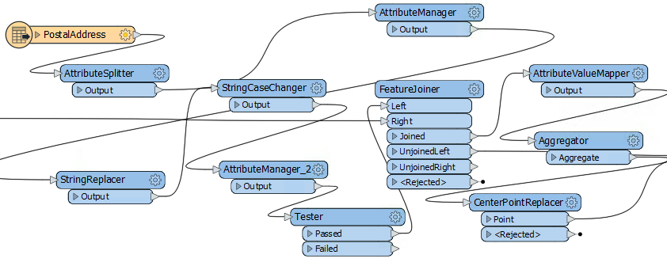

# 样式

> _“一个美观，井井有条的工作空间让客户感觉你已经完成了高质量的工作。”_

样式可能是FME最佳实践中最明显的组成部分。您可以一目了然地了解工作空间的样式是否合格，何时不是。正如上面的引用所暗示的那样，精心设计的工作空间展示了能力

但样式不仅仅是外观; 正确设计的工作空间提供了许多好处，因为它将来会进一步开发和编辑。

## FME工作空间样式指南

良好的设计样式使其更易于导航和理解现有工作空间。当工作空间可能需要由其他用户编辑时，或者您打算在以后自行编辑时，这一点很重要。

具体来说，一个好的样式可以帮助用户......

* 明确定义工作空间的不同部分或组件
* 快速导航到指定的部分或特定的转换器
* 将工作空间传递给另一个用户进行编辑
* 使用更具说明性的标题重命名工作空间和内容

### 设计不佳的例子

你需要证明吗？那么，您是否希望被赋予编辑此工作空间的任务？你能说出这部分的内容，或者更重要的是 - 为什么？

|  FME蜥蜴说...... |
| :--- |
|  正如我常说的，大小无关紧要！您应该始终使用最佳实践，无论是小型工作空间还是培训练习，还是大型项目。养成这个习惯有助于你的小项目的可扩展性。 |
|  如果您从一开始就没有很好地设计工作空间，那么在您进行工作时，编辑将变得越来越难。 |

