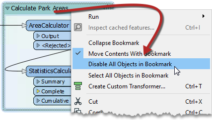

## 书签

书签就像它的真实世界同名一样，是一种放下标记以便于访问的方法。

通过FME，书签覆盖了工作空间的一个区域，该区域通常执行特定的任务，因此用户可以从更广泛的转换器组中选择它并相对容易地移动到它。

### 为什么要使用书签？

书签在样式良好的工作空间中起着重要作用，原因有很多，包括这些原因。

* 设计：作为细分工作空间和管理这些部分的一种方式
* 访问：作为快速访问工作空间特定部分的标记
* 编辑：作为一次移动转换器组的手段
* 性能：作为缓存数据时提高工作空间性能的一种方法

### 添加书签

要添加书签，请单击工具栏上的“书签”图标。

传统书签只标记书中的单个页面，而FME书签可以覆盖画布的大部分区域。通过应用多个书签，可以将单个工作空间划分为不同的部分。

|  技巧 |
| :--- |
|  如果在创建书签时选择了工作空间画布上的任何对象，则会自动扩展书签以包括这些项目。 |

### 调整书签大小和编辑书签

要将书签大小悬停在角落或边缘上，然后拖动光标以更改书签大小或形状。

### 书签属性

单击书签标题上的齿轮图标以打开书签属性对话框：

在这里，您可以更改书签的名称和颜色，并决定内容是否随之移动（稍后会详细介绍）。

书签颜色可以设置为现有的调色板，也可以使用自定义颜色。另外，可以通过转到工具> FME选项...>外观来创建自定义的调色板。

---

<!--Tip Section-->

<table style="border-spacing: 0px">
<tr>
<td style="vertical-align:middle;background-color:darkorange;border: 2px solid darkorange">
<i class="fa fa-info-circle fa-lg fa-pull-left fa-fw" style="color:white;padding-right: 12px;vertical-align:text-top"></i>
技巧
</td>
</tr>

<tr>
<td style="border: 1px solid darkorange">

书签的上下文（右键单击）菜单显示用于选择书签中的所有对象或禁用所有这些对象的选项，使其对测试有帮助： 
  

</td>
</tr>
</table>
