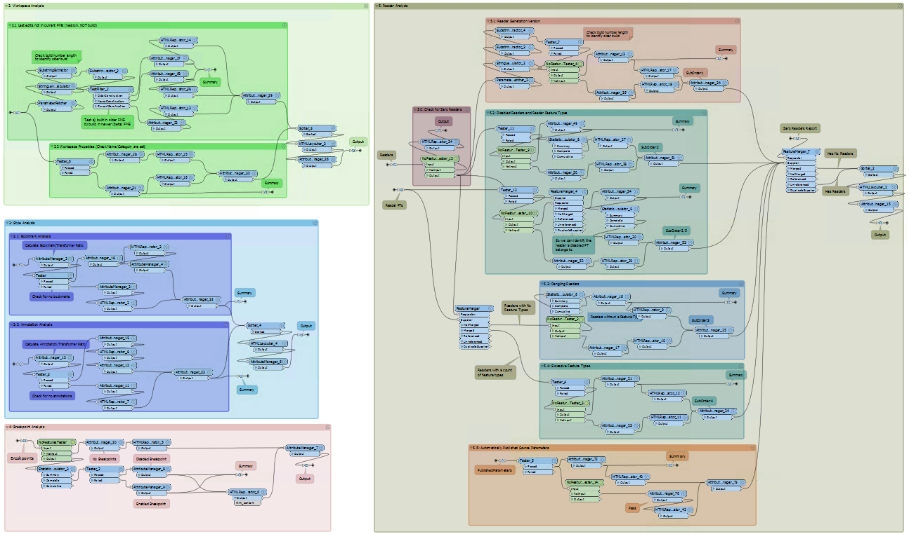
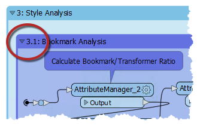
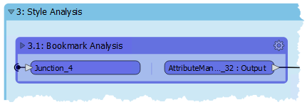
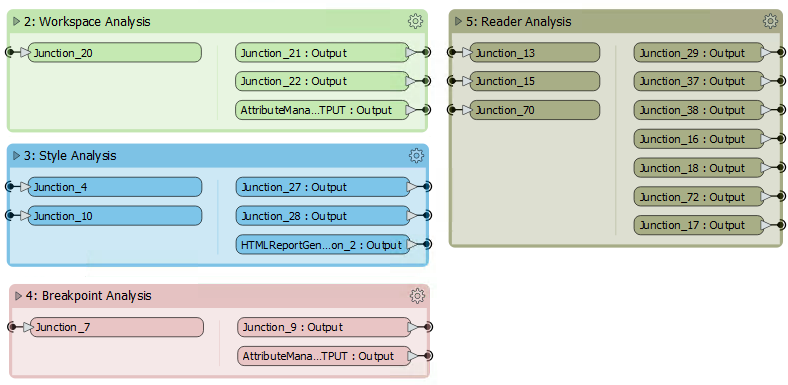
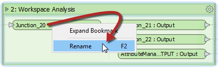

### 书签用于设计 ###
书签是指示工作空间的特定部分用于特定目的的好方法。通过以这种方式细分工作空间，布局通常更容易遵循。

正如一个用户所说，书签就像您工作空间的段落一样！

上面的工作空间说明了如何使用书签标记工作空间的不同部分。如您所见，可以通过将一个书签*嵌套*在另一个书签中来进一步细分书签。

#### 可折叠书签 ####

每个书签的左上角都有一个小图标，可以折叠它：

---

<!--Tip Section-->

<table style="border-spacing: 0px">
<tr>
<td style="vertical-align:middle;background-color:darkorange;border: 2px solid darkorange">
<i class="fa fa-info-circle fa-lg fa-pull-left fa-fw" style="color:white;padding-right: 12px;vertical-align:text-top"></i>
FME蜥蜴说...
</td>
</tr>

<tr>
<td style="border: 1px solid darkorange">

您是否注意到上图中的注释？与书签的颜色相同。2019年的新功能，书签中包含的所有注释将采用相同的颜色。这确实有助于清理工作空间的外观！

</td>
</tr>
</table>

---

折叠书签意味着将其压缩到单个转换器的大小，除了数据进入或退出书签的位置外，不显示任何内容：

第二次单击图标将书签重新打开为其先前的大小。

---

此功能允许将工作空间的大部分呈现在较小的区域中，并且仅在需要编辑时才打开。

例如，上面显示的工作空间部分可以简化为：

重新打开折叠的书签会调整工作空间的布局，将其他转换器器或书签移开，以使其内容重叠显示。重新关闭书签会导致相反的情况。

例如，在上面的屏幕截图中，如果展开了书签3（样式），则书签4和5被移到一侧以容纳它。当书签3再次合拢时，将发生相反的情况，以提供与以前相同的紧凑布局。

---

<!--Person X Says Section-->

<table style="border-spacing: 0px">
<tr>
<td style="vertical-align:middle;background-color:darkorange;border: 2px solid darkorange">
<i class="fa fa-quote-left fa-lg fa-pull-left fa-fw" style="color:white;padding-right: 12px;vertical-align:text-top"></i>
FME蜥蜴说...
</td>
</tr>

<tr>
<td style="border: 1px solid darkorange">

可以重命名折叠书签上的输入和输出端口，以帮助澄清输入和退出的数据：
  
  

 可以通过双击对象，按或使用上下文菜单中的“Rename”选项来实现。
</td>
</tr>
</table>
