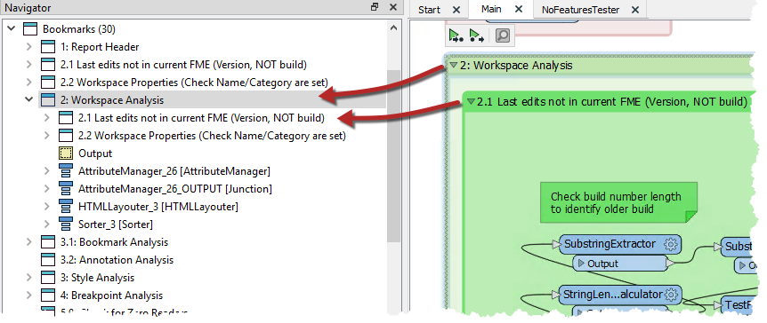
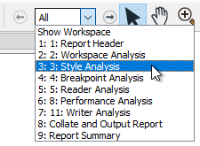
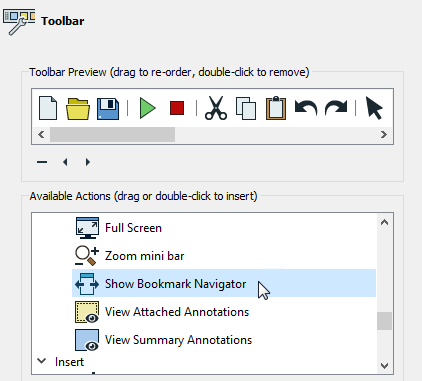
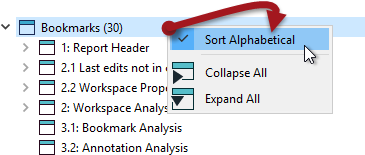

### 书签用于快速访问

书签在Workbench Navigator窗口中列出。每个书签都被描述为一个文件夹，可以展开以显示其内容。它可能包括要素类型，转换器或其他*嵌套*书签：

单击或双击导航器中的书签可选择该书签并将其显示在视图中。因此，当使用书签将工作空间划分为多个部分时，它们也可用于在该工作空间的不同部分之间导航。

通过这种方式，书签就像书中的章节标题！

### 书签导航器 ###
也可以使用“书签导航器”在FME Workbench工具栏上导航书签：

除了可以快速访问书签外，“书签导航器”工具还可以用于显示您的工作空间。通过单击箭头按钮（或按键盘上的空格键），可以使用动画在书签之间切换，这种方式在将工作空间显示为演示文稿的一部分时非常有用。

---

<!--Tip Section-->

<table style="border-spacing: 0px">
<tr>
<td style="vertical-align:middle;background-color:darkorange;border: 2px solid darkorange">
<i class="fa fa-info-circle fa-lg fa-pull-left fa-fw" style="color:white;padding-right: 12px;vertical-align:text-top"></i>
诀窍
</td>
</tr>

<tr>
<td style="border: 1px solid darkorange">

要访问该功能，您需要确保已将其添加到工具栏。您可以通过右键单击工具栏并使用自定义选项来执行此操作。 

</td>
</tr>
</table>

---

<!--Person X Says Section-->

<table style="border-spacing: 0px">
<tr>
<td style="vertical-align:middle;background-color:darkorange;border: 2px solid darkorange">
<i class="fa fa-quote-left fa-lg fa-pull-left fa-fw" style="color:white;padding-right: 12px;vertical-align:text-top"></i>
FME蜥蜴说...
</td>
</tr>

<tr>
<td style="border: 1px solid darkorange">

该窗口中书签的顺序是按字母顺序的，可能并不总是与您希望显示工作空间的顺序相同。 
  在这种情况下，请在“导航器”窗口中右键单击“书签”，然后关闭默认选项“按字母顺序排列(Sort Alphabetically)”。
  
  然后可以在“导航器”窗口中上下拖动书签以给出正确的顺序。此外，书签“属性”对话框上的新选项使您可以从“书签导航器”中排除特定的书签。嵌套书签默认情况下不包括在内，因此必须打开才能包含在导航器中。
 <br有关更多信息，请参阅Safe Software博客 <strong><a href=ww.safe.com/blog/2016/03/fmeevangelist146/"> 有关书签的文章</a></strong> 。

</td>
</tr>
</table>
