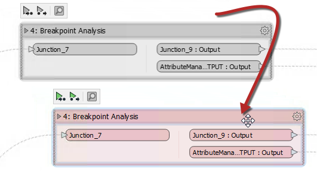

### 书签用来编辑

书签定义包含许多对象的工作空间的一部分。编辑没有书签的工作空间时，通过选择一个或多个对象并将它们拖动到新位置来完成移动对象。

但是，当工作空间被书签分割时，只需将书签拖动到新位置即可移动对象。当对象位于书签内部时，它会像书签一样移动。

使用此技术，可以在工作空间画布上移动大量对象，以创建更清晰的布局。无论书签是折叠还是展开，都可以在书签内部移动对象。

---

<!--Person X Says Section-->

<table style="border-spacing: 0px">
<tr>
<td style="vertical-align:middle;background-color:darkorange;border: 2px solid darkorange">
<i class="fa fa-quote-left fa-lg fa-pull-left fa-fw" style="color:white;padding-right: 12px;vertical-align:text-top"></i>
FME蜥蜴说...
</td>
</tr>

<tr>
<td style="border: 1px solid darkorange">

请记住，其中一个书签属性标记为 <strong>内容</strong>， 其值为“使用书签移动(Move with Bookmark)”或“独立移动(Move Independently)”。显然，前一个值会导致对象随转换器移动; 后一个值会导致对象在移动书签时保持在原位。

</td>
</tr>
</table>
