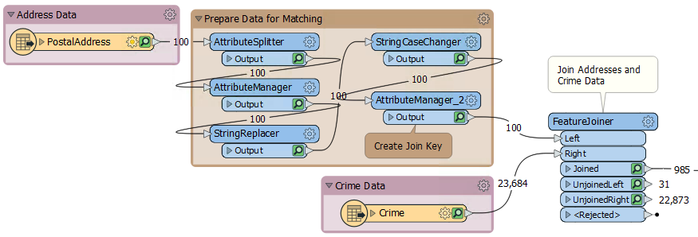
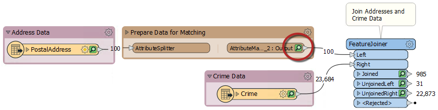
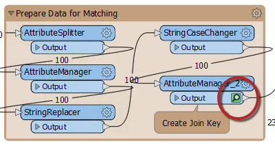

### 书签用于性能

在启用数据缓存的情况下运行工作空间时，会在每个转换器上缓存要素。可以想象，在较大的工作空间中，这会导致大量数据被缓存，有时不必要：

请注意，在上面的屏幕截图中，正在缓存“准备匹配数据”书签中的每个转换器。

但是，当折叠书签时，缓存仅发生在书签输出对象上：

此特性意味着仅为书签中的最终转换器缓存数据，从而节省大量时间和资源：

---

<!--Person X Says Section-->

<table style="border-spacing: 0px">
<tr>
<td style="vertical-align:middle;background-color:darkorange;border: 2px solid darkorange">
<i class="fa fa-quote-left fa-lg fa-pull-left fa-fw" style="color:white;padding-right: 12px;vertical-align:text-top"></i>
FME蜥蜴说....
</td>
</tr>

<tr>
<td style="border: 1px solid darkorange">

显然，无论您的书签是否已折叠，您都不希望在启用缓存时将工作空间投入生产。仅建议将此技术用于工作空间创建的设计，创作和测试阶段。 
</td>
</tr>
</table>
