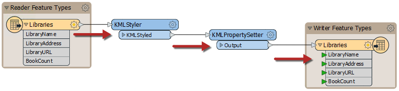
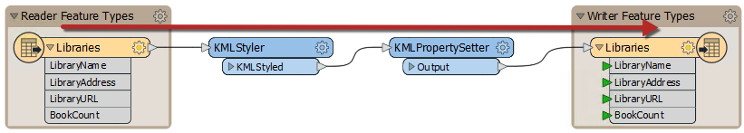
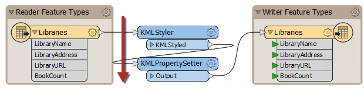
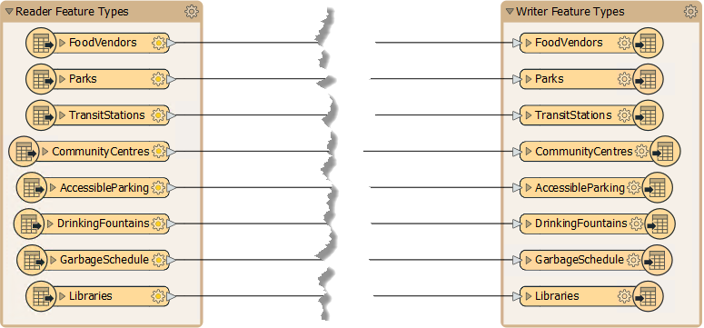
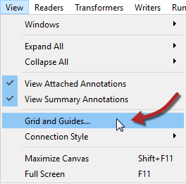
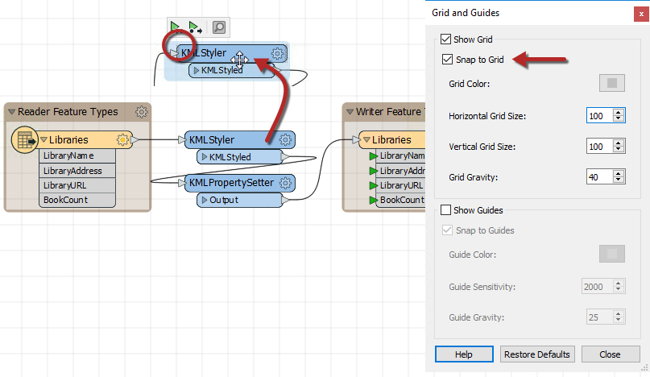
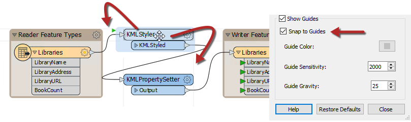
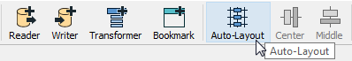
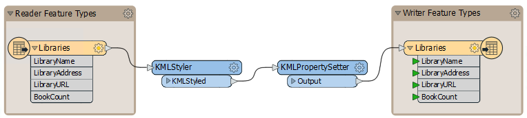
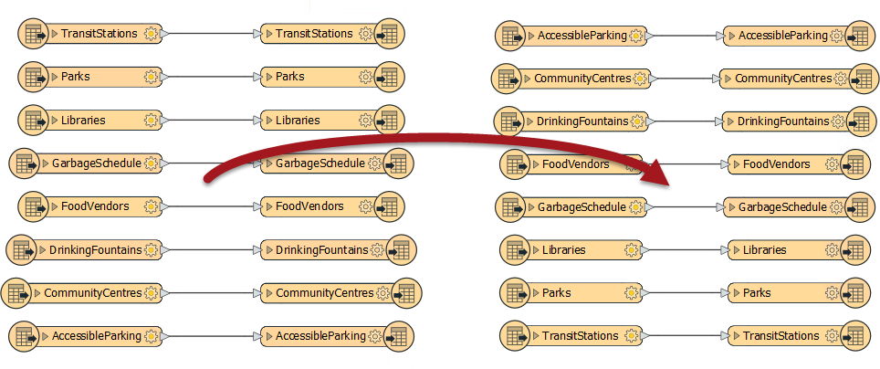

## 对象布局

工作空间对象的定位以及连接它们时的注意力可以使设计不良的工作空间与视觉上有吸引力且高效的工作空间之间产生差异。

### 对象布局

布局方法因用户而异。有些用户喜欢排列对象，以便所有*连接*都是水平的：

其他人则喜欢将*对象*的顶部水平对齐，并使用倾斜的连接：

有些人喜欢垂直对齐对象边缘：

使用的样式更多的是个人偏好而不是明确的规则，但重要的是一致性。没有明显布局样式或不一致的工作空间不会激发对作者能力的信心！
---

<!--Updated Section--> 

<table style="border-spacing: 0px">
<tr>
<td style="vertical-align:middle;background-color:darkorange;border: 2px solid darkorange">
<i class="fa fa-bolt fa-lg fa-pull-left fa-fw" style="color:white;padding-right: 12px;vertical-align:text-top"></i>
2019.1更新
</td>
</tr>

<tr>
<td style="border: 1px solid darkorange">

在FME2019.1中，新生成的工作空间中的读模块和写模块要素类型将被重新调整大小并对齐以提供更令人满意的布局： 
  

</td>
</tr>
</table>

---

### 网格和参考线 ###
网格和参考线是一种工具，可帮助您整洁整齐地对齐工作空间对象。可以通过Workbench菜单栏上的View&gt; Grid和Guides访问此功能。

**显示网格** 会导致在Workbench画布上显示线条格网。“移动到网格Snap to Grid”会导致所有对象（例如突出显示的摘要注释）在移动时移动到到格网线的交叉点。通过这种方式，对象可以更容易排列。

**显示参考线**可使参考线在移动对象时显示在Workbench画布上，并大致对齐另一个画布对象。对齐参考线可以将对象移动到突出显示的参考线上。

这两个工具使得工作空间对象以令人愉悦的方式对齐变得非常简单。

---

### 自动布局

自动布局工具显示在FME Workbench的工具栏上：

单击工具栏按钮将布局所有工作空间或仅显示当前选定的对象：

如您所见，自动布局倾向于使用水平图案，对象的顶部对齐。因此，在使用此工具时，最好一次选择转换器组，而不是尝试在单个操作中布置整个工作空间。

---

<!--Updated Section--> 

<table style="border-spacing: 0px">
<tr>
<td style="vertical-align:middle;background-color:darkorange;border: 2px solid darkorange">
<i class="fa fa-bolt fa-lg fa-pull-left fa-fw" style="color:white;padding-right: 12px;vertical-align:text-top"></i>
2019.1更新
</td>
</tr>

<tr>
<td style="border: 1px solid darkorange">

通常，自动布局算法很好。虽然它无法与花费大量时间手动组织对象布局相提并论，但随着时间的推移，它正在不断改进。2019.1布局算法已更新，具有多项改进，其中一项功能是按字母顺序对要素类型进行排序： 
  

</td>
</tr>
</table>
