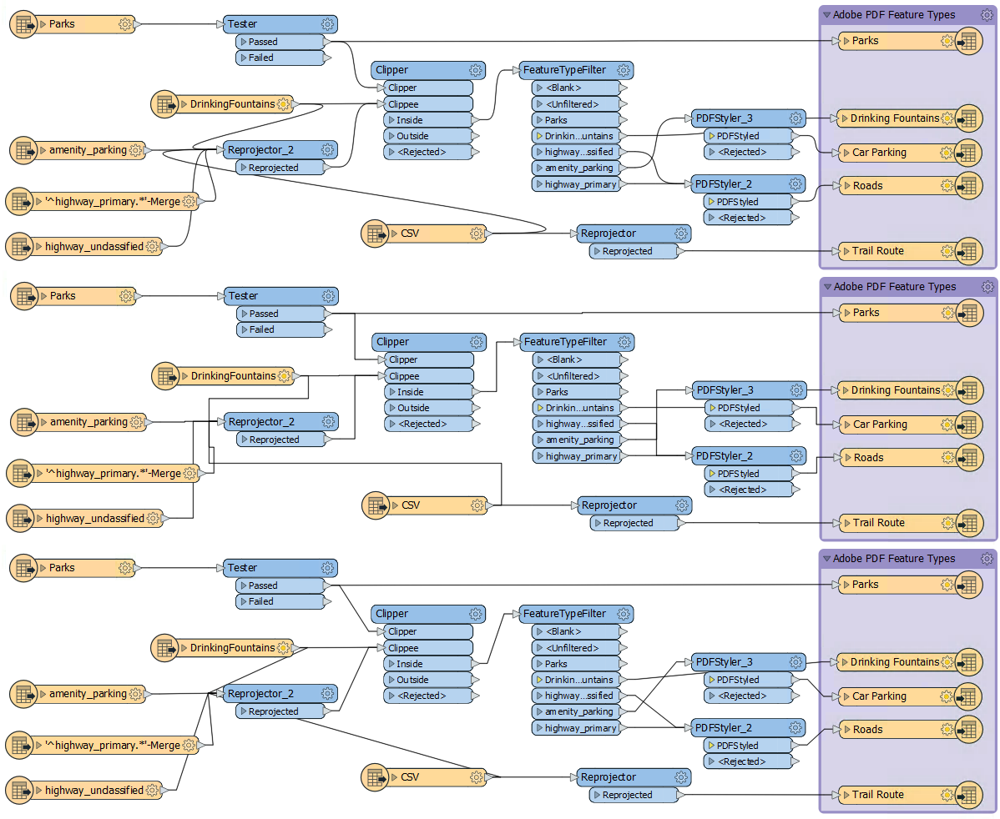
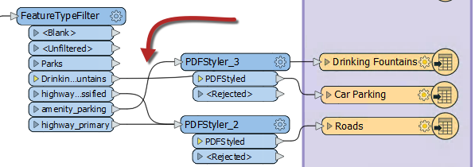
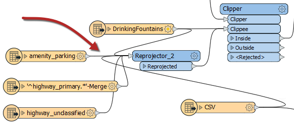
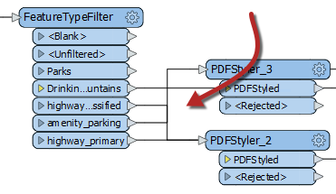
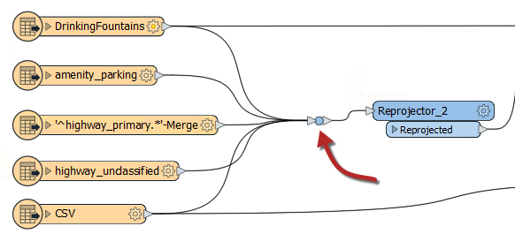
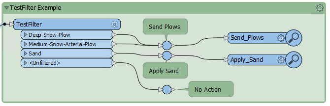
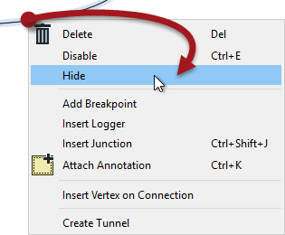
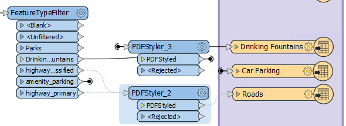
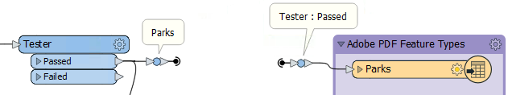

## 连接样式

值得注意的是，对象定位只是良好布局的一部分。另一个关键部分是连接样式。

与工作空间对象的定位一样，连接它们时的注意力可以使设计不良的工作空间与视觉上有吸引力且高效的工作空间之间产生差异。

### 连接样式

连接是工作空间画布上对象之间的线。您可以在Workbench中创建三种不同的连接样式：

* 弯曲：具有曲线连接的默认样式
* 方形：通过方形连接唤起曼哈顿天际线的风格
* 直的：原始连接方式; 两个物体之间的直线

您可以使用“视图”菜单，“FME选项”菜单或快捷键<kbd>Ctrl</kbd>+<kbd>Shift</kbd>+<kbd>C</kbd>在样式之间切换。此图显示了三种样式的比较：

再一次，关于使用哪种样式没有正确或错误的选择; 这更像是个人偏好。但是，对象布局和连接方式是相关的; 最好的FME作者将根据用于避免重叠连接等问题的连接方式改变对象的位置。

### 重叠连接

工作空间设计最明显的缺点之一是具有相互交叉的连接，例如：

当连接与画布上的另一个连接或另一个对象重叠时，连接的可见性和意图总是会受到损害。但是，连接方式的选择会影响重叠发生的可能性。例如，弯曲的连接往往比直的连接更多：

......方形连接有时会以难以理解的方式交叉：

因为当您切换连接样式时会出现这些问题，所以选择特定的连接样式和布局技术并坚持下去是明智的。例如，在弯曲连接工作空间中，转换器可以更宽的间隔以避免重叠。

### 接合

FME Workbench中有一个转换器，旨在用于增强对象和连接的布局。那个转换器叫做**接合**。

这个转换器是一个类似节点的小对象，它不对数据执行任何功能，而是用于整理工作空间内的连接 - 如上面的屏幕截图所示。这种特性使其成为最佳实践的绝佳工具。

与任何其他转换器一样，结点可以连接到Inspector或Logger，并且可以附加注释对象。它还适用于“快速添加”，“拖动/连接”功能和“要素缓存”。

<!--Updated Section--> 

<table style="border-spacing: 0px">
<tr>
<td style="vertical-align:middle;background-color:darkorange;border: 2px solid darkorange">
<i class="fa fa-bolt fa-lg fa-pull-left fa-fw" style="color:white;padding-right: 12px;vertical-align:text-top"></i>
2019.1更新/span>
</td>
</tr>

<tr>
<td style="border: 1px solid darkorange">

别忘了，在2019.1中，Junction转换器稍大一些，使其更易于选择以进行视可视化预览或部分运行操作。
  
  

</td>
</tr>
</table>

---

### 隐藏的连接和隧道

隐藏连接的能力对于避免重叠特别有用。要隐藏连接，请右键单击它并选择隐藏选项：

隐藏连接由“发射器”图标表示，或者当选择连接一端的对象时由灰色虚线表示：

此处必须选择对象（转换器或要素类型）才能使连接可见。

另一个可用选项是“创建隧道”。此选择会在每端添加带注释的结转换器时创建隐藏连接：

隧道使隐藏连接稍微明显，并允许在每一端进行注释。

#### 重新审视隐藏连接

要查看隐藏的连接，请单击任一端的对象。连接突出显示为灰色虚线。

要将连接返回到视图，请右键单击与其连接的对象，然后选择“显示连接”。

有关隧道和连接点的更多信息，请参阅[**此博客文章**](http://blog.safe.com/2016/05/fmeevangelist150/)。
