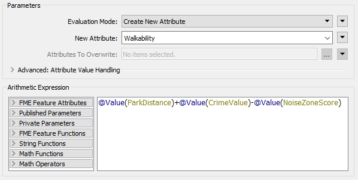
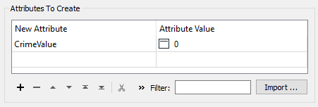

|  练习1 |  调试工作空间 |
| :--- | :--- |
| 数据 | 地址（Esri地理数据库） 犯罪数据（CSV - 逗号分隔值） 公园（MapInfo TAB） 游泳池（OSM - OpenStreetMap） |
| 总体目标 | 参与温哥华步行性项目 |
| 演示 | 调试最佳实践 |
| 启动工作空间 | C:\FMEData2019\Workspaces\DesktopBasic\BestPractice-Ex3-Begin.fmwt |
| 结束工作空间 | C:\FMEData2019\Workspaces\DesktopBasic\BestPractice-Ex3-Complete.fmwt |

继续上一个练习，您已被分配到一个项目，以计算温哥华市每个地址的“步行性”。步行性衡量步行访问当地设施的难易程度。该工作空间目前正在评估犯罪，公园和噪音控制区域，但并未对步行性进行全面衡量。

所以，让我们这样做，然后看看是否还有其他方面可以包括。

---

 **1) 启动FME Workbench**
 启动FME Workbench。打开工作空间模板 C:\FMEData2019\Workspaces\DesktopBasic\BestPractice-Ex1-Begin.fmw. 然后运行工作区以缓存数据。

这个工作空间有点混乱，但是我们将在以后的练习中修复它。首先，让我们弄清楚该工作空间的作用：

1. 正在从Addresses.gdb中读取PostalAddress和PostcodeBoundaries。
2. 正在清理PostalAddress要素类型的属性以创建单独的Number和Street属性。然后将数字的最后两位数字替换为XX，以创建一个属性，该属性将成为用于联接犯罪数据的联接关键字。
3. 读入Crime.csv后，每个犯罪事件的街道号都以XX作为最后两位数字来保护。
4. 基于2.中创建的Join Key属性和Crime的Block属性，在FeatureJoiner中将PostalAddress和Crime数据连接在一起。
5. 根据严重性为[crime] 类别属性指定一个数字，然后为每个地址块计算总的CrimeValue。然后，使用CenterPointReplacer，如果同一位置有多个犯罪事件，则仅提取一个点。
6. 读入公园MapInfo TAB文件。这将用于测量从地址到公园的步行距离。
7. 使用NeighborFinder确定最靠近每个地址的公园。
8. 使用NeighborFinder创建的_distance属性重命名为ParkDistance。
9. 使用Creator和FeatureReader读取计划限制Planning Restrictions OGC Geopackage。然后从该数据集中读取NoiseControlAreas，以获得噪声限制区域。该数据将与犯罪和住址数据结合在一起。
10. 使用PointOnAreaOverlayer，可以将包含犯罪，停车距离和地址的点数据与NoiseControlAreas多边形结合在一起。这会将噪声限制分配给任何重叠点。AttributeValueMapper用于为区域分配分数，从而创建属性NoiseZoneScore。此新属性将反映出，在噪声受限区域中更适合步行的地址。

---

<!--Tip Section-->

<table style="border-spacing: 0px">
<tr>
<td style="vertical-align:middle;background-color:darkorange;border: 2px solid darkorange">
<i class="fa fa-info-circle fa-lg fa-pull-left fa-fw" style="color:white;padding-right: 12px;vertical-align:text-top"></i>
技巧
</td>
</tr>

<tr>
<td style="border: 1px solid darkorange">

这个工作空间非常混乱，因为我们的同事没有遵循任何最佳实践。我们将在以后的练习中对其进行清理，但是如果您难以理解处于混乱状态，请单击“自动布局(Autolayout)”按钮以快速整理它：
 

  
 <strong>请注意，与屏幕截图和培训老师相比，这将改变工作空间的外观， 因此请注意转换器的名称和端口： </strong>
  

</td>
</tr>
</table>

---

 **2) 添加ExpressionEvaluator转换器**  
我们可以创建一个可步行性度量，它使用ExpressionEvaluator转换器组合所有当前值。

因此，将ExpressionEvaluator转换器添加到工作空间的末尾，并将其连接到AttributeValueMapper_2。

检查其参数。将其设置为创建一个名为Walkability的新属性，该属性为：

<pre>
@Value(ParkDistance) + @Value(CrimeValue) - @Value(NoiseZoneScore)
</pre>

使用此表达式，结果越小越好。运行工作空间。因为我们从一开始就运行工作空间来缓存所有数据，所以只有ExpressionEvaluator会运行。

 **3) 评估结果**  
让我们评估转换结果是否正确。

首先检查日志窗口是否有错误和警告。没有错误，但有几个警告，这不是一个好兆头：

***注意:*** *转换日志中显示的警告数量可能有所不同，这是基于FME选项中设置的“记录参数”。*

单击警告按钮以过滤掉警告。警告说：

<pre>
ExpressionEvaluator: 无法评估表达式 '@real64(560.3272250455418+&lt;null&gt;-0)'.
结果设置为空
</pre>

检查ExpressionEvaluator上的输出缓存，某些地址确实具有&lt;null&gt;的Walkability值。

所以我们知道存在问题，让我们试着弄清楚问题出在哪里以及问题发生的原因。

---

<!--Tip Section-->

<table style="border-spacing: 0px">
<tr>
<td style="vertical-align:middle;background-color:darkorange;border: 2px solid darkorange">
<i class="fa fa-info-circle fa-lg fa-pull-left fa-fw" style="color:white;padding-right: 12px;vertical-align:text-top"></i>
技巧
</td>
</tr>

<tr>
<td style="border: 1px solid darkorange">

一个有用的测试是在“表视图”窗口中右键单击CrimeValue，然后按升序排序。这会将所有空值放在表的顶部。

</td>
</tr>
</table>

---

 **4) Locate the Problem**
 定位问题**  
我们可以告诉ExpressionEvaluator发出警告，但这并不一定意味着问题所在。计算失败，因为中间值为&lt;null&gt;。如果表达式是：

<pre>
ParkDistance + CrimeValue - NoiseZoneScore
</pre>

然后我们知道必须是CrimeValue这个问题，因为它是中间值。

让我们找出问题所在。首先，稍微整理一下工作区，然后检查FeatureJoiner转换器上的缓存。我们正在检查FeatureJoiner，因为这是我们首先获得犯罪数据的地方：

没有来自FeatureJoiner的<null>值，因此让我们继续转换。检查缓存中的AttributeValueMapper。那是设置值的地方，所以也许空值从那里出来了？

检查时，那里的CrimeValue或Crime Type属性没有<null>值。对于Aggregator和CenterPointReplacer缓存，也没有null。

检查每个功能缓存比较耗时，让我们尝试另一种方法。检查每个连接上的要素计数。有68,446个带有犯罪标记的要素（FeatureJoiner:Joined），但在 Aggregator之后减少到9,899个，然后有3,698个没有带有犯罪标记的要素（FeatureJoiner:UnjoinedLeft）。这样一来，从NeighborFinder中出来的总数为13,597，这是正确的。

哦。你看到了吗？3,698个没有被标记为犯罪的要素：它们获得了什么CrimeValue？检查FeatureJoiner的UnjoinedLeft输出，您将看到它们不具有CrimeValue属性。这就是为什么ExpressionEvaluator表示存在空值的原因。这些要素没有CrimeValue值的原因是因为它们没有通过为CrimeValue分配值的AttributeValueMapper路由。

---

<!--Tip Section-->

<table style="border-spacing: 0px">
<tr>
<td style="vertical-align:middle;background-color:darkorange;border: 2px solid darkorange">
<i class="fa fa-info-circle fa-lg fa-pull-left fa-fw" style="color:white;padding-right: 12px;vertical-align:text-top"></i>
FME蜥蜴说...
</td>
</tr>

<tr>
<td style="border: 1px solid darkorange">

为了确认这一点，我将日志复制到文本编辑器中，并搜索了短语 "ExpressionEvaluator: Failed to evaluate expression"。
 它出现了3,698次，与退出UnjoinedLeft端口的要素数量相同。巧合？

</td>
</tr>
</table>

---

 **5) 解决问题** 
 如果这些功能没有CrimeValue属性，那么我们应该给它们一个。为此，将AttributeCreator转换器添加到FeatureJoiner：UnjoinedLeft输出端口和NeighborFinder：Base输入端口之间的工作空间中：

打开其参数并创建一个名为CrimeValue的属性，其值为零（0）。

运行工作空间，该工作空间将从AttributeCreator运行到ExpressionEvaluator。现在，您应该发现警告更少，并且输出不包含任何 &lt;null&gt;值。

 **6) 添加游泳池**
该市已决定，公园不是步行性得分的最佳候选者，因为通常附近有公园。他们决定评估步行到游泳池有多容易，并且此评估结果可用于以后确定应该在哪里建造新游泳池。

我们可以为公园使用的游泳池重复使用相同的工作流，仅需进行少量更新即可。

首先，我们添加一个具有以下参数的新读模块
：
<table style="border: 0px">

<tr>
<td style="font-weight: bold">读模块格式</td>
<td style="">OpenStreetMap (OSM) XML</td>
</tr>

<tr>
<td style="font-weight: bold">Reader Dataset</td>
<td style="">C:\FMEData2019\Data\OpenStreetMap\leisure.osm</td>
</tr>

</table>

出现提示时，仅选择leisure要素类型：

然后将新的休闲读模块移至Parks读模块附近，并将其连接到NeighborFinder：Candidate输入端口。然后右键单击Parks读模块，然后选择“禁用”。

 **7) 过滤休闲数据**
 如果您查看休闲数据，您会注意到休闲设施的类型多种多样，其类型记录在*leisure*属性中。

因此，在leisure读模块和NeighborFinder之间添加一个Tester转换器。设置参数以测试leisure = swimming_pool

 **8) 更新转换器参数**
 现在将AttributeRenamer更新为PoolDistance而不是ParkDistance。重命名此属性将使ExpressionEvaluator变为红色。

要修复ExpressionEvaluator，请打开参数并将@Value（ParkDistance）更改为@Value（PoolDistance），以考虑新的PoolDistance属性：

<pre>
@Value(PoolDistance) + @Value(CrimeValue) - @Value(NoiseZoneScore)
</pre>

重新运行工作空间。检查日志中是否有警告和错误，然后检查ExpressionEvaluator缓存。

请注意，由于PoolDistance，可步行性评分突然变得非常大。出了点问题，但是是什么呢？

 **9) 找到问题**
 PoolDistance是**问题**的根源。没有相关的日志消息提供线索，并且要素计数数字看起来正确。

让我们检查数据。单击leisure读模块，然后在按住<kbd>shift</kbd>键的同时，单击NeighborFinder。然后右键单击任一对象，然后选择“检查缓存的要素”。这将在Visual Preview中打开所有选定的缓存。

在“图形”视图中单击鼠标右键，转到“背景图”，并确保已选中“关闭背景图”。可视化预览显示了两个数据点，相距很远。此结果是典型的坐标系不匹配。

单击某些要素，然后选择要素信息按钮。在此窗口中，您将看到主数据的坐标系为UTM83-10，而OSM的休闲数据的坐标系为LL84。

这种差异就是为什么到每个地址的“最近”泳池如此之远的原因。

 **10) Fix Coordinate System Problem**
 显而易见的解决方案是将池重新投影到正确的坐标系。因此，添加一个Reprojector转换器以将leisure数据重新投影到NeighborFinder之前：

检查其参数并将其设置为从LL84重新投影到UTM83-10。

重新运行工作空间的相应部分。检查日志窗口并检查ExpressionEvaluator缓存。

现在，每个地址都有一个对于游泳池而不是公园的步行性得分帐户，数字越小越好，数字越多越差。

<table>
  <thead>
    <tr>
      <th style="text-align:left">恭喜</th>
    </tr>
  </thead>
  <tbody>
    <tr>
      <td style="text-align:left">
        
通过完成本练习，您已学会如何：
           
        

        <ul>
          <li>使用ExpressionEvaluator转换器</li>
          <li>检查日志窗口是否有错误和警告</li>
          <li>通过使用要素计数和可视化预览来查找问题</li>
          <li>识别并修复工作空间中的问题</li>
        </ul>
      </td>
    </tr>
  </tbody>
</table>
