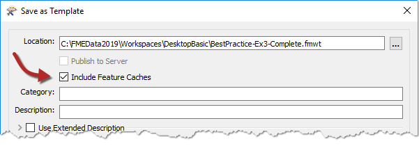
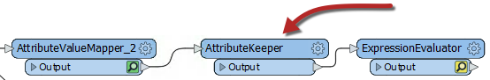
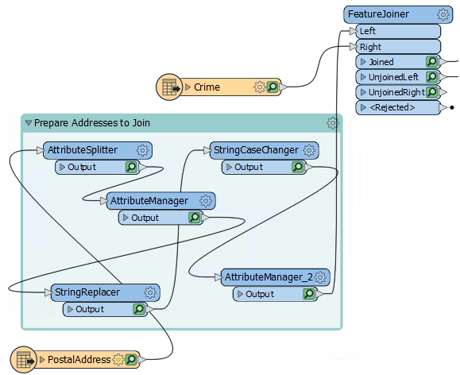
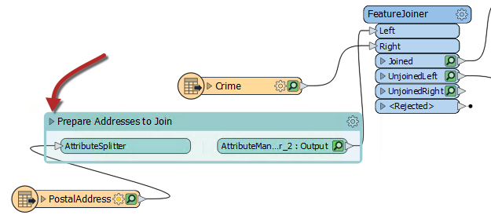

|  练习2 |  方法 |
| :--- | :--- |
| 数据 | 地址（Esri地理数据库） 犯罪数据（CSV - 逗号分隔值） 公园（MapInfo TAB） |
| 总体的目标 | 参与温哥华可步行性项目 |
| 演示 | 方法最佳实践 |
| 启动工作空间 | C:\FMEData2019\Workspaces\DesktopBasic\BestPractice-Ex2-Begin.fmwt |
| 结束工作空间 | C:\FMEData2019\Workspaces\DesktopBasic\BestPractice-Ex2-Begin.fmwt |

继续上一个练习，您已被分配到一个项目，以计算温哥华市每个地址的“可步行性”。可步行性是步行即可轻松访问本地设施的一种度量。最初的工作区分析了该地区和距最近公园的距离内的犯罪情况。然后要求您计算到最近的游泳池而不是公园的距离。

在本练习中，我们将修改工作空间以提高其性能。

---

 **1) 继续工作空间**
 启动FME Workbench并打开上一个练习中的工作空间。或者，您可以打开
C:\FMEData2019\Workspaces\DesktopBasic\BestPractice-Ex2-Begin.fmw. 从练习1的工作空间中继续，我们现在将尝试使该工作空间运行得更快。

***注意:*** *如果打开起始工作空间，则需要运行它来创建缓存。*

***注意:*** *请记住，如果在第一个练习中单击“自动布局(AutoLayout)”按钮，则工作空间将看起来不同。请密切注意转换器和端口名称。*

 **2) 确定性能改进**
 在上一练习中编辑ExpressionEvaluator时，您可能已经注意到，还有很多其他属性，例如CrimeList{}.City或 CrimeList{}.Block。这些多余的属性使显示混乱，检查输出变得困难。这些属性也几乎不能帮助提高工作区的性能-即使在开发过程中使用缓存可以减轻这种情况。

让我们将工作空间另存为模板文件。在顶部菜单中，转到"File &gt; Save As Template". 。出现提示时，请确保选中"Feature Caches"选项:

现在，如果我们稍后再返回该项目或共享它，则用户可以重新打开模板，并准备使用我们所有的缓存数据。

检查刚创建的模板文件BestPractice-Ex2-Begin.fmwt的大小。您会看到它的大小几乎为50mb，对于模板而言这是相当大的。拥有较大的模板文件不是问题，但是它确实表明正在缓存大量数据，这可能会影响工作空间的性能。

数据的一方面是属性和列表的数量。由于有很多其他属性要删除，但我们只需要保留几个，因此我们将使用AttributeKeeper转换器。将AttributeKeeper放置在AttributeValueMapper_2和ExpressionEvaluator转换器之间：

检查AttributeKeeper参数并将其设置为仅保留CrimeValue，NoiseZoneScore和PoolDistance。注意我们不保留的属性的名称。我们也许可以在工作空间中更早地删除它们。

 **3) 删除列表**
 感兴趣的一个属性是名为CrimeList{}的列表属性，该属性在此转换的任何部分都没有必要。通过按<kbd>Ctrl</kbd>+<kbd>F</kbd>跟踪其来源F并搜索CrimeList。搜索结果显示在“导航器”窗口中，您会发现Aggregator转换器正在创建CrimeList。

检查Aggregator转换器的参数并关闭“生成列表”参数，以防止创建列表。此步骤将导致许多缓存变得陈旧，但是我们很快将重新运行工作空间以解决此问题。

 **4) 删除多余的要素类型**
 工作空间运行缓慢的另一个原因是，您可能正在读取工作空间中未使用的多余数据。看起来原始作者是从Addresses.gdb中读取PostcodeBoundaries要素类型。此外，完成操作后，我们并未移除Parks要素类型。立即删除这两个选项，然后在弹出的所有警告上单击“是”。

 **5) 折叠书签**
 多余缓存的另一个来源是转换器产生了我们不需要检查的输出。通过将这些转换器隐藏在折叠的书签中可以防止这些情况。

通过选择所有转换器并按键盘上的<kbd>ctrl</kbd>+<kbd>B</kbd>，在PostalAddress读模块和FeatureJoiner之间的所有转换器周围添加书签。然后将书签命名为“Prepare Addresses to Join”：

***注意:*** *本章稍后将更详细地介绍书签。*

现在我们可以折叠书签，然后当我们重新运行转换时，只有最后一个转换器会具有缓存。要折叠书签，请单击书签名称旁边的箭头：

---

<!--Tip Section-->

<table style="border-spacing: 0px">
<tr>
<td style="vertical-align:middle;background-color:darkorange;border: 2px solid darkorange">
<i class="fa fa-info-circle fa-lg fa-pull-left fa-fw" style="color:white;padding-right: 12px;vertical-align:text-top"></i>
FME蜥蜴说...
</td>
</tr>

<tr>
<td style="border: 1px solid darkorange">

如果您想继续前进，请在其他部分周围添加更多书签，然后将其折叠。我们将在下一个练习中执行此操作，因此您可以查看您的书签是否相同。
</td>
</tr>
</table>

---

 **6) 运行工作空间**
 现在，通过单击ExpressionEvaluator并选择*Run to This*或仅单击run按钮来运行工作空间。

工作空间将运行并且将缓存数据，但是对于折叠的书签，将为其五个转换器仅创建一个缓存。AttributeKeeper也将删除输出不需要的属性。

将工作空间另存为新模板，然后选中包含缓存的选项。检查新模板的文件大小。它应该小得多（大约16mb）。

***注意：***  *如果要使用提供的工作空间，只需打开它们并将其另存为模板文件即可进行比较*。

---

<!--Exercise Congratulations Section-->

<table style="border-spacing: 0px">
<tr>
<td style="vertical-align:middle;background-color:darkorange;border: 2px solid darkorange">
<i class="fa fa-thumbs-o-up fa-lg fa-pull-left fa-fw" style="color:white;padding-right: 12px;vertical-align:text-top"></i>
恭喜
</td>
</tr>

<tr>
<td style="border: 1px solid darkorange">

通过完成本练习，您已学会如何： 
 
<li>删除不必要的属性以提高性能</li>
<li>跟踪不必要的列表并将其删除</li>
<li>通过折叠书签来防止缓存过多，从而提高性能</li>
<li>将工作空间另存为模板，包括缓存</li></ul>

</td>
</tr>
</table>
