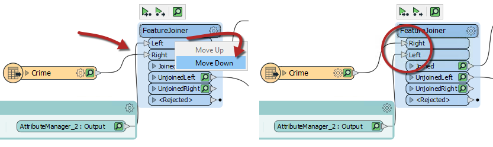
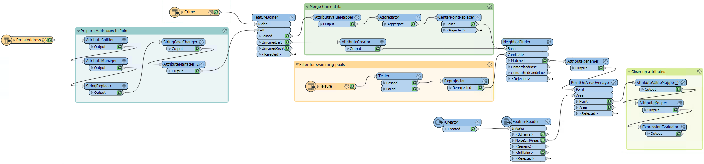
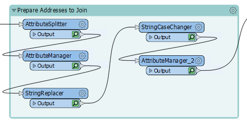
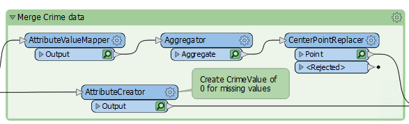
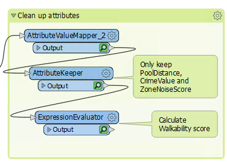
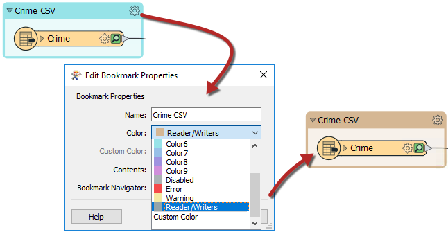
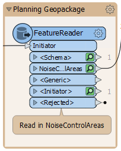

|  练习3 |  应用样式指南 |
| :--- | :--- |
| 数据 | 地址（Esri地理数据库） 犯罪数据（CSV - 逗号分隔值） 公园（MapInfo TAB） |
| 总体目标 | 参与温哥华可步行性项目 |
| 演示 | 样式最佳实践 |
| 启动工作空间 | C:\FMEData2019\Workspaces\DesktopBasic\BestPractice-Ex1-Begin.fmwt |
| 结束工作空间 | C:\FMEData2019\Workspaces\DesktopBasic\BestPractice-Ex1-Complete.fmwt |

上一个练习的继续，您已分配给一个项目，用于计算温哥华市每个地址的“可步行性”。

当您的同事给我们工作空间时，他并没有意识到FME风格的最佳实践，这给工作空间带来了挑战。我们需要展示我们的工作空间，因此我们希望它看起来整洁，井井有条并有据可查。

 **1) 启动Workbench**
 启动FME Workbench并打开上一个练习中的工作区。或者，您可以打开
C:\FMEData2019\Workspaces\DesktopBasic\BestPractice-Ex3-Begin.fmw.

***注意:*** *请记住，如果在第一个练习中单击“自动布局”按钮，则工作空间将看起来不同。请密切注意变压器和端口名称。*

 **2) 重新排列转换器**
 首先，让我们清理一下转换器。移动变压器，以确保没有重叠的连接。

对于FeatureJoiner，您可以将Crimes读模块移到“Prepare Addresses to Join”书签的下面，或者可以对FeatureJoiner端口重新排序。右键单击“左”输入端口，然后选择“下移”。现在两条连接线没有交叉：

将转换器移动到逻辑顺序，并在任何逻辑组周围添加书签：

不要忘记展开上一个练习中的“Prepare Addresses to Join”书签并组织这些转换器：

 **3) 添加样式**
 重新排列了转换器并添加了书签后，我们现在可以添加注释和颜色以突出显示正在发生的事情。此步骤将需要对转换器进行一些检查，以找出它们在做什么，以及查看读模块以了解它们采用的格式：

在需要的地方添加良好的注释将有助于确定工作空间中正在发生的事情：

---

<!--Tip Section-->

<table style="border-spacing: 0px">
<tr>
<td style="vertical-align:middle;background-color:darkorange;border: 2px solid darkorange">
<i class="fa fa-info-circle fa-lg fa-pull-left fa-fw" style="color:white;padding-right: 12px;vertical-align:text-top"></i>
诀窍
</td>
</tr>

<tr>
<td style="border: 1px solid darkorange">

通过在读模块或写模块周围添加书签，然后将颜色设置为预设的“读模块/写模块”颜色，可以快速查看一下您的读模块或写模块的位置：  
 
 
 
 您也可以使用FeatureReaders和FeatureWriters进行此操作：
  

</td>
</tr>
</table>

---

 **4) 运行工作空间**
 如果愿意，可以折叠所有书签，然后再次运行工作空间以确保所有缓存都是最新的。重新运行整个工作空间可能是一个好主意。

 **5) 保存工作空间**
 您可以选择将此工作区另存为常规工作空间或模板工作空间。

---

<!--Exercise Congratulations Section-->

<table style="border-spacing: 0px">
<tr>
<td style="vertical-align:middle;background-color:darkorange;border: 2px solid darkorange">
<i class="fa fa-thumbs-o-up fa-lg fa-pull-left fa-fw" style="color:white;padding-right: 12px;vertical-align:text-top"></i>
恭喜
</td>
</tr>

<tr>
<td style="border: 1px solid darkorange">

通过完成本练习，您已学会如何：
 
<ul><li>将转换器重新排列成逻辑布局，以将执行单个任务的转换器进行分组</li>
<li>使用注释来阐明工作空间中发生的过程</li>
<li>使用书签将单个工作空间变成已定义的部分</li>
<li>避免不良的设计选择，例如重叠的连接</li></ul>

</td>
</tr>
</table>
