|  练习4 |  FME黑客马拉松 |
| :--- | :--- |
| 数据 | 道路（Autodesk AutoCAD DWG和/或PostGIS） |
| 总体目标 | 找到从黑客马拉松到意大利咖啡馆的最短路线 |
| 演示 | 数据转换，变换和最佳实践 |
| 启动工作空间 | 无 |
| 结束工作空间 | C:\FMEData2018\Workspaces\DesktopBasic\BestPractice-Ex4-Complete.fmw |

一个区域GIS小组正在举办FME Hackathon，并且您已被邀请参加。

您已获得一组源数据，并被要求从中创建有用的项目。您决定制作制作一个工具来绘制出从黑客马拉松场地到一家咖啡厅的路线，在那里有个团体聚会将在当晚举行，这将是有趣的。

因此，您的任务是使用可用的数据来计算从会议中心到咖啡馆的最佳路线，并将该数据写出为GPX格式，以便民众可以在他们的GPS /移动设备中使用它。


**1) 创建数据库连接**
<br>源数据已在PostGIS数据库中提供; 因此，我们的首要任务应该是创建一个连接。这样我们就可以使用连接而不必输入连接参数。

在Web浏览器中访问[http://fme.ly/database](http://fme.ly/database) - 这将显示在Amazon RDS上运行的PostGIS数据库的参数。

在FME Workbench中，添加PostGIS读模块，然后为“Connection”单击下拉列表，然后选择“Add Database Connection”。然后在“Add Database Connection”对话框中，输入通过Web浏览器获取的Amazon RDS数据库上PostGIS的连接参数。在名称处输入Hackathon PostGIS数据库：

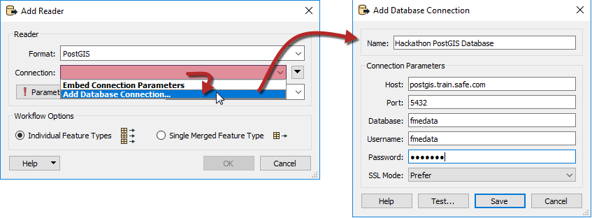

单击保存。单击“参数”以选择要从数据库中读取的表，然后选择public.CompleteRoads表。然后，单击确定两次，将读模块添加到画布。

<table style="border: 0px">

<tr>
<td style="font-weight: bold">读模块格式</td>
<td style="">PostGIS</td>
</tr>

<tr>
<td style="font-weight: bold">读模块数据集</td>
<td style="">Hackathon PostGI数据库</td>
</tr>

<tr>
<td style="font-weight: bold">参数</td>
<td style="">表列表: public.CompleteRoads</td>
</tr>

</table>

<!--Tip Section-->

<table style="border-spacing: 0px">
<tr>
<td style="vertical-align:middle;background-color:darkorange;border: 2px solid darkorange">
<i class="fa fa-info-circle fa-lg fa-pull-left fa-fw" style="color:white;padding-right: 12px;vertical-align:text-top"></i>
<span style="color:white;font-size:x-large;font-weight: bold;font-family:serif">诀窍</span>
</td>
</tr>

<tr>
<td style="border: 1px solid darkorange">
<span style="font-family:serif; font-style:italic; font-size:larger">
要在不先添加读模块的情况下添加连接，请从菜单栏中选择"工具> FME选项"。 
<br><br>
单击数据库连接类别的图标，然后单击[+]按钮创建一个新的连接。在“添加数据库连接”对话框中，首先，选择PostgreSQL作为数据库类型。然后输入通过Web浏览器获得的连接参数。
<br><br>

完成此练习的工作空间使用名为 <strong>Hackathon PostGIS Database</strong>的数据库连接。
<br>如果您想打开/使用此工作空间，则应使用相同的名称创建连接。这样，当您打开工作空间时，它将自动找到匹配的连接。
<br><br>这很好地说明了数据库（和Web）连接的命名约定的重要性。
</span>
</td>
</tr>
</table>

---

**2) 查看数据**
<br>单击public.CompleteRoads要素类型以打开弹出菜单。然后单击“查看源数据View Source Data”按钮以在Visual Preview中查看数据。

您将看到一组道路要素，每个道路要素都有一组属性。一个属性指定要素是否代表单向街道。如果我们要计算一条实际上合法的路线，请务必了解这一点！

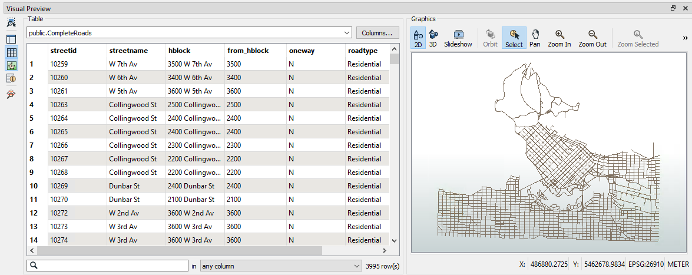

***注意:*** *如果您在使用PostGIS数据库时遇到任何问题（例如，防火墙的连接问题），则可以用很少的更改来替换以下AutoCAD数据集：*

<table style="border: 0px">

<tr>
<td style="font-weight: bold">读模块格式</td>
<td style="">Autodesk AutoCAD DWG/DXF</td>
</tr>

<tr>
<td style="font-weight: bold">读模块数据集</td>
<td style="">C:\FMEData2019\Data\Transportation\CompleteRoads.dwg</td>
</tr>

</table>


<br>**3) 添加GPX写模块r**
<br>现在我们知道我们在正确的表中进行读取，让我们准备一下写模块。使用以下参数将GPX写模块添加到画布：


<table style="border: 0px">

<tr>
<td style="font-weight: bold">写模块格式</td>
<td style="">GPS交换格式 (GPX)</td>
</tr>

<tr>
<td style="font-weight: bold">Writer Dataset</td>
<td style="">C:\FMEData2019\Output\Training\Route.gpx</td>
</tr>

<tr>
<td style="font-weight: bold">要素类型</td>
<td style="">全选</td>
</tr>

</table>


遵循本章介绍的最佳实践，在读模块要素类型和所有写模块要素类型周围添加书签。工作空间将如下所示：

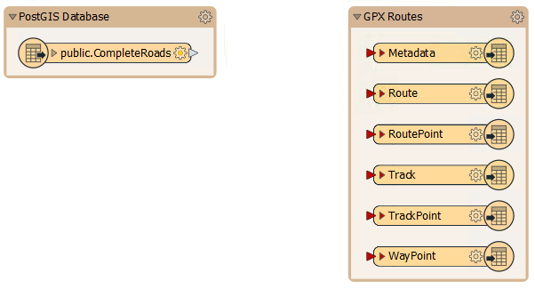

请记住，GPX是一种固定模式格式，因此会自动创建六种不同的写模块要素类型。

  
**4）添加ShortestPathFinder**  
现在我们需要开始计算路线。显而易见的第一步是添加ShortestPathFinder转换器，这是我们计算路线的方法。

因此，添加一个ShortestPathFinder转换器。将public.CompleteRoads连接到Network端口。

  
**5）添加Creator**  
 ShortestPathFinder上的另一个输入端口用于From-To路径（我们旅程的起点和终点）。有很多方法可以创建它 - 甚至接受来自Web地图的输入 - 但是在这里我们将使用Creator转换器手动创建一个要素。

因此，添加一个Creator转换器并将其连接到From-To端口：

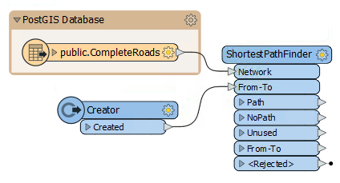

检查Creator的参数。

首先输入UTM83-10作为我们即将创建的数据的坐标系。对于Geometry Object参数，单击右侧的\[...\]浏览按钮以打开几何创建对话框。选择Line作为几何类型并输入以下坐标：

```text
X 491500 Y 5459550
X 494500 Y 5457440
```

第一个坐标是黑客马拉松场地的坐标，第二个坐标是我们网络中最接近我们要去的咖啡馆的点。

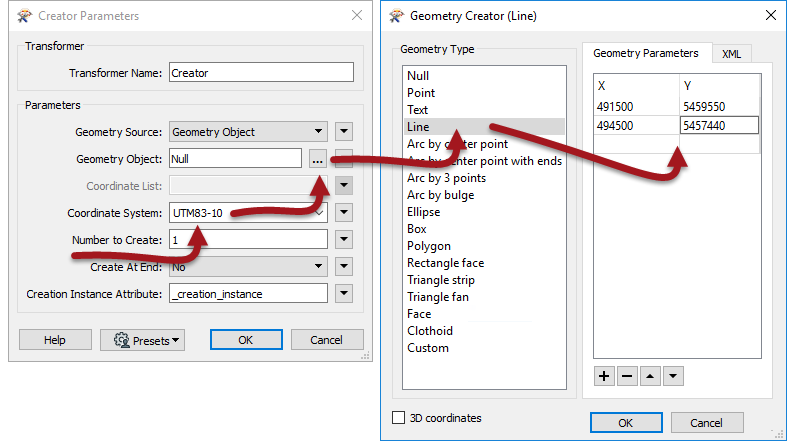

单击“确定”按钮以确认更改。

  
**6）检查ShortestPathFinder参数**  
我们添加的要素的坐标可能不完全位于道路网络上。为了解决这个问题，我们可以在ShortestPathFinder中使用参数。

因此，请检查ShortestPathFinder参数。在Snap Options下，将**From-To和Network Snapping设置**为_Yes，_并输入_150_作为**Snapping Tolerance捕捉容差**：

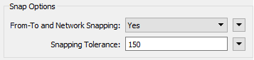

另外，请注意网络成本的参数 - 我们稍后会使用它们。

  
**7）运行工作空间**  
确保打开要素缓存并运行工作空间。检查日志，然后检查ShortestPathFinder：Path缓存。如果一切顺利，输出将如下所示，并定义了一条路线：


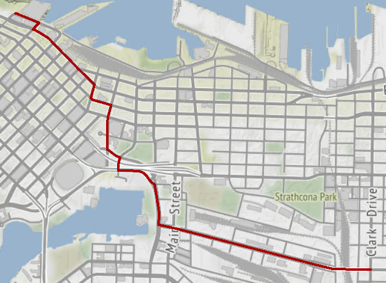
<br><span style="font-style:italic;font-size:x-small">地图瓦片由 <a href="https://stamen.com">Stamen Design</a>, 许可由 <a href="https://creativecommons.org/licenses/by/3.0">CC-BY-3.0</a>。数据由<a href="http://openstreetmap.org">OpenStreetMap</a>, 许可由 <a href="http://creativecommons.org/licenses/by-sa/3.0">CC-BY-SA</a></span>。

如果看不到这样的路径，则必须利用调试技巧来尝试找出错误！


**8）添加AttributeValueMapper**  
结果看起来很好，但有些事情我们仍然不确定：例如，如果这条线路使用的是较慢的住宅区道路怎么办?我们可以通过对每个道路要素应用不同的成本来强制路线更喜欢干线路线。

成本取决于道路类型。本质上，我们将道路类型映射到成本，而使用AttributeValueMapper转换器的方法是这样做。

因此，在CompleteRoads要素类型和ShortestPathFinder:Network端口之间向工作空间添加AttributeValueMapper转换器：

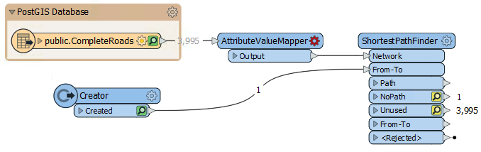


**9）编辑AttributeValueMapper**  
检查AttributeValueMapper的参数。输入以下值：

| 源属性 | roadtype（道路类型） |
| :--- | :--- |
| 目标属性 | Cost（成本） |
| 默认值 | 2 |

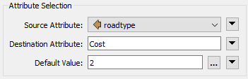

现在，在这些参数下面，我们将映射一些数据。

| 源值 | 目标值 |
| :--- | :--- |
| 干路 | 1 |
| 住宅 | 3 |

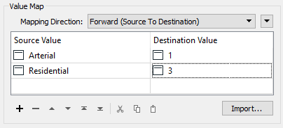

如果路线是干路（主要道路），它将获得1的成本，住宅路线将获得3的成本，而所有其他类型将获得2的成本（因为这是默认值）。单击“接受/确定”以确认参数。

  
**10）应用成本**  
现在我们必须应用我们刚刚创建的成本。检查ShortestPathFinder的参数。输入以下值：

| 成本类型 | 由两个属性 |
| :--- | :--- |
| 正向成本属性 | Cost |
| 逆向成本属性 | Cost |

|  技巧 |
| :--- |
|  为什么是“两个属性”？那是因为只有正向成本，我只能沿着与顶点排列方向相同的方向沿着一段道路行进。因为我不想根据它们的顶点方向避开道路，所以使用两个属性告诉FME两个方向的成本是相同的。 |

现在重新运行工作空间以查看结果是否有任何差异。它应该如下所示：

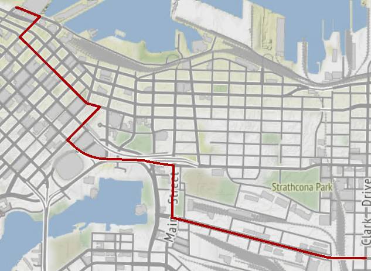
<br><span style="font-style:italic;font-size:x-small">地图瓦片由 <a href="https://stamen.com">Stamen Design</a>, 许可由 <a href="https://creativecommons.org/licenses/by/3.0">CC-BY-3.0</a>。数据由<a href="http://openstreetmap.org">OpenStreetMap</a>, 许可由 <a href="http://creativecommons.org/licenses/by-sa/3.0">CC-BY-SA</a></span>。


因此，成本加权已经产生了影响。但是这个结果有问题......

|  FME蜥蜴说...... |
| :--- |
|  这次路线走的是更长的路径，我可以看出原因可能是：成本被用来衡量路线**来取代**距离，而不是两者都有。  |
|  为了解释这一点，假设我想从A行进到B。有一个住宅道路要素从A开始到B结束，路线距离为1.5公里。  | 
|  还有一条主干道路的要素，从A开始，到B结束。相当极端，它环绕着月球的黑暗面，路线距离为768,000公里。 | 
|  目前我们的解决方案将选择768,000公里的行程，因为与“3”的住宅路线成本相比，它的成本为“1”！  | 
|  显然，这里的练习数据远没有这么荒谬，但同样明显的是，在将距离考虑回结果之前，路线可能不是最佳的。 |

**11）添加AttributeManager**  
在AttributeValueMapper：Output端口和ShortestPathFinder：Network端口之间添加AttributeManager转换器并查看参数。

在“成本”属性的值字段中，单击下拉箭头并选择“打开算术编辑器”。在该对话框中输入表达式：

<pre>
@Value(Cost)*@Length()
</pre>

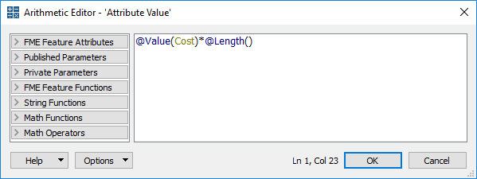

简而言之，我们现在将成本乘以道路长度，以便为我们提供综合权重。

重新运行转换，看看它是否有所不同：

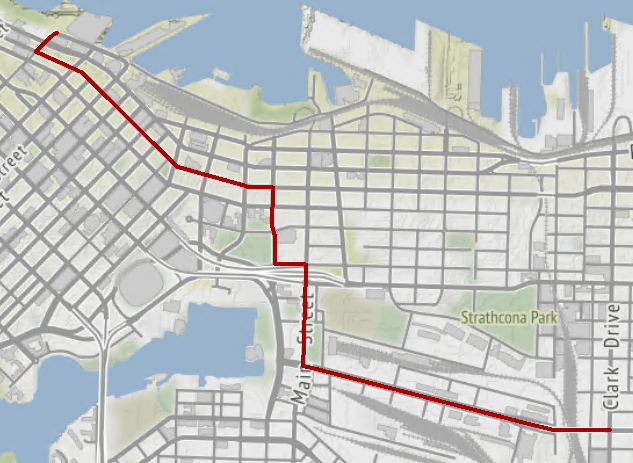
<br><span style="font-style:italic;font-size:x-small">地图瓦片由 <a href="https://stamen.com">Stamen Design</a>, 许可由 <a href="https://creativecommons.org/licenses/by/3.0">CC-BY-3.0</a>。数据由<a href="http://openstreetmap.org">OpenStreetMap</a>, 许可由 <a href="http://creativecommons.org/licenses/by-sa/3.0">CC-BY-SA</a></span>。

是的，它确实证明了这条路线比它可能的要长。当然，我们使用的表达式也是非常主观的，并且可以变得更复杂，以提供更好的结果（我们可以尝试使用对数标度来查看产生的结果）。

  
**12）编辑AttributeManager**  
无论我们的表达式如何，还有最后一个问题需要解决：单行道。目前，我们没有解决方案来防止我们朝错误的方向前进。

幸运的是，每条单行道都标有一个属性，其顶点按照允许的行程方向排序，因此我们知道要避免哪种方式。让我们用这些信息来解决这个问题。

我们现在需要为每个方向计算不同的成本属性，尽管只有涉及单行道时该值才会有所不同。像往常一样，有多种方法可以在FME中处理这个问题; 让我们使用一个相对简单的方法。

再次查看AttributeManager参数。这次创建一个名为ReverseCost的新输出属性。在值字段中，单击下拉箭头并选择“条件值”。

|  技巧 |
| :--- |
|  条件值是根据测试条件设置的值。这就像将Tester合并到AttributeManager中一样。这些内容在FME Desktop高级培训课程中有更详细的介绍。 |

在打开的定义对话框中，双击第一个“If”行并打开“测试条件”对话框。在这里设置一个测试oneway = Y。对于输出值（对话框的底部）输入值9999（即，错误的方式旅行的成本是*非常*昂贵的）！


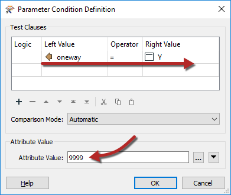

单击“确定”关闭该对话框。返回上一个对话框，双击显示&lt;No Action&gt;的位置，选择下拉箭头，然后选择Attribute Value&gt; Cost：

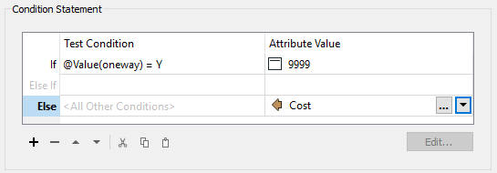

再次单击确定两次，以关闭这些对话框。

现在，单向街道的反向成本高得令人望而却步，而其他街道则只收到通常的远期成本。


<br>**13) 应用成本**
<br>我们已经创建了ReverseCost属性，但是我们仍然需要使用它。检查ShortestPathFinder参数，并将ReverseCost属性从Cost更改为ReverseCost：

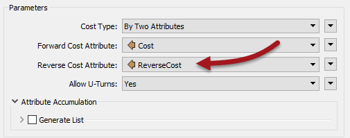

现在我们准备出发了。重新运行工作空间。您可以检查ShortestPathFinder：Path输出端口以查看结果。但是，如果要查看**实际的**写入输出，则必须将.gpx文件拖放到Visual Preview中。然后，您可以指定使用LL83坐标系读取数据，因为该信息未存储在GPX文件中：

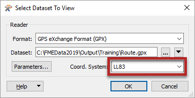

无论哪种情况，您都应该看到正确的输出：

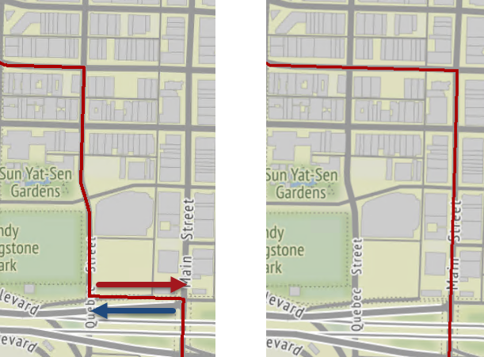

（上面的）变化是由先前沿单向（东西向）的街道以错误的方向（东西向）行进的路线引起的！


<br>**14) 连接模式**
<br>将路径端口连接到路由输出要素类型：

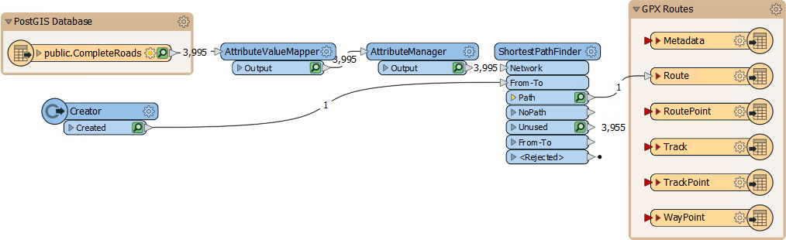

现在运行工作空间，将数据上传到您的GPS设备，您就可以开始了！

|  高级练习 |
| :--- |
|  并不是很高级，但你一直都在使用最佳实践，对吧? 我的意思是，在需要的地方有书签和注释，并且没有重叠连接? 同样，您是否删除了我们最终未使用的其他GPX要素类型？如果不是，那么你可能想要解决这个问题！ |

<table>
  <thead>
    <tr>
      <th style="text-align:left">恭喜</th>
    </tr>
  </thead>
  <tbody>
    <tr>
      <td style="text-align:left">
        <p>通过完成本练习，您证明了您知道如何：
          <br />
        </p>
        <ul>
          <li>创建并使用FME数据库连接</li>
          <li>使用各种转换器创建原型FME工作空间</li>
          <li>使用调试技术查找练习中遇到的任何问题</li>
          <li>使用好的样式来开发工作空间</li>
        </ul>
      </td>
    </tr>
  </tbody>
</table>
