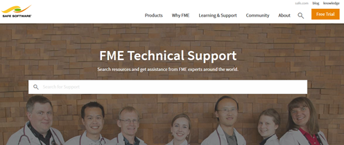

# 产品信息和资源 #

## Safe Software网站 ##
**[Safe Software网站](https://www.safe.com/ "Safe Software web site")** 是所有有关FME的官方信息源。 它包括有关FME产品，Safe Software服务，FME解决方案，FME支持和Safe Software本身的信息。

## 安全支持团队 ##
FME的背后是热情，有趣，知识渊博的专家，随时准备帮助您取得成功，并建立在知识转移原则基础上的**[支持团队](https://support.safe.com/knowledgeSubmitCase "FME Support Team page")** 理念。

您可以通过支持案例（网络/电子邮件）或使用在线聊天来请求产品支持。

## 您的本地合作伙伴 ##
Safe Software has partners and resellers around the world to provide expertise and services in your region and your language.

You can find a list of official partners on the **[Safe Software Partners Page](http://www.safe.com/partners/ "FME Partners Page")**.

## Safe Software Blog ##
The **[Safe Software blog](http://blog.safe.com/ "Safe Software Blog")** provides technical information and general thoughts about FME, customers' use cases, and spatial data interoperability. It includes articles, videos, and podcasts.

## FME Manuals and Documentation ##
Use the Help function in FME Workbench to access help and other documentation for FME Desktop. Alternatively, look on our web site under the **[Knowledge Center section](https://support.safe.com/KnowledgeDocumentation "FME Product Documentation")**.

